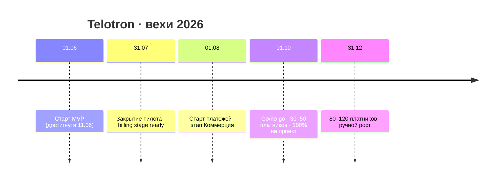
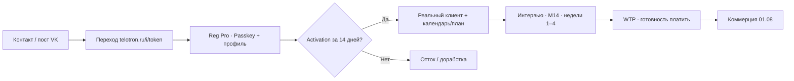

# Telotron · описание проекта

| Поле | Значение |
|------|----------|
| **Статус** | полная версия · 2026-06-16 (анализ рынка, юр. и перспективы) |
| **Аудитория** | личный контакт (вне команды) |
| **Автор** | Алексей Русаков, основатель |
| **Конфиденциальность** | внутреннее использование; не для публичного распространения |

---

## Содержание

1. [Краткое резюме](#1-краткое-резюме)
2. [Контекст основателя и мотивация](#2-контекст-основателя-и-мотивация)
3. [Проблема на рынке](#3-проблема-на-рынке)
4. [Анализ рынка](#4-анализ-рынка)
5. [Решение: что такое Telotron](#5-решение-что-такое-telotron)
6. [Целевая аудитория](#6-целевая-аудитория)
7. [Ценностное предложение](#7-ценностное-предложение)
8. [Бизнес-модель и монетизация](#8-бизнес-модель-и-монетизация)
9. [Текущий этап: Пилот (июнь–июль 2026)](#9-текущий-этап-пилот-июньиюль-2026)
10. [Дорожная карта 2026 (вехи)](#10-дорожная-карта-2026-вехи)
11. [Go-to-market на пилоте](#11-go-to-market-на-пилоте)
12. [Метрики и критерии успеха](#12-метрики-и-критерии-успеха)
13. [Команда, ресурсы, ограничения](#13-команда-ресурсы-ограничения)
14. [Риски и открытые вопросы](#14-риски-и-открытые-вопросы)
15. [Запрос обратной связи](#15-запрос-обратной-связи)
16. [Юридические вопросы](#16-юридические-вопросы)
17. [Перспективы развития](#17-перспективы-развития)

**Приложения:** [A](#приложение-a-ссылки-и-контакты) · [B](#приложение-b-воронка-пилота) · [C](#приложение-c-тарифы-черновик) · [D](#приложение-d-юридический-контур)

---

## 1. Краткое резюме

**Telotron** — B2B SaaS-платформа для **персональных фитнес-тренеров** и их клиентов. Продукт собирает в одном месте то, что сегодня размазано по мессенджерам, таблицам и заметкам: **календарь и запись**, **клиентская база**, **планы тренировок и питания**, **дневник клиента** (трекер), **обратная связь**.

**Кто платит:** тренер (подписка). Клиент пользуется бесплатно в рамках связи со своим тренером.

**Стадия:** MVP **в production** с 11 июня 2026. Сейчас идёт **пилот** (июнь–июль): бесплатный триал 60 дней, без приёма платежей. Цель пилота — доказать ценность на реальных тренерах и подготовить коммерцию к **1 августа 2026**.

**Команда:** solo-основатель (продукт + разработка + продвижение), part-time. Отдельного отдела продаж нет; рост строится на **личных связях**, **соцсетях** и **партнёрской программе** (тренер приводит тренера).

**Стратегия роста:** ручное продвижение **1–2 года**, без рекламного бюджета на старте. Ориентиры: **30–50 платящих** к октябрю 2026, **80–120** к концу года, **~200** по России к середине 2027. Долгосрочный горизонт — порядка **5 000 платящих** (не KPI 2026 года).

**Контекст рынка РФ:** с 2022 года часть **импортных B2B- и потребительских сервисов** недоступна или неудобна (оплата, магазины приложений, поддержка, ПДн за рубежом). Для тренеров это ослабляет зарубежные SaaS и усиливает спрос на **локальный** продукт — при условии, что Telotron реально закрывает «день тренера», а не только «российский аналог».

**Ёмкость (оценка):** целевой сегмент (SAM) — порядка **225–265 тыс.** тренеров и **~130–152 млрд ₽** оборота фитнес-услуг вне крупных сетей; подробнее — [§4](#4-анализ-рынка).

**Зачем этот документ:** прошу взглянуть со стороны на модель, позиционирование, go-to-market и слепые зоны. Интересна честная обратная связь — что выглядит сильным, что хрупким, где я переоцениваю или недооцениваю риски.

---

## 2. Контекст основателя и мотивация

**Алексей Русаков** — IT-специалист (образование: КубГТУ, компьютерные технологии), предприниматель. Продукт разрабатываю сам: full-stack, инфраструктура, продуктовые решения.

**Почему этот проект:**

- Вижу повторяющуюся боль у тренеров из личного круга и из серии интервью с целевой аудиторией: рост числа клиентов ломает ручные процессы.
- Есть доступ к **тёплой сети** — тренеры из интервью, церковные сообщества в разных городах России, личные контакты. Это стартовый канал, а не массовый маркетинг.
- Хочу построить устойчивый продукт с recurring revenue, без зависимости от инвестиций на ранней стадии.

**Ограничения по времени (реалистично):**

| Зона | Часы в неделю |
|------|----------------|
| Разработка продукта | ~10–15 |
| Продвижение (outreach, интервью, соцсети) | ~5–6 |
| Согласование материалов, кейсы | ~2 |

Полная занятость проектом планируется с **октября 2026** (go/no-go по результатам пилота и первых платежей). До этого — совмещение с другими обязательствами.

**Личный финансовый ориентир:** ~200 тыс. ₽/мес чистого дохода от проекта. Реалистичный горизонт — **2027** при ~200 платящих, не KPI пилота.

---

## 3. Проблема на рынке

### «День тренера» без единого инструмента

Типичный персональный тренер ведёт **5–30+ клиентов**. Для каждого нужно:

- согласовать расписание и переносы;
- выдать и обновить план тренировок / питания;
- отслеживать прогресс (вес, замеры, выполнение);
- напоминать об оплате занятий;
- оставаться на связи.

На практике это живёт в **Telegram / WhatsApp**, **Google-таблицах**, **заметках**, иногда — в тяжёлых CRM для залов, которые не заточены под «один тренер — много клиентов».

### Последствия

| Проблема | Эффект |
|----------|--------|
| Информация в переписке | Теряется контекст, сложно найти «что было на прошлой неделе» |
| Ручная рутина | Часы уходят на администрирование вместо тренировок |
| Рост клиентской базы | Процессы «ломаются» — тренер либо отказывается от роста, либо выгорает |
| Клиентский опыт | Клиент не видит единой картины: где план, где записаться, куда писать |

### Что Telotron сознательно не решает на старте

- **Привлечение новых клиентов для тренера** (маркетинг тренера, лидогенерация) — следующий этап, не MVP.
- **Медицинские** сценарии и диагностика — продукт **не является** медицинским сервисом.
- **Крупные фитнес-сети** — у них свои ERP/CRM; фокус на индивидуалах и небольших студиях.

### Контекст РФ: блокировки и уход импортных продуктов

С **2022 года** для российского рынка это не фон, а **фактор спроса и конкуренции**:

| Что происходит | Как это бьёт по тренеру |
|----------------|-------------------------|
| Уход или ограничение **зарубежных SaaS** (оплата картами РФ, биллинг, поддержка) | Trainerize, TrueCoach и аналоги — сложнее или невозможно легально и стабильно вести практику |
| **Магазины приложений**, зарубежные облака, отдельные сервисы (Notion, часть Google-экосистемы) | Разрозненный стек «таблица + заметки + VPN» — хрупкий и непредсказуемый |
| Требования к **ПДн в РФ** (152-ФЗ, РКН) | Риск для тех, кто хранит клиентские данные в иностранных сервисах без прозрачного контура |
| **Мессенджеры** (Telegram, MAX) при этом остаются рабочими | Главный конкурент Telotron — не заблокированный SaaS, а **привычка «всё в чате»** |

**Окно возможности:** часть тренеров **ищет замену** импортным инструментам или устала от обходных схем. Telotron изначально проектируется под РФ: **рубли и ЮKassa**, **MAX** для auth, **уведомление РКН**, данные без зарубежной обработки на текущем этапе, хостинг в российском контуре.

**Честная оговорка:** «мы российские» **не заменяет** продукт. Блокировки дают **tailwind**, а не гарантию платников; параллельно растут **отечественные** CRM и фитнес-решения. В пилоте проверяем, что тренеру **удобнее**, а не только «доступнее», чем VPN + Notion.

---

## 4. Анализ рынка

Ниже — сжатый обзор **ёмкости**, **структуры** и **конкурентов**. Цифры — **оценки порядка величины** по открытым отраслевым публикациям (FitnessData / FPA, Коммерсантъ, региональная аналитика); для инвесторского уровня точности нужны платные отчёты (FitnessData и др.).

### 4.1. Ёмкость рынка (TAM · SAM · SOM)

**Что считаем:** рынок **фитнес-услуг** в России (абонементы, персональные занятия, доп. сервисы в клубах и студиях) и **численность тренеров** — как прокси для B2B SaaS.

| Уровень | Что это | Ориентир |
|---------|---------|----------|
| **TAM** | Весь рынок фитнес-услуг / все тренеры | **~217 млрд ₽** оборот (РФ, 2025); **~375 тыс.** тренеров (все форматы занятости) |
| **SAM** | Сегмент Telotron: **без крупных полноформатных сетей** — студии, малые залы, ИП и самозанятые, микрокоманды | **~130–152 млрд ₽** (60–70% от TAM); **~225–265 тыс.** тренеров (профессиональное ядро **~245 тыс.** на основном месте >30 ч/нед.) |
| **SOM** | Реально достижимая доля Telotron за 1–3 года без большого рекламного бюджета | **Доли процента** активных платящих от SAM — единицы–сотни тренеров в 2026, **~200** к середине 2027, **~5 000** — долгосрочный north star, не KPI года |

**Методология SAM:** в открытых сводках нет строки «доля выручки крупных сетей». Коэффициент **0,60–0,70** от TAM — **эвристика**: ~30–40% рынка относим к федеральным и крупным региональным сетям с собственными ERP/CRM и долгим циклом внедрения стороннего «рабочего места тренера».

**Региональный пример (Краснодарский край):** краевой TAM **>10 млрд ₽** (2025, +~10% г/г); SAM **~6–7,5 млрд ₽**; г. Краснодар — **~2,3–3,2 млрд ₽** SAM (оценка ~40–45% края). Тренеров в SAM края — порядка **9–14 тыс.**, в городе **~4–6 тыс.** (масштабирование от 375 тыс. по населению + коэфф. 1,0–1,35× за миллионник и курортную зону).

**Потолок SaaS-выручки (грубо):** при среднем чеке **~5 000 ₽/мес** и **5 000** платящих — **~300 млн ₽ ARR**; при **200** платящих — **~12 млн ₽ ARR**. Это верхняя рамка при текущей тарифной гипотезе, без учёта партнёрских выплат и скидок.

**Важно:** диетологи/нутрициологи в эти цифры **не включены** отдельной строкой — потенциальное расширение SAM после проверки WTP.

### 4.2. Структура рынка

Рынок **не монолитен** — у разных игроков разные инструменты, бюджеты и цикл покупки.

#### Сегменты по типу бизнеса

| Сегмент | Доля (оценочно) | Кто платит за софт | Отношение к Telotron |
|---------|-----------------|-------------------|----------------------|
| **Крупные сетевые клубы** | ~30–40% выручки TAM | Собственные или корпоративные CRM | **Вне фокуса** MVP |
| **Малые студии и залы** (2–10 специалистов) | Часть SAM | Владелец / админ | **Смежный** сегмент (идея отдельного тарифа позже) |
| **Соло-тренеры** (ИП, самозанятые, 5–30+ клиентов) | Ядро SAM | Сам тренер | **Основной** покупатель |
| **Онлайн-коучи** без офлайн-базы | Хвост | Нестабильно | Не приоритет на старте |

#### Слои «стека» специалиста сегодня

Тренер почти никогда не покупает **один** продукт — он **склеивает** несколько слоёв:

| Слой | Типичные инструменты | Закрывает ли «день тренера» целиком |
|------|----------------------|--------------------------------------|
| Коммуникации | Telegram, WhatsApp, MAX | Нет структуры и масштаба |
| Запись и база | YCLIENTS, DIKIDI | Запись, не глубокое сопровождение |
| CRM клуба | impulseCRM, Mobifitness, Fitness365 | Админка зала, избыточно для соло |
| Планы и трекинг | Таблицы, PDF, разрозненные приложения | Один кусок процесса |
| Питание | FatSecret, заметки | У клиента, не у специалиста как CRM |
| Платежи | СБП, переводы, касса | Вне единого контекста клиента |

**Динамика рынка:** фитнес-услуги в РФ **растут** (ориентир **~10%** г/г в 2025, замедление до **10–15%** в 2026), но конкуренция усиливается — выигрывают те, кто **удерживает клиентов** и повышает LTV. Это усиливает спрос на инструменты сопровождения, а не только на запись.

**Поведение B2C → B2B:** клиенты ждут онлайн-запись, напоминания, видимый прогресс; гибрид офлайн + мессенджер + домашние задания — норма. Тренер без цифрового контура **теряет** часть клиентов из‑за слабого сервиса.

### 4.3. Конкурентная среда

Конкурент Telotron — **не один продукт**, а **фрагментированная альтернатива** + привычка «и так в чате работает».

#### Слои конкуренции

| Категория | Примеры | Сильные стороны | Слабые для solo-тренера | Угроза для Telotron |
|-----------|---------|-----------------|-------------------------|---------------------|
| **Мессенджеры + таблицы** | Telegram, Sheets, Notion | Бесплатно, привычно | Нет масштаба, теряется контекст | **Высокая** — главный «конкурент» |
| **Запись / салонные CRM** | YCLIENTS, DIKIDI | Запись, узнаваемость | Не про планы, трекер, «день тренера» | Средняя — часто уже стоит |
| **CRM клуба / студии** | impulseCRM, Mobifitness, AppEvent | Абонементы, касса, сеть | Избыточно и дорого для фрилансера | Высокая в студиях, слабее в соло |
| **Универсальные CRM** | Битрикс24, amoCRM | Гибкость, воронки | Нет готовой модели фитнес+питание | Низкая прямая |
| **Тренер–клиент (узкие)** | Разные приложения РФ/СНГ | Планы, чек-листы | Фрагмент, часть закрылась | Средняя |
| **Дневник питания** | FatSecret и др. | База продуктов у клиента | Не CRM сопровождения | Низкая как замена |
| **Зарубежные PT-платформы** | Trainerize, TrueCoach, My PT Hub | Зрелый UX | Оплата, ПДн, доступ в РФ с 2022 | Снижается; tailwind для локального SaaS |

**Прямых копий** задумки Telotron (тренировки + питание + прогресс + календарь + удержание в **одном** продукте под **одного** специалиста) **мало**; чаще — **конкурируешь за «второй экран»** рядом с YCLIENTS или за отказ от таблицы.

#### Позиция Telotron

**Ниша:** «**рабочее место одного тренера**» в России — не админка клуба и не универсальная CRM.

**Сильные стороны в сравнении:**

- Подписка в **рублях**, эквайринг **ЮKassa**; **ПДн** в РФ (реестр РКН); **MAX** для auth; PWA без привязки к сторам.
- **Цельность сценария:** клиент → план → факт → календарь → трекер в одном контуре.
- **Партнёрский рост** без отдела продаж.

**Не переоценивать:**

- Многие уже **довольны** Telegram + таблицей; блокировки бьют в первую очередь по тем, кто сидел на **импортном SaaS**.
- Отечественные CRM **тоже** занимают освободившуюся нишу.
- Конкуренты могут скопировать отдельные модули; ставка на **сарафан**, **онбординг <15 мин** и **измеримую пользу** (удержание клиента тренера), а не на единственный «запретный» фактор.

**Формула против конкурентов:** не «ещё одна CRM» и не «ещё один дневник калорий», а **одно место, где специалист ведёт клиента от цели до факта** — тренировки, питание, прогресс, напоминания, оплаты — **без админки клуба**.

**Источники оценок (открытые):** итоги рынка фитнес-услуг РФ 2025 (Коммерсантъ); численность тренеров (FitnessData / FPA); динамика Краснодарского края (Деловая газета.Юг). Детальная методология — во внутреннем `Анализ рынка Краснодарский край 2026.md` (бухгалтерия / бизнес-план).

---

## 5. Решение: что такое Telotron

**Telotron** — веб-платформа (PWA — можно «установить» на телефон) с двумя зонами:

| Зона | Аудитория | Назначение |
|------|-----------|------------|
| **Pro** | Тренер | Рабочее место: клиенты, календарь, планы, группы, партнёрка |
| **Client** | Клиент тренера | Дневник, планы, запись, связь с тренером |

Публичный сайт [telotron.ru](https://telotron.ru/) — витрина и точка входа в регистрацию.

### Ключевой функционал MVP (уже в production)

- **Регистрация и вход** — Passkey (без пароля) + подтверждение через мессенджер **MAX** (OTP).
- **Клиенты** — приглашение по ссылке/коду, карточка клиента, заметки.
- **Календарь** — индивидуальные и групповые занятия, запись.
- **Группы** — постоянные группы с участниками из клиентской базы.
- **Программы тренировок** — база упражнений, назначение клиенту.
- **Планы питания** — на старте как файл (конструктор — позже).
- **Трекер** — вода, еда, шаги, сон, замеры тела; лента у клиента.
- **Обратная связь (M14)** — встроенная кнопка, переписка с поддержкой.
- **Партнёрские ссылки** — атрибуция регистраций (выплаты — с августа).

### Что сознательно не в MVP

- Встроенный **чат** тренер–клиент (сложность; пока — мессенджеры снаружи).
- **Оповещения** о тренировках через MAX (auth готов, напоминания — позже).
- **Брендирование** интерфейса под тренера (зарезервировано за тарифом Max, после MVP).
- Нативные **мобильные приложения** в сторах — сначала PWA.

### Техническая зрелость (для контекста, без деталей)

- Production на собственной инфраструктуре, четыре HTTPS-зоны.
- Юридический пакет v1.0 «можно публиковать»; уведомление в **Роскомнадзор** внесено в реестр (№ 100316582), обработка ПДн с 12.06.2026.
- Разработка ведётся итеративно (спринты 2 недели), с тестами и регрессией перед выкатами.

---

## 6. Целевая аудитория

### Кто платит

**Персональный тренер** — индивидуал или небольшая студия (1–3 тренера). Ведёт клиентов **офлайн и/или онлайн**. Уже есть практика, а не «только мечтает открыть зал».

### Кто пользуется (бесплатно для клиента)

**Клиент тренера** — человек, которого тренер пригласил в зону Client. Может иметь нескольких тренеров (multi-trainer), но без «перевода» между тренерами.

### География первой волны

**Россия**, не привязка к одному городу. Первая волна outreach:

- Москва, Санкт-Петербург;
- Юг: Краснодар, Сочи, Адлер, Ставрополь, Ростов, Новороссийск;
- выход через **церковные сети** и **интервьюированных тренеров** (уже есть контакты).

### Портрет «идеального» пилотного тренера

- Ведёт **5+ реальных клиентов** сейчас.
- Готов дать **честную обратную связь** в течение 2–4 недель.
- Использует мессенджеры / таблицы — чувствует боль рутины.
- Желательно: активен в соцсетях (кандидат в партнёры-ядро).

### Кого не таргетируем на старте

- Крупные сети и франшизы с корпоративными CRM.
- «Коучи без клиентов» — нет боли, которую продукт закрывает.
- Медицинские / реабилитационные клиники с регуляторными требованиями.

---

## 7. Ценностное предложение

### Для тренера

| Боль | Как Telotron помогает |
|------|----------------------|
| Хаос в чатах | Единое место: клиент, план, календарь, дневник |
| Потеря записей и контекста | Календарь с историей; карточка клиента |
| Ручная выдача планов | Программы тренировок, назначение в пару кликов |
| Нет картины по клиенту | Трекер: клиент фиксирует, тренер видит |
| Рост базы = хаос | Масштабируемый процесс без смены инструментов |

**Формулировка в одну фразу:** *«Весь день тренера и клиента — в одном приложении, без таблиц и бесконечных чатов»*.

### Для клиента

- Понятно, **куда смотреть план** и **как записаться**.
- **Дневник** прогресса в одном месте.
- Связь с тренером через привычный телефон (PWA), без установки из стора.

### Отличие от «заметки + Telegram + таблица»

| Критерий | Разрозненные инструменты | Telotron |
|----------|--------------------------|----------|
| Единый контекст клиента | Нет | Да |
| Календарь + планы + трекер | Вручную связать | Встроено |
| Масштаб при росте | Ломается | Процесс сохраняется |
| Оплата платформы | — | Подписка тренера; клиент бесплатно |
| **Работа в РФ без VPN и иностранных карт** | Зависит от стека; импортный SaaS — риск | Рублёвый биллинг, локальный комплаенс |

### Отличие от тяжёлых CRM для залов

Telotron **не** про управление залом, кассу и абонементы сети. Фокус: **один тренер — его клиенты — его день**.

---

## 8. Бизнес-модель и монетизация

### Модель: B2B подписка

Платит **тренер**. Клиент не платит платформе.

### Тарифная линейка (рабочая гипотеза)

| Тариф | Цена | Смысл |
|-------|------|-------|
| **Лайт** | 0 ₽ навсегда | Можно работать, но **намеренно узко** (нет групп, урезанная операционка) |
| **Профи** | ~5 000 ₽/мес | **Полная операционка** — основной платный контур |
| **Максимальный** | ~10 000 ₽/мес | **Рост и продвижение**: воронка, метрики, ИИ-рекомендации (слой «рост») |

Цены — **гипотеза**; финал по итогам пилота (интервью WTP + поведение activated-тренеров). Жёстких лимитов на число клиентов на Лайте **нет**.

### Вход в оплату

1. **Триал 60 дней** при регистрации — полный функционал **как Профи**, без карты.
2. **Промо 2 месяца Max** — от даты регистрации (на старте коммерции; в пилоте gating не действует).
3. После промо — по умолчанию **Лайт**, если тренер не выбрал платный тариф.
4. **Пилотная когорта** (июнь–июль 2026) — планируется **скидка ~6 месяцев** (размер уточняется).

### Механика оплаты (с 01.08.2026)

- Пополнение через **ЮKassa** (карты РФ, рубли).
- Внутренний **счёт абонплаты**; **ежедневное списание** = месячная цена / 30.
- Недостаточный баланс → **даунгрейд на Лайт** (данные сохраняются, функции скрываются).
- Комиссия эквайринга **включена в цену** для тренера.

### Партнёрская программа (ключевой канал роста)

Тренер приглашает **другого тренера** по многоразовой ссылке. Доступна **на всех тарифах**.

**Вознаграждение** — процент от платежей приглашённых (база = фактические пополнения счёта абонплаты):

| Уровень | Доля |
|---------|------|
| L1 (прямой приглашённый) | 20% от базы |
| L2 | 5% от базы |
| L3 | 2,5% от базы (после подписания партнёрского договора) |

До порога **S** (сумма месячной абонплаты партнёра) начисления идут **скидкой на подписку**; свыше S — на **внутренний счёт** с возможностью вывода после договора.

**Почему это важно для модели:** отдельного отдела продаж нет. Рост = **сарафан тренер → тренер** + личные связи основателя + соцсети.

### Что в пилоте бесплатно

- Триал **60 дней**, **полный** функционал MVP.
- **Нет** gating по тарифам, **нет** приёма платежей в prod.
- Партнёрские ссылки работают для **учёта регистраций**; выплаты — с **01.08**.

### Unit-экономика (ориентиры)

| Показатель | Значение |
|------------|----------|
| ARPU (основной тариф) | ~5 000 ₽/мес |
| MRR к 31.12.2026 | 80–120 × ~5 000 ≈ **0,4–0,6 млн ₽/мес** |
| CAC на старте | Низкий (личные связи, партнёрка); paid — не раньше 50–100 платников |
| Долгий горизонт | ~5 000 × ~5 000 ₽ — **north star лет**, не 2026 |

---

## 9. Текущий этап: Пилот (июнь–июль 2026)

### North star этапа

На **реальных тренерах в триале** проверить ценность «день тренера и клиента» и **подготовить коммерцию к 01.08** — без приёма платежей в prod.

### Четыре вопроса этапа

| Вопрос | Как поймём ответ |
|--------|------------------|
| Нужен ли продукт тренерам? | Регистрации, activation, интервью, удержание в триале |
| Что мешает / чего не хватает? | Insight brief → backlog с доказательствами |
| Чем продавать с 01.08? | Матрица тарифов + billing/partner stage ready |
| Как привлекать? | Outreach + партнёрское ядро; цифры по воронке |

### Что уже сделано (срез 11.06.2026)

- MVP в **production**, PWA Pro/Client.
- MAX auth (регистрация/восстановление через бота).
- Юрпакет v1.0, РКН, outreach разрешён с **12.06**.
- Публичный сайт, зона Pro/Client, обратная связь M14.

### Что сознательно не делаем в пилоте

| Тема | Когда |
|------|-------|
| Платежи, MRR, ЮKassa в prod | Этап 2, **01.08** |
| Gating по тарифам | **01.08** |
| Paid-реклама | После ~50–100 платников |
| Видео, тяжёлый маркетинг | Не в пилоте |
| Найм разработчика | Go/no-go по MRR, ориентир **01.10** |

### Режим prod в пилоте

- Триал **60 дней**, полный функционал MVP.
- Без gating и без оплат.
- Все регистрации — через **партнёрские ссылки** (`/i/{token}`) для атрибуции.

---

## 10. Дорожная карта 2026 (вехи)



| Дата | Веха | Смысл |
|------|------|-------|
| **01.06.2026** | Старт MVP | **Достигнута** — prod, триал, outreach с 12.06 |
| **31.07.2026** | Закрытие пилота | ≥50 activated, billing+partner stage ready |
| **01.08.2026** | Старт платежей | ЮKassa, gating, партнёрка full |
| **01.10.2026** | Полное посвящение | 30–50 платников; go/no-go; найм dev по MRR |
| **31.12.2026** | Ручной рост | 80–120 платников |
| **~07.2027** | Масштаб РФ | ~200 платников; тест paid-рекламы |

**Стратегия:** без инвестиций в ads **1–2 года**; paid — только после доказанной конверсии и базы платников.

**Запасной план**, если billing не готов к 01.08: не включать платежи; продлить триал активным (+14 дней); пересмотреть темп целей.

---

## 11. Go-to-market на пилоте

### Приоритет каналов

```
① Личные связи  →  ② VK  →  ③ Telegram (опционально)
```

| Канал | Роль | Целевая доля reg |
|-------|------|------------------|
| **Личные связи** | Доверие, глубокая ОС, ядро партнёров | **30** |
| **VK** (группа + личная страница) | Масштаб, кейсы, повторяемый контент | **70** |
| **Telegram** | Опционально, 0–1 пост/нед | по остаточному |
| **Paid** | **0** в пилоте | — |

### Личные связи (~30 человек)

Источники: интервьюированные тренеры, церковные сети (Москва, СПб, Юг), личный круг.

**Скрипт первого касания (суть):** «Запускаем Telotron — сервис для тренера и клиента: запись, планы, дневник. Ищем тренеров на бесплатный 60-дневный пилот, нужна живая обратная связь».

Ритм: **5–6 ч/нед** основателя; с ~01.07 — **1–3 помощника** на соцсети.

### Соцсети

- **VK-группа:** [Telotron · для тренеров](https://vk.com/club239586245)
- **Личная страница:** [vk.com/id224642120](https://vk.com/id224642120) (Алексей Русаков)
- Ритм: **2 поста/нед** в VK
- Тон: от **первого лица** основателя, не безликий SaaS
- Старт продвижения в соцсетях: **15.06.2026**

### Партнёры-ядро

Из ~30 личных контактов отобрать **5–10** с активными соцсетями и интересом к доп. доходу. В июле — тест реферальных ссылок; выплаты с 01.08.

### Чего не делаем

- Массовый холодный outreach.
- Реклама (VK/TG ads, контекст).
- Instagram, YouTube, TikTok — вне фокуса пилота.
- Обещание цен, скидок и выплат партнёрки **до** запуска billing.

---

## 12. Метрики и критерии успеха

### Главная метрика пилота

**≥50 activated** к 31.07.2026 (минимум доказательства: **≥40%** от подключённых).

### Определение «activated»

Тренер **activated**, если в течение **14 дней** после регистрации:

1. Завершена регистрация Pro (Passkey + профиль).
2. Создан **≥1 реальный клиент** (инвайт принят; тестовый не считается).
3. Создана **≥1 запись в календаре** или назначен план тренировки/питания.

Дополнительно: учёт **реального использования** по неделям 1–4.

### KPI пилота (сводка)

| Метрика | Цель | Успех / минимум |
|---------|------|-----------------|
| **Подключения** (reg Pro) | **100** | **≥80** — успех маркетинга |
| **Activated** | **≥50** | мин. **≥40%** от подключённых |
| **Глубинные интервью** | **6** | 2/мес |
| **Insight brief** | **3** | для backlog |
| **Партнёры-ядро** | 5–10 | из ~30 личных |

**Приоритет при конфликте:** доказательство **пользы** (цель 1) важнее числа подключений (цель 2).

Если **60–80 reg** + **≥50 activated** + польза доказана — цель по reg формально не достигнута, но **пилот успешен**.

### Честная оценка capacity

Без помощи на соцсетях solo-основатель реалистично тянет **~30 reg** к 31.07. Цель **100** — при подключении помощников с июля.

### Вердикт «польза доказана»

Принимает **только директор** по совокупности: activated, интервью, цитаты, готовность платить после триала.

Если польза **не** доказана к 31.07 — продление пилота без оплат + доработка продукта; billing 01.08 **не** стартует автоматически.

---

## 13. Команда, ресурсы, ограничения

### Текущая структура

| Роль | Кто | Зона |
|------|-----|------|
| Основатель / директор / dev | Алексей Русаков | Продукт, разработка, outreach, интервью |
| PO / маркетолог | Внутренняя роль (документы, тексты, исследования) | Тарифы, материалы, метрики |
| Дизайнер | Подключён точечно | VK-обложки, one-pager |
| Юрист, бухгалтер | Внешние | Оферта, РКН, регламент закрытия месяца |
| Поддержка | Через M14 + основатель | Топ-5 обращений еженедельно |

**Нет:** отдела продаж, штата разработчиков, аккаунт-менеджеров (до 500–1000 платников не планируются).

### Юридический контур

Кратко — в [§16](#16-юридические-вопросы); сводка — [приложение D](#приложение-d-юридический-контур).

### Технические ограничения

- Solo dev ~10–15 ч/нед → приоритет: **P0 prod** > **billing на stage** > polish.
- MAX — канал auth; напоминания о тренировках — позже.

### Что критично не перегружать

- Scope пилота: не тащить чат, конструктор питания, paid-трафик «на всякий случай».
- KPI: не гнаться за 100 reg ценой качества activated.
- Партнёрка: не обещать доход до запуска выплат.

---

## 14. Риски и открытые вопросы

### Продуктовые

| Риск | Митигация |
|------|-----------|
| Тренерам «достаточно Telegram» | Activation + интервью WTP; фокус на цельности сценария |
| Низкий activation | Онбординг, поддержка, созвоны с ядром |
| Billing не готов к 01.08 | Запасной план: продление триала |

### Рыночные

| Риск | Митигация |
|------|-----------|
| Узкий сегмент (только «продвинутые» тренеры) | Расширение через партнёрку и кейсы |
| Цена 5 000 ₽ высока для части ЦА | Лайт бесплатно; WTP в пилоте; скидка пилотной когорте |
| Конкурент с большим бюджетом | Ниша «индивидуал в РФ»; сарафан; без гонки за ads |
| **Переоценка «tailwind» от блокировок** | Импортный SaaS — не единственный конкурент; проверка WTP и retention, не только «доступен в РФ» |
| **Отечественные аналоги** | Фокус на цельности «день тренера»; скорость итераций на пилоте |

### Операционные

| Риск | Митигация |
|------|-----------|
| Solo founder — bottleneck | Помощники на соцсети; найм dev по MRR с 01.10 |
| ~30 reg без помощи vs цель 100 | Честная воронка; найм с июля |
| Выгорание основателя | Go/no-go 01.10; part-time до доказательства модели |

### Открытые вопросы (хочу прояснить)

1. Реалистична ли **партнёрская MLM-модель** (L1/L2/L3) для тренеров или воспринимается как «сетевой маркетинг»?
2. Правильно ли **якорим цену** на 5 000 ₽ или стоит входить ниже с апселлом?
3. Достаточно ли **PWA** vs нативное приложение для adoption в РФ?
4. Когда имеет смысл **первый найм** — dev или маркетинг/коннект?
5. Есть ли **слепые зоны** в go-to-market через церковные сети (этика, масштаб, репутация)?
6. Насколько **реален и долговечен** спрос из-за блокировок импортных продуктов — и не завышаю ли я этот фактор в позиционировании?

---

## 15. Запрос обратной связи

Прошу взглянуть на проект **со стороны бизнеса** и дать обратную связь по пунктам ниже. Техническая глубина не обязательна.

### На что прошу взгляд

1. **Бизнес-модель** — подписка + партнёрка без отдела продаж: жизнеспособно? что усилить?
2. **Позиционирование** — понятно ли отличие от «Telegram + таблица» и от CRM залов?
3. **Рынок** — адекватны ли оценки TAM/SAM/SOM в [§4](#4-анализ-рынка)? не завышен ли SAM?
4. **Ценообразование** — гипотеза 5 000 / 10 000 ₽ и трёхуровневая линейка: адекватно сегменту?
5. **Go-to-market** — приоритет личные связи → VK → партнёрка: что бы ты изменил?
6. **Контекст РФ** — блокировки импортных сервисов: это существенное преимущество или вторичный аргумент?
7. **Вехи 2026** — 30–50 / 80–120 / ~200: оптимистично, пессимистично или реалистично?
8. **Риски** — что я, вероятно, недооцениваю?
9. **Слепые зоны** — вопросы, которые я не задал, но должен был.

### Формат обратной связи

Удобно любое:

- **Звонок** 45–60 мин (могу прислать этот документ заранее).
- **Письменные комментарии** прямо в документе или списком.
- **Один абзац** «главное, что бросилось в глаза» — тоже ценно.

### Чего не прошу

- Детальный технический аудит кода.
- Юридическую экспертизу (есть отдельный юрист).
- Гарантию «инвестируй / не инвестируй» — проект bootstrapped.

---

## 16. Юридические вопросы

Обзор для контекста; детали — у профильного юриста. Не юридическая консультация.

### Закрыто (достаточно для пилота)

| Тема | Что сделано |
|------|-------------|
| **Оператор ПДн (152-ФЗ)** | Уведомление в РКН подано и **внесено в реестр** (№ 100316582); обработка ПДн в prod с **12.06.2026** |
| **Юрпакет v1.0** | Sign-off «можно публиковать»: политика конфиденциальности, пользовательское соглашение, согласие на ПДн |
| **Акцепт при регистрации** | Обязательное принятие документов; аудит акцептов; баннер при смене редакции |
| **Возраст** | Gate **18+** при регистрации |
| **Публичная витрина** | Сайт telotron.ru со ссылками на юрдоки (требование MAX и прозрачности) |
| **Ролевой доступ** | Клиент видит себя, тренер — своих клиентов; журнал действий пользователей |
| **Позиционирование** | Сервис **не медицинский**; в продуктах и коммуникации — без медобещаний |

### В работе / к 01.08.2026

| Тема | Статус |
|------|--------|
| **Юрпакет v2.0** | Оферта **подписки**, тексты **партнёрской программы**, согласование с внешним юристом |
| **Партнёрский договор in-app** | Подписание в продукте перед выводом вознаграждений (текст — к 01.07) |
| **Коммуникация пилота** | Формулировки «без оплат до 01.08», без обещания цен и выплат партнёрки |
| **Скидка пилотной когорте** | Размер и юридическая упаковка — TBD |
| **Бухгалтерия** | Регламент закрытия месяца (1-е число) для партнёрских начислений |
| **Биллинг** | ЮKassa: оферта, чеки через провайдера, возвраты |

### Потенциальные (после старта коммерции)

| Тема | Зачем всплывёт |
|------|----------------|
| **Договор тренер–клиент** | Кто исполнитель услуги, возвраты, отмены — шаблон внутри продукта |
| **Оплаты клиентов тренеру** | Учёт занятий, долги, абонементы — прозрачный контур, не «серая» схема |
| **Налоги самозанятых** | Интеграция с ФНС / «Мой налог» — только после объёма и юр. модели |
| **Партнёрка L2/L3** | Многоуровневые выплаты — восприятие как MLM, договорная база |
| **Маркетинг и реклама** | Запрет гарантий результата; **маркировка рекламы** при paid (geo, каталог) |
| **Контент тренеров** | Права на загружаемые планы/видео; удаление по жалобе |
| **Чат и рассылки** | Сроки хранения, согласия на касания, anti-spam (CRM-реактивация) |
| **Каталог тренеров и лиды** | Кто оператор ПДн лида, оферта продажи лида, цена и претензии |
| **Геореклама на лендинг тренера** | Кто рекламодатель — тренер или платформа |
| **Ответственность за травмы** | Дисклеймеры клиенту, противопоказания — при углублении health-трекера |

---

## 17. Перспективы развития

Зафиксированные **идеи** (не обязательства, не в пилоте). Отобраны с наибольшим потенциалом для бизнеса.

### Слой «рост» · тариф Максимальный

Инструменты, чтобы тренер **привлекал своих клиентов**, а не только вёл базу:

| Идея | Бизнес-смысл |
|------|--------------|
| **Лендинг тренера + запись** | Воронка снаружи Telotron; upsell Профи → Макс |
| **Брендирование** | Лого, цвета, свой домен — премиум и лояльность |
| **Геореклама → лендинг** | Paid из продукта «в пару кликов»; комиссия со spend или в тарифе |
| **Отзывы Яндекс Карт** | Социальное доказательство без ручного сбора |
| **Скидки клиентам за рефералов** | Рост базы тренера со стороны **клиентов**, не только тренер→тренер |

### CRM и удержание

| Идея | Бизнес-смысл |
|------|--------------|
| **Индикатор «клиент на грани слива»** | Проактивное удержание; дифференциатор vs мессенджер |
| **Реактивация старых контактов** | Дешевле нового лида; ценность тарифа Макс |
| **Воронка и статусы лидов** | Связка с лендингом и рекламой |

### Новые сегменты и revenue

| Идея | Бизнес-смысл |
|------|--------------|
| **Тариф для малых студий (2–5 тренеров)** | Выше ARPU, сегмент между solo и сетью |
| **Публичный каталог тренеров + запись** | Агрегатор спроса на telotron.ru; **продажа лидов** (CPL/CPA) — новый поток выручки |
| **Оплаты клиентов у тренера** | Учёт занятий, долги, абонементы — sticky-функция, ближе к «деньгам тренера» |
| **Налоги самозанятых (API ФНС)** | Дифференциатор и удержание при достаточном объёме |

### Продукт и коммуникации (средний горизонт)

| Идея | Бизнес-смысл |
|------|--------------|
| **Встроенный чат** | Меньше утечки в Telegram; сложная разработка |
| **Напоминания через MAX/TG** | Удержание клиентов тренера |
| **Конструктор питания, КБЖУ** | Глубина продукта vs конкуренты |
| **Видео, обучение, Телемост** | Контент как часть ценности Макс |
| **ИИ-рекомендации по бизнесу тренера** | Заявленный слой «рост» на Макс |

### Логика приоритизации

1. **Сначала** — доказать ценность операционки (пилот) и **Commerce** (01.08).
2. **Затем** — лендинг + CRM-удержание (аргумент для Макс).
3. **При масштабе** — каталог/лиды, студии, налоговый контур.
4. **Paid и маркетплейс** — после ~50–100 платников и ручной воронки.

*Полный реестр идей: `Команда/backlog/идеи/`.*

---

## Приложение A · Ссылки и контакты

| Ресурс | URL |
|--------|-----|
| Сайт | [https://telotron.ru/](https://telotron.ru/) |
| Зона Pro (тренер) | [https://pro.telotron.ru/](https://pro.telotron.ru/) |
| Зона Client | [https://client.telotron.ru/](https://client.telotron.ru/) |
| VK-группа | [https://vk.com/club239586245](https://vk.com/club239586245) |
| Основатель (VK) | [https://vk.com/id224642120](https://vk.com/id224642120) |

---

## Приложение B · Воронка пилота



**Каналы reg (цель 100):** 30 личные связи + 70 соцсети.  
**100%** регистраций — через партнёрские ссылки для атрибуции.

---

## Приложение C · Тарифы (черновик)

| | Лайт | Профи | Максимальный |
|--|------|-------|--------------|
| **Цена** | 0 ₽ | ~5 000 ₽/мес | ~10 000 ₽/мес |
| **Операционка** | урезанно | полная | полная |
| **Группы** | нет | да | да |
| **Партнёрка** | да | да | да |
| **Рост** (воронка, метрики, ИИ) | нет | нет | да |
| **Брендирование UI** | нет | нет | после MVP |

**Триал:** 60 дней, функционал как Профи.  
**Промо:** 2 месяца Max с даты регистрации (gating с 01.08).  
**Финальные цены** — по итогам пилота, публикация к 01.08.

---

## Приложение D · Юридический контур

Сводка; развёрнуто — [§16](#16-юридические-вопросы).

| Тема | Статус |
|------|--------|
| Оператор ПДн | РКН № **100316582**, с **12.06.2026** |
| Юрпакет v1.0 | Закрыт (пилот) |
| Юрпакет v2.0 | Подписка + партнёрка → **01.08** |
| Медицинские claims | Запрещены |
| Оплата | ЮKassa (с 01.08), чеки через провайдера |

---

*Документ подготовлен для личной передачи. Актуальные операционные детали — во внутренних планах команды; при расхождении приоритет у канона в `Команда/01-Директор/Инструкции/Цели этапов 2026.md`.*
