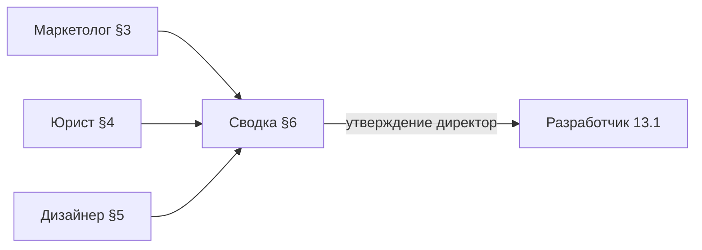

# ТЗ — public-страница проекта (A13)

**Статус:** **черновик §3 и §5** — на ревью маркетолога, юриста, директора (май 2026)  
**Инициатор:** директор (01)  
**Дата поручения:** май 2026  
**Gate:** обязательный артефакт **периода 0** до разработки A13 ([план-доработки-период-0](../../../_telotron.ru/docs/Техдок/00-мета/план-доработки-период-0.md) §1.2)

**Связь:** [План до 31.12.2026 — A13](План%20до%2031.12.2026%20—%20вехи%20и%20цели%20по%20периодам.md) · [max-бот-прод-страница](../../../_telotron.ru/docs/Техдок/03-модули/max-бот-прод-страница-и-интеграция.md) · [многозонная-платформа](../../../_telotron.ru/docs/Бизнес-требования/00-канон-mvp/многозонная-платформа.md)

---

## Поручение директора

**Прошу маркетолога (02), юриста (07) и дизайнера (08)** совместно сформировать **техническое задание** на **страницу описания проекта** на базовом домене **`telotron.ru`** (публичная зона).

**Цель страницы:** заменить заглушку «Скоро» на **рабочую** страницу сервиса к деплою **01.06.2026** — с понятным описанием продукта, юридически корректными ссылками и визуалом бренда **Телотрон**.

**Не входит в scope A13 (это ≠ C7):** полноценная маркетинговая витрина (кейсы, SEO-лендинг, блог, **блок тарифов**, форма лидов). **Тарифы на public** — вместе с системой тарифов в **периоде I** (биллинг **01.08**), не в A13.

**Ориентир готовности ТЗ:** **7 рабочих дней** с даты поручения — до передачи разработчику (задача **13.1** в плане доработки).

**Финальный владелец сборки:** директор утверждает сводный документ (§6) и передаёт разработчику.

---

## 0. Решения директора (зафиксировано, май 2026)

Ответы на уточняющие вопросы; обязательны для §3–§6 и разработки.

| # | Тема | Решение |
|---|------|---------|
| D1 | **URL страницы** | **`https://telotron.ru/`** — замена `welcome`; канонический URL для **MAX** |
| D2 | **Primary CTA** | **«Начать бесплатно»** → регистрация тренера (не «Войти») |
| D3 | **Партнёрская ссылка CTA** | Не прямой `pro.telotron.ru`, а **платформенная** ссылка админа: `purpose = platform_trainer_recruitment`, **title = «С сайта telotron»**; публичный URL **`https://telotron.ru/i/{token}`** (хаб `public.invite_hub` → Pro). Если записи нет — **создать seeder’ом** при деплое/seed |
| D4 | **Безопасность выборки ссылки** | При чтении из БД для welcome: только `platform_trainer_recruitment`, **владелец — пользователь с ролью admin/super-admin**; **не** подставлять одноимённую ссылку **тренера** (`specialist_referral`) |
| D5 | **Триал 60 дней** | **Кратко в тексте / footer**, не hero; детали — **после перехода в Pro** (регистрация) |
| D6 | **Client** | **Одна строка:** «Клиенты заходят по приглашению тренера» — отдельный блок Pro vs Client **не** нужен |
| D7 | **Тарифы** | **Не на A13**; добавить на сайт в **периоде I** вместе с системой тарифов |
| D8 | **Юр. документы на public** | **Решение юриста** в §4 с обоснованием; **акцепт** документов — **только** в Pro/Client при регистрации |
| D9 | **Визуал** | **На усмотрение дизайнера** в рамках бренда (§5); директор не фиксирует ширину колонки |
| D10 | **Аналитика** | **Нет** (Метрика/GA и т.п.) на A13 к **01.06** |
| D11 | **Канон многозонности** | Supersede формулировку «без ссылок на Pro» в [многозонная-платформа](../../../_telotron.ru/docs/Бизнес-требования/00-канон-mvp/многозонная-платформа.md): на public допустима **только** CTA через **`/i/{token}`** платформы, не прямые URL admin/client |

**Код и доки:** [api-http §10](../../../_telotron.ru/docs/Техдок/01-канон-mvp/api-http-контракт-mvp.md) · Filament **«Партнёрские ссылки администратора»** · `PlatformTrainerRecruitmentInviteUrl`

---

## 1. Контекст и ограничения

| Параметр | Значение |
|----------|----------|
| **Домен** | `telotron.ru` (prod), локально `telotron.test` |
| **Зона** | Public — без авторизации, HTTPS |
| **Аудитория страницы** | Тренеры (основная); посетители по ссылке из **MAX** (модерация бота); редко — клиенты (не путать с зоной Client) |
| **CTA** | **«Начать бесплатно»** → `https://telotron.ru/i/{token}` (§0 D3–D4); не прямой URL Pro |
| **Юрдоки** | Объём на public — **§4 юриста**; акцепт — только в Pro/Client |
| **MAX** | Канонический URL: **`https://telotron.ru/`**; явное описание сервиса в контенте |

**Текущее состояние кода:** `resources/views/welcome.blade.php` — заглушка; **не проходит A13**.

**Тон и бренд (ориентиры):** [Стартовые выводы по бренду](../../08-Дизайнер/Инструкции/Стартовые%20выводы%20по%20бренду,%20логотипу%20и%20цветам.md) · [Токены цветов](../../08-Дизайнер/Инструкции/Токены%20цветов%20—%20Pro%20и%20Client.md). На public-странице — **единый бренд «Телотрон»**, не смешивать Pro/Client как два продукта; допустима нейтральная палитра или ветка Pro как «лицо» сервиса для тренеров.

**Модель старта (май 2026):** **60 дней полного доступа** — упоминание **кратко** (§0 D5); **тарифы и цены на A13 не показываем** (§0 D7).

---

## 2. Процесс работы



| Шаг | Действие | Срок |
|-----|----------|------|
| 1 | Каждая роль заполняет **свой раздел** (§3–§5) | параллельно, ≤ 5 раб. дн. |
| 2 | Дизайнер сверяет макет/ wireframe с текстами маркетолога и блоками юриста | +1–2 дн. |
| 3 | Маркетолог проверяет финальные формулировки на ЦА | +1 дн. |
| 4 | Юрист — финальное «можно публиковать» по юридическим блокам | +1 дн. |
| 5 | Директор собирает **§6**, фиксирует канонический URL и передаёт разработчику | gate |

**Формат правок:** правки в **этом файле**; спорные пункты — в комментарии `[?]` и на weekly sync директора.

---

## 3. Раздел маркетолога (02)

**Ответственный:** маркетолог (черновик — дизайн/продукт, май 2026)  
**Статус раздела:** ☑ черновик · ☐ на ревью · ☐ согласован

### 3.1. Цель страницы и KPI

| Поле | Заполнить |
|------|-----------|
| Одна фраза — зачем страница | Публичное описание сервиса **Телотрон** для тренеров и модерации **MAX**; точка входа в регистрацию |
| Что посетитель должен **понять** за 10 секунд | **Телотрон** — сервис для **тренеров**, чтобы вести клиентов, расписание и планы; кнопка **«Начать бесплатно»** |
| **Primary CTA (директор D2)** | **«Начать бесплатно»** → партнёрская ссылка §0 D3 |
| Метрика успеха до 01.08 (если есть) | Регистрации тренеров с атрибуцией invite «С сайта telotron» *(без аналитики на странице — D10)* |

### 3.2. Целевая аудитория

| Поле | Заполнить |
|------|-----------|
| Первичная ЦА (кто) | **Соло-тренеры** и наставники: фитнес, силовые, функционал, **консультанты по питанию**; ориентир **5–30 активных клиентов**, онлайн или гибрид |
| Job-to-be-done (1–2 предложения) | Собрать работу с клиентами в одном месте: кто записан, что назначено, что клиент отметил в трекере — без хаоса в мессенджерах и таблицах |
| Что **не** обещаем на этой странице | **Тарифы и цены** (D7); медицинские услуги и «лечение»; прямой вход клиентов; ИИ, чат с поддержкой 24/7, конструктор рациона |

### 3.3. Структура контента (блоки страницы)

**Обязательный каркас (директор).** Маркетолог заполняет **черновики текстов**; юрист согласует блок MAX и footer.

| # | Блок | Заголовок (H1/H2) | Содержание (черновик) | Примечание |
|---|------|-------------------|------------------------|------------|
| 1 | Hero | **H1:** Ведите клиентов в одном сервисе | **Lead:** см. §6.2 | CTA **«Начать бесплатно»** |
| 2 | Что такое Телотрон | **H2:** Что такое Телотрон | См. **§6.2 L1** (согласовано с юристом §4.6 T-MAX) | MAX |
| 3 | Для кого / ценность | **H2:** Для кого сервис | См. **§6.2 блок 3** (вводная строка + 4 буллета) | |
| 4 | Возможности | **H2:** Что вы можете делать | См. **§6.2 блок 4** (5 пунктов) | только MVP |
| 5 | Client (одна строка) | — | **«Клиенты заходят по приглашению тренера.»** | D6, дословно |
| 6 | Footer | — | T-TRIAL + T-MED + реквизиты §4.5 + ссылки §4.1 | D5, не hero |
| — | ~~Pro vs Client блок~~ | — | **Не делаем** | D6 |
| — | ~~Тарифы~~ | — | **Период I** | D7 |

### 3.4. Микрокопи и CTA

| Элемент | Текст | Комментарий |
|---------|-------|-------------|
| `<title>` (SEO) | **Телотрон — сервис для тренеров** | 34 символа; шире «фитнес», согласовано с §3.2 |
| `meta description` | **Ведите клиентов, расписание и планы тренировок в одном сервисе. Пробный период 60 дней для новых тренеров.** | ~95 символов (§3.6.4) |
| **Primary CTA** | **«Начать бесплатно»** | href = URL из §6.3 (партнёрская `/i/{token}`) |
| Secondary | **Нет** (один primary, D2) | |
| Текст про **60 дней** | **«Новым тренерам доступен пробный период 60 дней с полным доступом к функциям сервиса. Подробные условия — после регистрации.»** | §4.6 T-TRIAL, только footer |

**Voice:** обращение к тренеру — **«вы»**; см. [Voice Pro и Client](../../08-Дизайнер/Инструкции/Voice%20Pro%20и%20Client.md).

### 3.5. Чего избегать

- [x] Обещания «медицины», диагностики, лечения  
- [x] **Тарифы и цены** на A13 (D7)  
- [x] Ссылки на **admin** и прямой `pro.` / `client.` без `/i/{token}`  
- [x] Конкурирующие CTA  
- [x] **Аналитика** на странице (D10)

**Подпись маркер:** _________________ **Дата:** _______

---

### 3.6. Требования к текстам (канон для ТЗ)

**Назначение:** единые правила для черновиков §3.3, §3.4, §4.3 и приёмки **AC1**. Источники: [Voice Pro и Client](../../08-Дизайнер/Инструкции/Voice%20Pro%20и%20Client.md), [Проверка текстов — понятность MVP](../../08-Дизайнер/Инструкции/Проверка%20текстов%20—%20понятность%20MVP.md), [Стартовые выводы по бренду](../../08-Дизайнер/Инструкции/Стартовые%20выводы%20по%20бренду,%20логотипу%20и%20цветам.md), §0 директора.

#### 3.6.1. Аудитория и тон

| Параметр | Требование |
|----------|------------|
| **Кому пишем** | **Тренер** (фитнес, диетология — сегмент уточняет маркетолог в §3.2) |
| **Обращение** | **«Вы»** с заглавной в начале предложения; без «ты» на public |
| **Кто не адресат hero** | Клиенты — **одна** фиксированная строка (D6); не дублировать блок «для клиентов» |
| **Бренд** | **Телотрон** — единое имя сервиса; **не** два продукта «Pro и Client» в hero |
| **Подписи зон** | Допустимо **один раз** в footer или пояснении: «Телотрон Pro — для тренеров»; **запрещено** «зона Pro», «зона Client», «API», внутренние коды |

#### 3.6.2. Принципы понятности

1. **10 секунд:** посетитель понимает *что это* (платформа для тренеров) и *что делать* (CTA «Начать бесплатно»).
2. **Без контекста разработчика:** текст читается человеком, который **не** знает MVP, модулей M1–M14, Docker, PWA.
3. **Конкретика, не абстракция:** «календарь занятий», «карточка клиента», «программа тренировок» — **лучше**, чем «экосистема», «цифровизация», «комплексное решение».
4. **Один primary CTA** на странице (D2); повтор CTA в hero и sticky header — **допустимо**, второй смысл («Войти», «Тарифы») — **нет**.
5. **CTA = глагол + объект:** канон **«Начать бесплатно»**; не «Регистрация», не «Попробовать платформу» без согласования.
6. **Обещаем только то, что есть в MVP** или явно помечено «скоро»; не обещать чат, ИИ, конструктор питания, тарифы (D7).

#### 3.6.3. Требования по блокам (§3.3)

Ориентиры объёма — для mobile ~360px; длинные абзацы **разбивать** на 2–3 коротких.

| Блок | Заголовок (H1/H2) | Lead / тело | Ограничения |
|------|-------------------|-------------|-------------|
| **1 Hero** | **H1** — одна мысль, **≤ 60 символов** (ориентир) | Lead **1–2 предложения**, **≤ 220 символов** | **Без** «60 дней» в H1/lead (D5). **Без** цен. CTA под lead |
| **2 Что такое Телотрон** | H2, нейтральный («Что такое Телотрон» или аналог) | **2–4 предложения**: кто оператор сервиса, для кого, что делает платформа | **Обязательно** для **MAX** (§4.2): понятное описание сервиса без жаргона. Согласование с юристом |
| **3 Для кого / ценность** | H2 | **3–5 буллетов** или 2 коротких абзаца | Фокус **боль → результат** для тренера (время, клиенты, порядок). Без сегмента «студии» как главного |
| **4 Возможности** | H2 *(опционально)* | **3–6 пунктов**, по **≤ 80 символов** на пункт | Только функции **в MVP / близком релизе**: клиенты, календарь, программы, трекеры — **без** перечня тарифов и модулей Max |
| **5 Client** | — | **Дословно (D6):** «Клиенты заходят по приглашению тренера.» | Не расширять; без CTA для клиента |
| **6 Footer** | — | Строка про **60 дней полного доступа** + юр. блок §4 | Триал — **мелкий текст / footer**, не hero (D5). Формулировку «60 дней» согласует **юрист** |

#### 3.6.4. SEO и служебные тексты

| Элемент | Требование |
|---------|------------|
| `<title>` | **«Телотрон — …»**; **≤ 60 символов**; без «зона», без «MVP»; ключ: платформа / сервис для **тренеров** |
| `meta description` | **120–160 символов**; суть + призыв; **без** тарифов и «бесплатно навсегда» |
| `og:title` / `og:description` | По смыслу = title / description (если добавят в T2) |
| Favicon / alt логотипа | `alt="Телотрон"` |

#### 3.6.5. Терминология (канон)

**Использовать:**

| Термин | Когда |
|--------|--------|
| **Телотрон** | Название сервиса |
| **тренер** | ЦА страницы |
| **клиент** | Человек тренера (не «пользователь Client») |
| **занятие** | Встреча тренер–клиент в календаре |
| **программа тренировок** / **программа** | Назначенный план (см. [глоссарий](../../01-Директор/Инструкции/1-контекст-и-правила/Глоссарий.md)) |

**Не использовать на public:**

| Запрет | Замена |
|--------|--------|
| зона Pro / Client, PWA, API, backend | «приложение для тренеров», «личный кабинет» |
| M1, M2, модуль, MVP, A13 | — (убрать) |
| комплекс (без пояснения) | «тренировка по программе» или «программа» |
| медицина, диагностика, лечение, назначение врача | «сопровождение», «тренировки и питание» *(+ дисклеймер юриста)* |
| CRM, ERP, экосистема, стек | простые глаголы: «вести», «назначать», «смотреть» |

#### 3.6.6. Юридические и MAX-ограничения на текст

- Абзац **«Что такое Телотрон»** должен быть пригоден для **модерации MAX** как описание сервиса (§4.2).
- **Не** обещать медицинский результат; роль платформы vs договор **тренер–клиент** — формулировка **§4.3** (юрист).
- **Акцепт** оферты/ПД на public **не** требовать (D8); в тексте **не** «нажимая, вы соглашаетесь…» у primary CTA.
- **60 дней:** формулировка без двусмысленности «бесплатно навсегда»; детали условий — после перехода в Pro (D5).

#### 3.6.7. Чего избегать (дополнение к §3.5)

- [ ] Суперлативы без доказательств («лучший», «№1», «революционный»)
- [ ] Сравнение с конкурентами по имени
- [ ] Упоминание **admin**, `pro.telotron.ru`, `client.` напрямую (D11 — только `/i/{token}`)
- [ ] Два и более равнозначных CTA
- [ ] Английские вставки без необходимости (Agenda, dashboard в user-facing тексте)
- [ ] Капслок и множественные восклицательные знаки
- [ ] Текст, который **обязует** юридически сильнее, чем §4 юриста

#### 3.6.8. Критерии приёмки текстов (AC1)

| # | Критерий | Проверяет |
|---|----------|-----------|
| T1 | За **10 с** понятно: платформа для **тренеров** + есть CTA | Маркетолог |
| T2 | Тон **«вы»**; нет запретной терминологии §3.6.5 | Дизайнер / маркетолог |
| T3 | Блок **«Что такое Телотрон»** согласован с **юристом** (MAX) | Юрист |
| T4 | **Нет** тарифов, цен, hero про «60 дней» | Директор |
| T5 | Client — **ровно** одна строка D6 | Директор |
| T6 | CTA **«Начать бесплатно»**; footer про триал — §4.3 | Маркетолог + юрист |
| T7 | `<title>` и `meta description` заполнены по §3.6.4 | Разработчик / маркетолог |
| T8 | Тексты **влезают** в wireframe §5 без обрезки на 360px | Дизайнер |

#### 3.6.9. Формат сдачи черновиков

Маркетолог передаёт в §3.3 таблицу с **финальными** строками (не «уточнить») + отдельной строкой **вариант B** только для hero, если нужен выбор директору.

**Чеклист перед подписью §3:**

- [ ] Все ячейки §3.3 заполнены
- [ ] §3.6.5 — прогон на запретные слова
- [ ] Согласование с §4.3 (триал, MAX, дисклеймер)
- [ ] Прочитано вслух: «понятно тренеру без дemo продукта»

---

## 4. Раздел юриста (07)

**Ответственный:** юрист  
**Статус раздела:** ☐ черновик · ☐ на ревью · ☐ «можно публиковать»

**Поручение директора (D8):** определить, **какие** юридические элементы **обязательны на public**, если акцепт — **только в Pro/Client**. Зафиксировать решение и обоснование.

### 4.0. Решение: нужны ли юр. ссылки на public?

| Вариант | Выбор | Обоснование |
|---------|-------|-------------|
| A. Минимум (контакт оператора) | ☐ | |
| B. **Стандарт (ПД + соглашение + контакт + реквизиты + дисклеймер)** | **☑** | 152-ФЗ: доступ к политике до регистрации; идентификация оператора; доверие для MAX и тренеров; акцепт — отдельно в Pro/Client (D8) |
| C. Только в приложениях | ☐ | Недостаточно: на public уже есть технические данные (логи, cookies при появлении) и обращение посетителя |
| D. Иное | ☐ | |

**Не на public в MVP:** чекбоксы акцепта, согласие на чувствительные ПДн, правила чата (чата нет), платёжная оферта (биллинга нет), тарифы (D7).

### 4.1. Элементы на странице (по §4.0)

| # | Элемент | На public? | Где | URL (шаблон) | Версия |
|---|---------|------------|-----|--------------|--------|
| 1 | Политика конфиденциальности | **Да** | Footer, ссылка | `https://telotron.ru/legal/privacy` *(или иной стабильный путь — зафиксировать)* | v1.0 + дата на странице документа |
| 2 | Пользовательское соглашение | **Да** | Footer, ссылка | `https://telotron.ru/legal/terms` | v1.0 + дата |
| 3 | Контакт оператора / поддержки | **Да** | Footer | email **или** ссылка «Обратная связь» / «Запрос по ПДн» на публичную форму *(без отдельного ящика, который никто не мониторит)* | — |
| 4 | Реквизиты оператора (ИП) | **Да** | Footer (компактно) или ссылка «Реквизиты» | см. §4.5 | — |
| 5 | Дисклеймер «не медицинский сервис» | **Да** | Footer, 1–2 строки | — | см. §4.6 |
| 6 | Согласие на обработку ПДн (отдельный документ) | **Нет** *(ссылка опциональна)* | Только если юрист потребует дубль в footer | `…/legal/personal-data-consent` | Акцепт — в Pro/Client |
| 7 | Правила чата | **Нет** | — | — | Чат в MVP отсутствует |
| 8 | Оферта на оплату / тарифы | **Нет** | — | — | Период I / биллинг |

### 4.2. MAX

| Требование | Как закрываем |
|------------|---------------|
| Описание сервиса понятно модератору | Блок §3.3 #2 + абзац §4.6 (нейтральный, без медицины) |
| URL стабилен, HTTPS, без auth | **`https://telotron.ru/`** (D1) |
| Нет запрещённого контента | Ревью маркетолог + юрист §3.5 |

### 4.3. Требования к **отдельным юридическим документам** (публикуются по ссылкам)

Юрист готовит тексты по [Юридический пакет v0](../../07-Юрист/Инструкции/Юридический%20пакет%20v0%20для%20пилота.md). Для A13 обязательны **минимум два** полных документа к деплою **01.06**:

| Документ | Обязателен к A13 | Что должно быть внутри (минимум) |
|----------|------------------|----------------------------------|
| **Политика конфиденциальности** | **Да** | Оператор (ИП, ИНН, адрес, контакт); цели и категории ПДн по факту MVP; сроки хранения; права субъекта; субпроцессоры; трансграничность/хостинг; **канал ПДн-запросов** (форма в продукте + публичная форма); исключение для audit/security-логов (12 мес, минимизация) |
| **Пользовательское соглашение** | **Да** | Роль платформы (инструмент, не исполнитель услуг клиенту); договор тренер–клиент **вне** платформы; правила аккаунта; запреты; ИС; ограничение ответственности; применимое право *(блок юриста)*; **без** цен и тарифов на A13 |
| Согласие на обработку ПДн | К публикации **до** регистрации Pro, на public — **ссылка не обязательна** | Текст для акцепта в Pro/Client; согласован с политикой |
| Согласие на чувствительные данные | **Не на public** | Акцепт при первом использовании трекера/веса (как решит юрист) |
| Правила чата | **Нет** | До появления M3 |
| Платёжная оферта | **Нет** | До биллинга |

**Формат страницы документа:** HTML на public-домене; в шапке документа — **номер редакции** и **дата вступления в силу**; без авторизации; ответ **200** (критерий T5 / AC2).

### 4.4. Требования к **текстам на самой landing** (inline, не полные документы)

Тексты готовит **юрист** (согласование с маркетологом по тону). Разработчик вставляет **утверждённые** строки из §6.2.

| # | Блок | Где на странице | Требования к содержанию | Лимит / формат |
|---|------|-----------------|-------------------------|----------------|
| L1 | **Описание сервиса (MAX)** | §3.3 блок «Что такое Телотрон» | Платформа для **тренеров** ведения клиентов: расписание, планы, напоминания, базовый трекер; **не** медицинский сервис; клиенты — по приглашению тренера (D6) | 400–800 знаков; без «лечение», «диагноз», «гарантированный результат» |
| L2 | **Роль платформы** | Внутри L1 или отдельным предложением | Телотрон — **информационный инструмент**; услуги клиенту оказывает **тренер**, не оператор платформы | 1–2 предложения |
| L3 | **Триал 60 дней** | **Только footer** (D5), не hero | «Пробный период … дней с полным доступом к функциям сервиса»; **без** «пилотной версии», цен, тарифов; подробные условия — после регистрации | ≤ 200 знаков; формулировку утверждает юрист |
| L4 | **Дисклеймер «не медицина»** | Footer | Не ставит диагнозов, не назначает лечение, не заменяет врача; рекомендации — образ жизни/тренировки/питание | 1–2 строки; см. черновик §4.6 |
| L5 | **Реквизиты ИП** | Footer | См. §4.5 — только разрешённые к публикации поля | Компактный блок |
| L6 | **Клиенты** | Одна строка (D6) | **«Клиенты заходят по приглашению тренера.»** (дословно D6, не «подключаются… своего») | 1 предложение |
| L7 | **Обработка ПД (отсылка)** | Footer рядом со ссылкой на политику | Не дублировать политику; достаточно ссылки «Политика конфиденциальности» | Без отдельного абзаца, если есть ссылка |

**Запрещено на landing (§3.5 + юрист):** медицинские обещания; цены и тарифы; гарантии результата; упоминание роли **менеджера**; встроенный чат; обязательные чекбоксы согласий.

### 4.5. Реквизиты оператора на public (ИП)

**Публиковать** (по выписке ЕГРИП; сверить ОГРНИП перед публикацией):

| Поле | Значение (черновик) | На public |
|------|---------------------|-----------|
| Наименование | **ИП Русаков Алексей Павлович** | Да |
| ИНН | **231102447066** | Да |
| ОГРНИП | **319237500143424** *(проверить по выписке; при расхождении с ЕГРИП — исправить)* | Да |
| Адрес | **Краснодарский край, г. Краснодар, ст. Елизаветинская** *(уточнить формулировку по выписке)* | Да |
| Контакт | Email / ссылка на форму *(TBD)* | Да |

**Не публиковать:** пол, гражданство, дата регистрации ИП, паспортные данные, личный мобильный, банковские реквизиты (до появления оплат).

**Черновик блока footer:**

> ИП Русаков Алексей Павлович · ИНН 231102447066 · ОГРНИП 319237500143424  
> Адрес: … · Контакт: …

### 4.6. Черновики формулировок (на утверждение юристом)

| ID | Назначение | Черновик текста | Статус |
|----|------------|-----------------|--------|
| T-MAX | Абзац для MAX / «Что такое Телотрон» | = §6.2 блок 2 (абзац) | ☐ утверждено |
| T-TRIAL | Footer, триал | = §6.2 T-TRIAL | ☐ утверждено |
| T-MED | Footer, дисклеймер | «Сервис не является медицинским и не заменяет консультацию врача. Рекомендации носят информационный характер.» | ☐ утверждено |
| T-ROLE | Роль платформы | «Оператор платформы не является стороной договора между тренером и клиентом на оказание услуг.» | ☐ утверждено *(можно в ПСогл + кратко на landing)* |

### 4.7. Регистрация и акцепт

| Вопрос | Решение |
|--------|---------|
| Акцепт юрдокументов на public | **Нет** — без чекбоксов (D8) |
| Где акцепт | Pro/Client при регистрации: **одна галка** + список ссылок на документы *(если юрист подтвердит)* |
| CTA с landing | **«Начать бесплатно»** → `/i/{token}` платформы (D3) |

### 4.8. Приёмка юридического блока (AC2)

- [ ] Footer содержит ссылки на политику и пользовательское соглашение (200).
- [ ] На страницах документов указаны редакция и дата.
- [ ] Реквизиты ИП соответствуют выписке ЕГРИП.
- [ ] Дисклеймер T-MED на странице.
- [ ] Нет чекбоксов акцепта на public.
- [ ] Нет тарифов, цен, медицинских обещаний.
- [ ] Абзац T-MAX согласован для модерации MAX.

**Подпись юриста:** _________________ **Дата:** _______ **«Можно публиковать»:** ☐

---

## 5. Раздел дизайнера (08)

**Ответственный:** дизайнер (08)  
**Статус раздела:** ☑ wireframe / требования · ☐ макет Figma · ☐ согласован

**Поручение директора (D9):** каркас зафиксирован ниже; отклонения — только с согласованием директора.

### 5.1. Принципы визуала

| Параметр | Решение |
|----------|---------|
| **Тема** | Класс **`theme-pro`** на `<html>` или корневой обёртке ([Токены Pro](../../08-Дизайнер/Инструкции/Токены%20цветов%20—%20Pro%20и%20Client.md): `background` #F8FAFC, `primary` #1D4ED8) |
| **Не использовать** | Градиентный backdrop, noise, «стеклянная» карточка 640px из старого `welcome.blade.php` |
| **Логотип** | `/brand/logo.png`, 40×40, `alt="Телотрон"`, стиль `.telotron-public-header__logo` |
| **Типографика** | **Geist** из `resources/css/app.css`; H1/H2 — `telotron-h1` / `telotron-h2`; body — `telotron-body-sm` |
| **Единство** | Шапка — как [TelotronPublicHeader](../../08-Дизайнер/Инструкции/Задание%20разработчику%20—%20единый%20стиль%20install%20и%20auth.md); CTA — pill primary, `min-height: var(--btn-h)` |
| **Колонка** | `max-width: 40rem`, `mx-auto`, padding `--page-px` |
| **Тексты** | Только **§6.2**; на 360px — сокращать текст, не body &lt; 14px |

### 5.2. Wireframe (финальный каркас)

Одна колонка (не лендинг C7 на всю ширину).

```
┌──────────────────────────────────────┐
│ [logo] Телотрон     [Начать бесплатно]│  CTA в header только ≥640px
├──────────────────────────────────────┤
│ H1 + lead                            │
│ [ Начать бесплатно — full width ]    │
├──────────────────────────────────────┤
│ H2 Что такое Телотрон · абзац L1    │
│ H2 Для кого · буллеты                │
│ H2 Что вы можете · 5 пунктов         │
│ caption: клиенты по приглашению      │
├──────────────────────────────────────┤
│ footer: триал · дисклеймер · ссылки  │
│ реквизиты ИП                         │
└──────────────────────────────────────┘
```

| Зона | Desktop (≥640px) | Mobile (~360px) |
|------|------------------|-----------------|
| Header | Logo + «Телотрон»; CTA pill справа | Logo + название; **без** CTA в header |
| Hero | H1 + lead + CTA (max-width 20rem) | CTA **full-width** |
| Секции 2–4 | Stack, gap `--section-gap` | То же |
| Footer | `border-t`, `text-xs`/`text-sm`, muted | То же |

### 5.3. Компоненты (Blade / CSS)

| Элемент | Спецификация |
|---------|----------------|
| Страница | `lang="ru"`, `theme-pro`, `@vite` + `app.css` |
| Обёртка | `.telotron-public-wrap`: `min-h-dvh`, `bg-background`, без backdrop |
| Header | `partials/telotron-public-header` **без** подписи «Pro»; flex + CTA desktop |
| Списки | `TelotronCard` или `<ul>` + Lucide 20px `text-primary` |
| Footer links | `text-sm text-primary`; Политика · Соглашение · контакт |
| Иконки в H1 | **Запрещены** |

### 5.4. Иллюстрации

Скриншоты приложения и `og:image` — **не блокер** A13; допустим только логотип.

### 5.5. Handoff разработчику

- [ ] Тексты — **§6.2**
- [ ] CTA → `/i/{token}` §6.3, не `pro.telotron.ru`
- [ ] Footer §4.1 (5 элементов)
- [ ] 360px и 1280px без горизонтального скролла
- [ ] `<meta name="theme-color" content="#1D4ED8">`

**Подпись дизайнера:** _________________ **Дата:** _______

---

## 6. Сводная спецификация для разработчика

**Статус:** ☑ черновик контента и дизайна · ☐ утверждено директором · ☐ передано в разработку

### 6.1. Маршруты и URL

| Маршрут | Назначение | MAX |
|---------|------------|-----|
| `GET /` | Страница проекта | **да** |
| `GET /i/{token}` | Хаб приглашений | нет |

**Prod URL для MAX:** `https://telotron.ru/`

### 6.2. Контент страницы (копипаст для Blade)

**Правило:** в вёрстку — **дословно**; правки только через ревью §3 / §4.

#### Meta

| Ключ | Текст |
|------|-------|
| `<title>` | Телотрон — сервис для тренеров |
| `meta description` | Ведите клиентов, расписание и планы тренировок в одном сервисе. Пробный период 60 дней для новых тренеров. |
| `og:title` | = title |
| `og:description` | = meta description |

#### Блок 1 — Hero

| Элемент | Текст |
|---------|-------|
| **H1** | Ведите клиентов в одном сервисе |
| **Lead** | Приглашайте клиентов, ведите расписание занятий, назначайте планы тренировок и питания файлами. Всё для ежедневной работы с клиентской базой — без таблиц и разрозненных переписок в мессенджерах. |
| **CTA** | Начать бесплатно |

#### Блок 2 — Что такое Телотрон (L1 / T-MAX)

| Элемент | Текст |
|---------|-------|
| **H2** | Что такое Телотрон |
| **Абзац** | Телотрон — онлайн-сервис для фитнес-тренеров и специалистов по питанию: ведение клиентской базы, расписание занятий, назначение планов тренировок и питания файлами, напоминания и базовый учёт показателей клиента. Сервис не оказывает медицинские услуги. Оператор платформы не является стороной договора между тренером и клиентом на оказание услуг. |

#### Блок 3 — Для кого

| Элемент | Текст |
|---------|-------|
| **H2** | Для кого сервис |
| **Вводная строка** | Если вы ведёте клиентов один на один или небольшой группой — Телотрон помогает держать расписание и назначения под контролем. |
| **Буллет 1** | Список клиентов и приглашения по ссылке |
| **Буллет 2** | Календарь и запись на занятия |
| **Буллет 3** | Планы тренировок: назначение файла и отметки клиента в трекере дня |
| **Буллет 4** | План питания файлом и заметки о питании в трекере дня |

#### Блок 4 — Возможности

| Элемент | Текст |
|---------|-------|
| **H2** | Что вы можете делать |
| **Пункт 1** | Пригласить клиента и видеть его в одном списке |
| **Пункт 2** | Запланировать занятие и отправить напоминание |
| **Пункт 3** | Загрузить план тренировок файлом и назначить его клиенту |
| **Пункт 4** | Отправить план питания файлом |
| **Пункт 5** | Смотреть отметки клиента в трекере за день |

#### Блок 5 — Клиенты (D6)

| Текст |
|-------|
| Клиенты заходят по приглашению тренера. |

#### Footer (inline)

| ID | Текст |
|----|-------|
| T-TRIAL | Новым тренерам доступен пробный период 60 дней с полным доступом к функциям сервиса. Подробные условия — после регистрации. |
| T-MED | Сервис не является медицинским и не заменяет консультацию врача. Рекомендации носят информационный характер. |
| Ссылки | Политика конфиденциальности · Пользовательское соглашение · *(контакт — §4.5)* |
| Реквизиты | ИП Русаков Алексей Павлович · ИНН 231102447066 · ОГРНИП 319237500143424 · Адрес: Краснодарский край, г. Краснодар, ст. Елизаветинская · Контакт: *(TBD)* |

**Вариант B (hero, на выбор директора):** H1 — **Телотрон — рабочее место тренера**; lead без изменений.

### 6.3. Партнёрская ссылка «С сайта telotron»

| # | Требование |
|---|------------|
| S1 | **Seeder:** `platform_trainer_recruitment`, **title = «С сайта telotron»**, владелец — admin |
| S2 | **Welcome:** выборка только admin + `platform_trainer_recruitment` + точный title (D4) |
| S3 | href CTA = `https://telotron.ru/i/{token}` |
| S4 | Нет записи — лог ops; fallback при реализации (не битая ссылка) |

### 6.4. Ссылки (prod)

| Назначение | URL |
|------------|-----|
| CTA «Начать бесплатно» | `/i/{token}` §6.3 |
| Политика конфиденциальности | `https://telotron.ru/legal/privacy` |
| Пользовательское соглашение | `https://telotron.ru/legal/terms` |
| Контакт / ПДн-запрос | *(email или URL публичной формы — §4.5)* |

### 6.5. Технические требования

| # | Требование |
|---|------------|
| T1 | Blade welcome (+ controller для CTA URL) |
| T2 | HTTPS; title, description, favicon |
| T3 | Адаптив 360px+ |
| T4 | Без аналитики (D10) |
| T5 | Без тарифов (D7) |
| T6 | Smoke: `/` 200; CTA → `/i/{token}` → 302 Pro |

**Задачи:** [план-доработки-период-0 §1.2](../../../_telotron.ru/docs/Техдок/00-мета/план-доработки-период-0.md) · **разработчик:** [Задание A13](../../../Команда/03-Разработчик/Инструкции%20разработка/Задание%20—%20public-страница%20A13%20(период%200).md) · **дизайн v2:** [вёрстка](../../../Команда/08-Дизайнер/Инструкции/Задание%20разработчику%20—%20public-страница%20A13%20вёрстка%20и%20дизайн%20v2.md)

### 6.6. Приёмка

| # | Критерий | Проверяет |
|---|----------|-----------|
| AC1 | Тексты §3 + **§3.6** (T1–T8) | Маркетолог |
| AC2 | Юр. §4 | Юрист |
| AC3 | Визуал §5 | Дизайнер |
| AC4 | CTA = admin platform link | Dev + директор |
| AC5 | A13 + HTTPS | Тестировщик / сисадмин |

**Утверждение директора:** _________________ **Дата:** _______

---

## 7. Журнал

| Дата | Событие |
|------|---------|
| 2026-05 | Поручение: маркетолог + юрист + дизайнер |
| 2026-05 | **§3.6** — требования к текстам (канон для черновиков и AC1) |
| 2026-05 | Ревью §6.2 — [Ревью текстов A13](../../08-Дизайнер/Инструкции/Ревью%20текстов%20—%20public-страница%20A13.md); правки title, L1, триал, буллет 2 |
| 2026-05 | **§4** — требования к юридическим текстам (public vs документы, реквизиты ИП, черновики T-MAX / T-MED / T-TRIAL) |
| 2026-05 | **§6.2** — правки текстов по ревью: MVP (планы файлом, без «упражнений»), T-TRIAL без «пилотной версии», lead про мессенджеры |
| 2026-05-21 | **§6** — ссылка на [Задание разработчика A13](../../03-Разработчик/Инструкции%20разработка/Задание%20—%20public-страница%20A13%20(период%200).md) |
