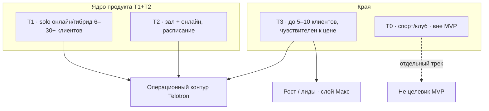

# Обзор интервью · структура болей (для Дмитрия Рябко)

| Поле | Значение |
|------|----------|
| **Статус** | рабочий обзор · июль 2026 |
| **Аудитория** | Дмитрий Рябко · стратегия / co-promo Telotron |
| **Конфиденциальность** | внутреннее · не для публичной рассылки |
| **Основатель** | Алексей Русаков |

> Сводка по **исследованиям до пилота** (май–июнь 2026) + **первая входная анкета пилота** (Алексей, 30.06). Не финальная статистика: **10 респондентов**, из них **4 глубинных интервью**, **5 анкет MVP**, **1 пилотная анкета**.

**Связь:** [Сотрудничество — Дмитрий Рябко](Сотрудничество%20—%20Дмитрий%20Рябко.md) · детали в [`Обобщение интервью`](../../03-Разработчик/Исследования/Интервью/Обобщение%20интервью/) · [сегментация MVP-3](../../03-Разработчик/Исследования/Интервью/Сегментация/Сегментация%20тренеров%20(MVP-3).md)

---

## 1. Зачем этот документ

Показать **не список цитат**, а **каркас болей**: что повторяется, для кого критично, что ложится на продукт Telotron, а что — на отдельный слой «роста» (тариф Максимальный, маркетинг).

---

## 2. Кто опрошен

| # | Имя | Тип | Сегмент | Fit | Ссылка |
|---|-----|-----|---------|-----|--------|
| 1 | **Катя** | глубинное | T1 | ядро | [обобщение](../../03-Разработчик/Исследования/Интервью/Обобщение%20интервью/Катя%20—%20обобщение%20интервью%20(анализ%20ЦА).md) |
| 2 | **Павел** | глубинное | T1 | ядро | [обобщение](../../03-Разработчик/Исследования/Интервью/Обобщение%20интервью/Павел%20—%20обобщение%20интервью%20(анализ%20ЦА).md) |
| 3 | **Максим** | глубинное | T2 | высокий | [обобщение](../../03-Разработчик/Исследования/Интервью/Обобщение%20интервью/Максим%20—%20обобщение%20интервью%20(анализ%20ЦА).md) |
| 4 | **Валера** | глубинное | **T0** | вне MVP | [обобщение](../../03-Разработчик/Исследования/Интервью/Обобщение%20интервью/Валера-Саркисян_1%20—%20обобщение%20интервью%20(анализ%20ЦА).md) |
| 5 | **Анатолий** | анкета Forms | T1 | высокий | [обобщение](../../03-Разработчик/Исследования/Интервью/Обобщение%20интервью/Анатолий%20—%20обобщение%20анкеты%20(Google%20Forms).md) |
| 6 | **Татьяна** | анкета Forms | T1/T3 | средний | [обобщение](../../03-Разработчик/Исследования/Интервью/Обобщение%20интервью/Татьяна%20—%20обобщение%20анкеты%20(Google%20Forms).md) |
| 7 | **Олеся** | анкета Forms | T2 | средний | [обобщение](../../03-Разработчик/Исследования/Интервью/Обобщение%20интервью/Олеся%20—%20обобщение%20анкеты%20(Google%20Forms).md) |
| 8 | **Дарья** | анкета Forms | T3 | слабый | [обобщение](../../03-Разработчик/Исследования/Интервью/Обобщение%20интервью/Дарья%20—%20обобщение%20анкеты%20(Google%20Forms).md) |
| 9 | **Илья** | анкета Forms | слабый | офлайн/дети | [обобщение](../../03-Разработчик/Исследования/Интервью/Обобщение%20интервью/Илья%20—%20обобщение%20анкеты%20(Google%20Forms).md) |
| 10 | **Алексей** (Подмосковье) | **анкета пилота** | T3 | пилот | [обобщение](../../03-Разработчик/Исследования/Интервью/Обобщение%20интервью/Алексей%20(Подмосковье)%20—%20обобщение%20анкеты%20пилота.md) |

**Пилотная анкета (ответы):** [Google Sheet](https://docs.google.com/spreadsheets/d/1VrFQBMbpILYOi8a1JrTd8xgWNoGcZNHrfHDYVpXGbCw/edit?gid=1895221138)

---

## 3. Сегменты (упрощённо)

| Код | Кто | Главный язык боли |
|-----|-----|-------------------|
| **T1** | Катя, Павел, Анатолий (+ частично Татьяна) | «Всё размазано» + ручная рутина + удержание |
| **T2** | Максим, Олеся | Расписание, запись, отмены, группы |
| **T3** | Дарья, Илья, **Алексей** | Мало клиентов, простота, низкий порог, не VPN |
| **T0** | Валера | План–факт тренировки, не админка CRM |

**Для co-promo:** основной нарратив Telotron бьёт в **T1+T2**; у **T3** (в т.ч. Алексей) часто доминирует **привлечение**, не «CRM».

---

## 4. Каркас болей (7 блоков)

Ниже — **структура**, в которую укладываются ответы. Сила: **●●●** часто / **●●○** несколько раз / **●○○** единично.

### 4.1. Фрагментация («нет единого места»)

**Суть:** клиент, план, отчёт, оплата, переписка — в разных приложениях.

| Сила | Кто |
|------|-----|
| ●●● | Катя, Павел, Максим, Анатолий, Дарья, Татьяна |
| ●○○ | Олеся (частично «в одном месте»), Илья |

**Продукт:** единая карточка клиента, план, отчётность в приложении — **ядро MVP**.

---

### 4.2. Ручная рутина и «склейка» данных

**Суть:** таблицы, переносы, рассылки, ручной контроль оплат и отчётов.

| Сила | Кто |
|------|-----|
| ●●● | Катя, Павел, Татьяна |
| ●●○ | Максим, Анатолий, Илья, Олеся |

**Продукт:** автонапоминания, структурированный ввод клиентом, статусы в карточке.

---

### 4.3. Расписание · запись · отмены

**Суть:** сверка слотов, потери от отмен, ручное формирование расписания.

| Сила | Кто |
|------|-----|
| ●●● | Максим, Олеся |
| ●●○ | Катя (косвенно), анкета v2 (C4) |

**Продукт:** календарь M2, напоминания о занятии, учёт отмен.

---

### 4.4. Отчётность клиента (хаос в чате)

**Суть:** клиент шлёт текст/голос/фото; тренер вручную разбирает.

| Сила | Кто |
|------|-----|
| ●●● | Катя, Павел |
| ●●○ | Максим (трекеры), Дарья (прогресс не ведётся) |

**Продукт:** дневник, трекер, простые формы отчёта.

---

### 4.5. Оплаты и продления

**Суть:** задержки, ручные напоминания, нет учёта продления.

| Сила | Кто |
|------|-----|
| ●●● | Павел, Анатолий |
| ●●○ | Катя (удержание), Татьяна (оплаты из-за рубежа) |

**Продукт:** статус оплаты, напоминания (A2 — отдельное решение по глубине).

---

### 4.6. Удержание и отвал клиентов

**Суть:** срыв дисциплины, отвал после 1–6 месяцев, нет раннего сигнала.

| Сила | Кто |
|------|-----|
| ●●● | Катя, Павел |
| ●●○ | Илья (дети / родители) |

**Продукт:** сигнал «клиент молчит», напоминания, динамика.

---

### 4.7. Рост · мало клиентов · маркетинг

**Суть:** не операционка, а **поиск клиентов**, соцсети, пустые созвоны.

| Сила | Кто |
|------|-----|
| ●●● | **Алексей**, Дарья |
| ●●○ | Катя (лиды/воронка), Татьяна (делегировать продвижение) |

**Продукт:** слой **«Максимальный»** (лендинг, VK-запись, опросы) — **не ядро MVP**, но важен для **T3** и upsell.

---

### 4.8. Прочие (реже, но заметны)

| Боль | Кто | Комментарий |
|------|-----|-------------|
| Видео / медиа | Катя, Павел | Узкое место нишевых платформ |
| VPN / мессенджеры | Олеся, Дарья | MAX как альтернатива |
| Неудобный YCLIENTS и др. | Катя, Анатолий | Конкурентный фон |
| Офлайн / дети / зал | Илья, Валера | Слабый fit MVP |

---

## 5. Матрица «боль × респондент»

Легенда: **+** явно звучит · **±** косвенно · **—** нет в материале

| Боль | Катя | Павел | Макс | Анат | Татьяна | Олеся | Дарья | Илья | Алексей |
|------|:----:|:-----:|:----:|:----:|:-------:|:-----:|:-----:|:----:|:-------:|
| Фрагментация | + | + | + | + | + | ± | + | ± | — |
| Ручная рутина | + | + | + | + | + | + | ± | + | — |
| Расписание/отмены | ± | — | + | — | — | + | — | — | — |
| Отчёты в чате | + | + | ± | — | — | ± | + | — | — |
| Оплаты/продления | + | + | ± | + | ± | — | — | + | — |
| Удержание/отвал | + | + | — | — | — | ± | — | + | — |
| Мало клиентов/рост | + | — | — | — | ± | — | + | — | **+** |
| Группы/CRM глубина | ± | — | + | — | — | — | — | — | — |

**Алексей** выделяется: **карточка уже «в одном месте»**, главная боль — **поиск клиентов**, в пилоте хочет **invite + план тренировок**.

---

## 6. Что люди хотят (must-have) — сводка

| Потребность | T1 | T2 | T3 |
|-------------|----|----|-----|
| Всё в одном месте | ●●● | ●● | ● |
| Карточка + история клиента | ●●● | ●●● | ●● |
| Календарь / запись | ● | ●●● | ●● |
| План тренировок / питания | ●●● | ●●● | ●● |
| Отчёт клиента в приложении | ●●● | ●● | ● |
| Напоминания (занятие, продление, ДР) | ●● | ●●● | ● |
| Трекер (вода, шаги, сон) | ● | ●●● | ● |
| Простота, без VPN, быстрый старт | ● | ● | ●●● |
| Готовность платить ~3–5k | ●●● | ●● | ● (до 3k) |

**WTP (ориентиры из интервью):** Павел ~5k · Анатолий 3–5k · Максим 2–4k · Катя до 30k при высокой ценности · Дарья ~3k.

---

## 7. Выводы для стратегии (коротко)

1. **Продуктовое ядро** (оправдывает **Профи ~5k**): единый контур **клиент → план → отчёт → календарь → напоминание** для **T1+T2**. Это повторяется чаще всего.
2. **Второй рычаг** — **расписание и группы** (T2, Максим в пилоте).
3. **T3 / малый бизнес** (Алексей, Дарья): боль **привлечения**; операционная CRM **не всегда** главный триггер покупки. Нужен понятный **первый успех** (клиент в приложении за 15 мин) + позже слой **роста**.
4. **Не смешивать** в одном питче: «мы решим хаос ведения» и «мы приведём клиентов» — для разных сегментов.
5. **Выборка мала** (N≈10); цифры WTP и приоритеты — **гипотезы** до массовой анкеты (50+) и метрик пилота.

---

## 8. Связь с тарифами Telotron (черновик)

| Боль | Лайт | Профи | Максимальный |
|------|------|-------|----------------|
| Операционка (ядро) | урезанно | полная | полная |
| Группы | нет | да | да |
| Продления / сигналы отвала | — | да | да |
| Лиды / VK / лендинг | — | — | да (идеи в бэклоге) |

Детали обсуждаются в [T-078](../../backlog/бэклог/T-078-идеи-ограничения-тарифа-профи.md).

---

## 9. Что смотреть дальше (пилот)

| Метрика | Зачем |
|---------|--------|
| Activation: reg → реальный клиент → занятие/план | Проверка ядра T1/T2 |
| Какие разделы открывают | Отделить «красиво в ТЗ» от использования |
| Причины отказа платить после триала | Калибровка Лайт/Профи |
| Кейсы T3 (Алексей и др.) | Отдельно: пришёл ли **клиент**, а не только «удобно тренеру» |

---

## Журнал

| Дата | Запись |
|------|--------|
| 2026-07-06 | Обзор для Д. Рябко; добавлен Алексей (пилотная анкета 30.06) |
