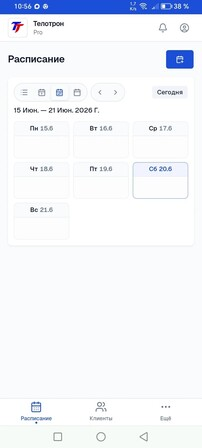
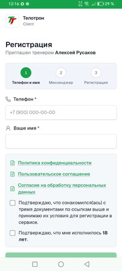

Коротко о продукте и пилоте · 2026
```{=openxml}
<w:p><w:r><w:br w:type="page"/></w:r></w:p>
```

## Знакомая картина?

- План тренировок — в одном чате, отчёт клиента — в другом, расписание — в голове или таблице.
- Клиент снова спрашивает «а где тот файл?» — вы снова пересылаете.
- Пока клиентов немного — терпимо. Потом рутина съедает время, которое хочется тратить на людей.

**Telotron** — приложение **для тренера и клиента**: расписание, планы, дневник в одном месте.  
**Не клиника и не медицина** — обычная организация вашей работы.
```{=openxml}
<w:p><w:r><w:br w:type="page"/></w:r></w:p>
```

## Что внутри

**Для вас (Pro):** календарь · клиенты · программы · планы питания · группы

**Для клиента (Client):** записи и планы · дневник · отдельное приложение · напоминания MAX/TG

Работает в браузере и **ставится на экран телефона** как обычное приложение (PWA).
```{=openxml}
<w:p><w:r><w:br w:type="page"/></w:r></w:p>
```

## Календарь

Запись, перенос и отмена — у вас и у клиента. Не нужно дублировать «на среду в 10» в пять чатов.



*Расписание в кабинете тренера.*
```{=openxml}
<w:p><w:r><w:br w:type="page"/></w:r></w:p>
```

## Клиенты и приглашение

Один **реальный** клиент принимает ссылку — и вы видите его в списке. Дальше ведёте работу в продукте, а не только в переписке.


*Ссылка или код для клиента — из раздела «Клиенты».*
```{=openxml}
<w:p><w:r><w:br w:type="page"/></w:r></w:p>
```

## Планы тренировок

Шаблон программы назначаете клиенту — он открывает план **у себя в приложении**, а не ищет PDF в Telegram.


*Шаблоны в разделе «Тренировки»; планы питания — отдельным файлом.*
```{=openxml}
<w:p><w:r><w:br w:type="page"/></w:r></w:p>
```

## Приложение клиента

Клиент регистрируется по **вашей** ссылке и работает в **Telotron Client** — отдельная иконка на телефоне.



*Так клиент видит старт: «Приглашён тренером…».*
```{=openxml}
<w:p><w:r><w:br w:type="page"/></w:r></w:p>
```

## Группы (если актуально)

Постоянная группа, участники из клиентов, групповые слоты в календаре — **на пилоте открыто на всех**.


*Создание группы и групповое занятие.*
```{=openxml}
<w:p><w:r><w:br w:type="page"/></w:r></w:p>
```

## Пилот · что предлагаем

- **Срок** — **60 дней** бесплатно, полный функционал
- **Оплата** — не раньше **01.08.2026**, карта на пилоте не нужна
- **Кого ищем** — **10–15 тренеров** со своими клиентами (очно и/или онлайн)
- **Что просим** — reg, **1 реальный клиент** в приложении, **2–4 недели** обратной связи
- **Чего не просим** — публичную рекламу и «продавать» сервис
```{=openxml}
<w:p><w:r><w:br w:type="page"/></w:r></w:p>
```

## Чего пока нет

- Оплата занятий клиентом через Telotron — в разработке.
- Чат с клиентом внутри приложения — пока привычные мессенджеры.
- SMS-коды — вход через **MAX**, **Telegram** или e-mail.

Если кнопка есть, но ведёт себя странно — **напишите нам**. Это как раз задача пилота.
```{=openxml}
<w:p><w:r><w:br w:type="page"/></w:r></w:p>
```

## Как присоединиться

1. **Короткая анкета** (3–4 мин) — чтобы понять ваш формат работы.
2. **Личная ссылка** на регистрацию — пришлём **отдельным сообщением** (адрес вида `telotron.ru/i/…`).
3. **PDF-инструкция** — пошагово: reg → первый клиент → календарь.

> **Важно:** в этой презентации **нет** ссылки на регистрацию — она **персональная**.  
> Не регистрируйтесь через `pro.telotron.ru` без ссылки из сообщения.

**Неудобно с формой?** Напишите или позвоните — проведём за **15 минут**.
```{=openxml}
<w:p><w:r><w:br w:type="page"/></w:r></w:p>
```

## Контакты

- **Алексей Русаков** — основатель, поддержка пилота
- **Телефон** — +7 (900) 255-99-40
- **VK** — [vk.com/id224642120](https://vk.com/id224642120)
- **Группа** — [Telotron · для тренеров](https://vk.com/club239586245)
- **Сайт** — [telotron.ru](https://telotron.ru/)

---

