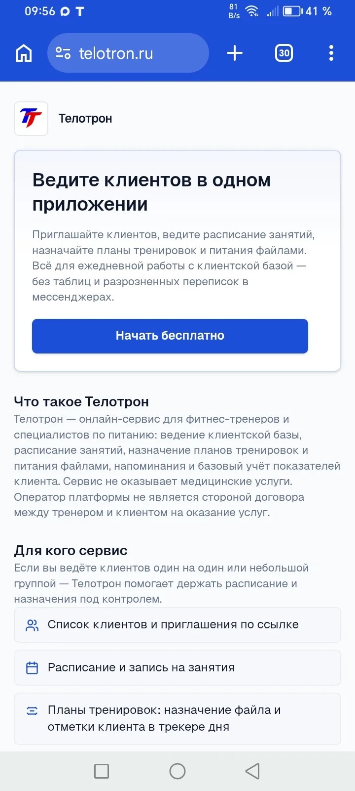
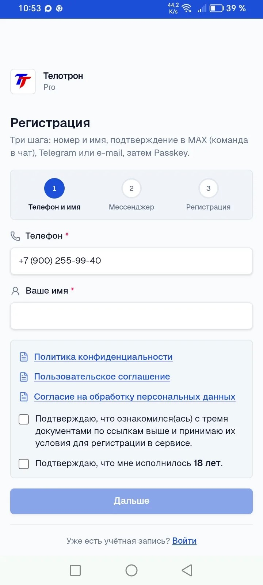
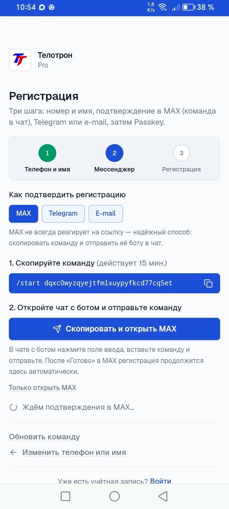
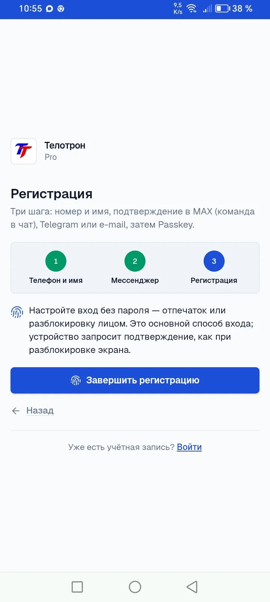
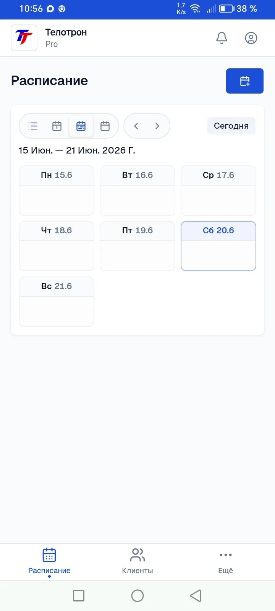

# Telotron · как начать работу (для тренера)

Простая инструкция: с нуля до первого клиента и первого занятия.

| | |
|--|--|
| **Пилот** | до **31 июля 2026** — пробный период, всё нужное для работы открыто |
| **Регистрация** | **только** по **личной ссылке** `telotron.ru/i/…` из сообщения (WhatsApp, VK, Telegram) |
| **Вход в кабинет** | [pro.telotron.ru](https://pro.telotron.ru/) — когда **уже** зарегистрировались |

> **Важно:** эта инструкция **одна для всех**. Ссылку на **первую регистрацию** мы присылаем **отдельным сообщением** — без неё начать нельзя. **Не** регистрируйтесь через `pro.telotron.ru` и **не** ищите «просто telotron.ru» в интернете.

> **Telotron** — приложение для тренера и клиента: расписание, планы, дневник. **Не врач и не клиника** — обычная организация вашей работы.

---

## Что понадобится

- Телефон (удобнее всего) или компьютер.
- **MAX** или **Telegram** — для подтверждения входа (SMS **нет**).
- **15–30 минут** на первый заход.
- **Один реальный клиент**, готовый попробовать (не «тестовый»).

Если застрянете — напишите **Алексею** (контакты в конце). Это нормально, мы на связи.

---

## Шаг 1 · Откройте вашу ссылку

1. Перейдите по **личной ссылке** из сообщения — адрес вида `telotron.ru/i/…` (WhatsApp, VK, Telegram).
2. Откроется страница Telotron с кнопкой регистрации для тренера.

*Рис. 1 — страница после перехода по ссылке.*

---

## Шаг 2 · Примите правила

1. Прочитайте короткие документы: политика, соглашение, согласие на обработку данных.
2. Поставьте галочку и нажмите **продолжить**.

Без этого регистрация **не завершится** — так требует закон.

*Рис. 2 — галочка и кнопка «продолжить».*

---

## Шаг 3 · Подтвердите телефон и создайте вход

### 3.1 Выберите способ

- **MAX** — удобнее всего, если пользуетесь.
- **Telegram** — если MAX нет.
- **E-mail** — если так проще.

### 3.2 MAX или Telegram

1. Выберите канал в форме.
2. Откройте бота **«Телотрон Pro»** (ссылка будет на экране).
3. Нажмите **«Начать»** / **Start** в боте.
4. Вернитесь на сайт — телефон привяжется.

*Рис. 3 — бот в MAX или Telegram.*

### 3.3 Passkey — вход без пароля

1. Система предложит **Passkey** (отпечаток, Face ID или ключ на телефоне).
2. Согласитесь — **пароль придумывать не нужно**.
3. Заполните **профиль**, если попросят (имя, город — по желанию продукта).

*Рис. 4 — создание входа по отпечатку / Face ID.*

**Готово:** вы зарегистрированы. Дальше кабинет открывается на [pro.telotron.ru](https://pro.telotron.ru/) — это **вход**, не первая регистрация.

Подсказки внутри приложения можно **пропустить** — сразу идите в разделы «Клиенты» и «Календарь».

---

## Шаг 4 · Поставьте на главный экран телефона

После регистрации (шаги 1–3):

1. Откройте [pro.telotron.ru](https://pro.telotron.ru/) в **Chrome** или **Safari** — вы уже должны быть внутри кабинета.
2. Нажмите **«Установить приложение»** или **«На экран Домой»**.

Так Telotron открывается как обычное приложение — быстрее, чем каждый раз искать ссылку в переписке.

*Рис. 5 — кнопка «Установить» в браузере.*

---

## Шаг 5 · Пригласите первого клиента

1. В кабинете найдите **«Пригласить клиента»** (или раздел **Клиенты**).
2. Скопируйте **ссылку** или **код** для клиента.
3. Отправьте клиенту в мессенджер — как обычно делаете.

**Важно:** пригласите **настоящего** клиента, с которым уже работаете. Так вы увидите продукт «как в жизни».

*Рис. 6 — ссылка или код для клиента.*

---

## Шаг 6 · Клиент регистрируется

Клиенту нужно:

1. Перейти по **вашей** ссылке.
2. Пройти те же шаги: правила → MAX/Telegram/e-mail → Passkey.
3. Открыть приложение **Telotron Client** (отдельная иконка / [client.telotron.ru](https://client.telotron.ru/)).

После этого клиент **привязан к вам** — он появится в вашем списке клиентов.

*Рис. 7 — как это выглядит у клиента на экране.*

**Про здоровье:** если клиент ведёт дневник (вес, питание), данные он вносит **только в приложении Client**. В MAX и Telegram **не отправляйте** замеры и медицинские подробности.

---

## Шаг 7 · Создайте занятие в календаре

1. Откройте **Календарь**.
2. Нажмите **добавить занятие**.
3. Выберите **клиента**, дату и время.
4. Сохраните.

Клиент увидит запись у себя. Вы — в своём расписании.

Можно сразу попробовать **перенести** или **отменить** занятие — так проверите, что всё понятно.

*Рис. 8 — новое занятие в календаре.*

---

## Шаг 8 · Дайте клиенту план

1. Откройте **программы тренировок** или **план питания** (файл).
2. Создайте или выберите готовое.
3. **Назначьте** клиенту.

Клиент откроет план в своём приложении — не в переписке.

*Рис. 9 — шаблон программы в разделе «Тренировки» (назначение — в карточке клиента). План питания файлом — в разделе «Планы питания».*

---

## Если ведёте группы (по желанию)

1. Создайте **группу** (название, сколько человек).
2. Добавьте **постоянных** участников из клиентов.
3. Поставьте **групповое занятие** в календаре.

*Рис. 10 — группа и групповое занятие.*

---

## Минимум за первые 2 дня

Сделайте **хотя бы это**:

| ✓ | Действие |
|---|----------|
| ☐ | Вы зарегистрировались в Pro |
| ☐ | Один **реальный** клиент принял приглашение |
| ☐ | Есть **занятие** в календаре **или** **план** клиенту |

Этого достаточно, чтобы понять, «ваше» это или нет.

---

## Что попробовать за 2–4 недели

Не обязательно всё сразу — по мере работы:

- перенос и отмена занятий;
- заметки в **карточке клиента**;
- дневник клиента (вода, еда, замеры — если актуально);
- вход с другого телефона (Passkey и восстановление через MAX/Telegram);
- кнопка **«Обратная связь»** внизу слева — если что-то непонятно или сломалось.

---

## Чего пока нет (чтобы не ждать зря)

| | |
|--|--|
| Оплата занятий клиентом через Telotron | в разработке |
| Автонапоминания о тренировке в MAX | позже |
| Чат с клиентом внутри приложения | пока общайтесь как привыкли (Telegram и т.д.) |
| SMS-коды | нет, только MAX / Telegram / e-mail |

Если кнопка есть, но работает странно — **напишите нам**. Это как раз нужно в пилоте.

---

## Как нам помочь обратной связью

Подойдёт **любой** способ:

1. Кнопка **«Обратная связь»** в кабинете.
2. Личное сообщение **Алексею**.
3. Короткий **звонок 20–30 минут** через 1–2 недели.

**Хорошо описать так:**

- что делали («пригласил клиента, поставил слот на среду»);
- что **удобно**;
- что **раздражает** или заставляет снова писать в Telegram;
- что **не получилось** (можно словами, скрин пришлёте отдельно).

Критика — **нормальна**. Вы не «тестируете нас в суде», вы помогаете сделать инструмент, которым реально пользуются.

---

## Контакты

| | |
|--|--|
| **Алексей Русаков** | основатель, поддержка пилота |
| **Телефон** | +7 (900) 255-99-40 |
| **VK** | [vk.com/id224642120](https://vk.com/id224642120) |
| **Группа** | [Telotron · для тренеров](https://vk.com/club239586245) |
| **Сайт** | [telotron.ru](https://telotron.ru/) |

---

## Для команды (не отправлять тренеру)

| Документ | Назначение |
|----------|------------|
| [Пилот — канон ссылок](Пилот%20—%20канон%20ссылок%20регистрации.md) | какой `/i/…` в какой канал |
| [T-060 Pro onboarding](../../backlog/в-работе/T-060-pro-onboarding-k-p.md) | dev: автоматизированный онбординг К+П |
| [Онбординг — инструкция для тренеров.md](Онбординг%20—%20инструкция%20для%20тренеров.md) | исходник · правки |
| [Онбординг — инструкция для тренеров.pdf](Онбординг%20—%20инструкция%20для%20тренеров.pdf) | **PDF для отправки** · сборка `build-onboarding-docx.py` |
| Папка `онбординг-тренеров/` | скрины `01_glavnaya_posle_ssylki` … `10_gruppy` |
| Папка `../Скрины/` | архив скринов с осмысленными именами |

**Activation (14 дней):** reg Pro + **реальный** клиент + календарь **или** план.
