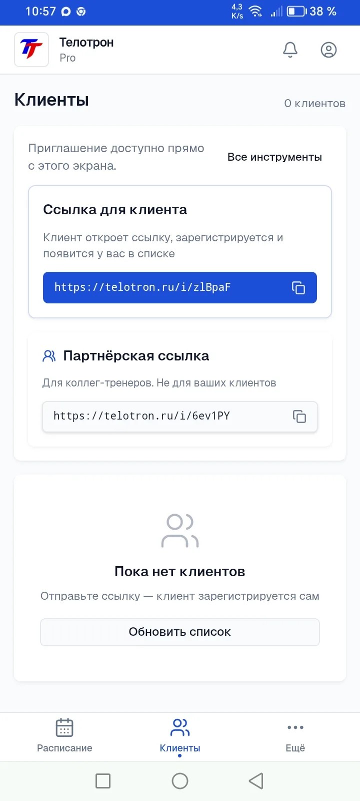
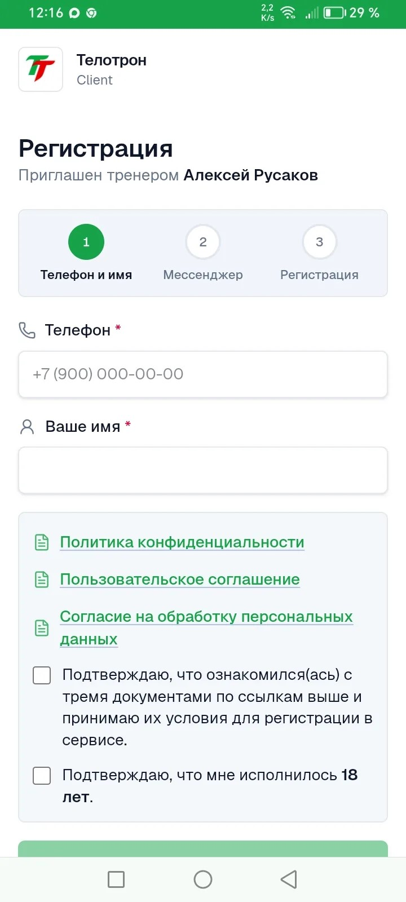
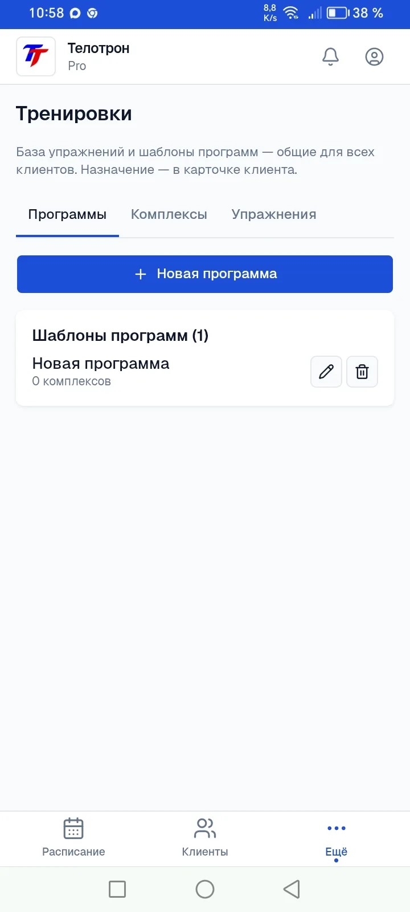
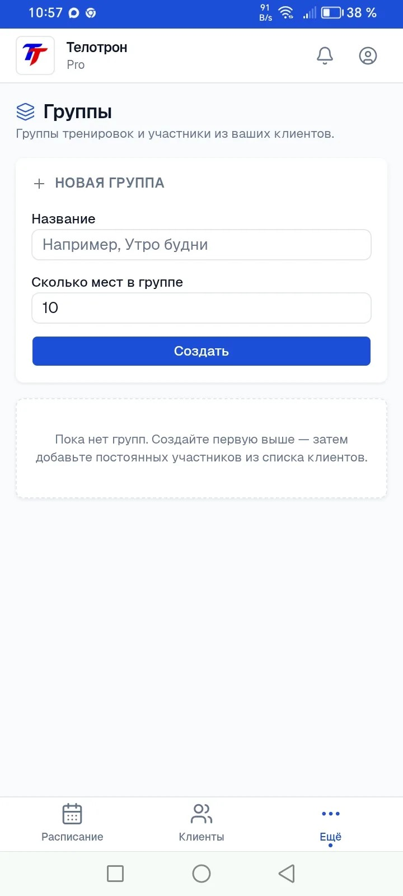

# Telotron · для тренера

Бесплатный тест-драйв · 2026

---

## Знакомая картина?

Пятница, 21:00. Клиент пишет: **«Скинь ещё раз план на следующую неделю»**. Вы ищете файл в переписке месячной давности. Второй клиент спрашивает, **во сколько завтра тренировка** — хотя вы уже договаривались. Третьему нужен отчёт по питанию — он снова в другом чате.

Пока клиентов мало — живёте в Telegram и таблицах. Когда их больше — **вы становитесь архивом переписки**, а не тренером.

> Перед запуском мы опрашивали коллег-тренеров. Чаще всего звучало: **«всё размазано — чаты, таблицы, разные сервисы»**.

**Telotron** — одно место для **вас и клиента**: расписание, планы, дневник.  
**Не клиника и не медицина** — организация вашей работы.

---

## Что меняется на практике

Не «ещё одно приложение», а меньше однотипных сообщений в день:

| Было | Стало | Что это даёт вам |
|------|--------|------------------|
| «Скинь план ещё раз» | План **всегда у клиента** в приложении | Не копаетесь в переписке — **отправили один раз** |
| «Во сколько завтра?» | Запись **видна вам обоим** в календаре | **Меньше** уточняющих сообщений про время |
| Отчёт по еде в чате | Дневник **у клиента**, вы видите сводку | Не собираете скрины и голосовые |
| «Как установить, куда нажать?» | **Одна ссылка** от вас — первый раз поможем вместе | Клиент не «отваливается» на старте |

Вы по-прежнему общаетесь в привычных мессенджерах — но **планы, записи и отчёты** не теряются в потоке сообщений.

---

## Что внутри

| Зачем вам | Как это выглядит |
|-----------|------------------|
| **Меньше пересылок** | Программы и планы питания (файлом) — **назначили один раз**, клиент открывает сам |
| **Расписание без дублей** | Календарь: запись, перенос, отмена — **у вас и у клиента** |
| **Напоминания о занятии** | За **12 часов** — в приложении клиента и в **MAX, Telegram или почте** (как он зарегистрировался) |
| **Подключение клиента** | **Одна ссылка** из кабинета — скопировали и отправили в чат |
| **Группы** | Постоянные группы и групповые занятия — **открыты на тест-драйве** |
| **Свой сервис у клиента** | Отдельное приложение Telotron на телефоне — не «очередной файл в Telegram» |

Открывается в браузере и **ставится на экран телефона** как обычное приложение — и у вас, и у клиента.

---

## Календарь и напоминания

Создали занятие — клиент видит его у себя. Перенесли или отменили — **сообщение сразу** (в приложении и в мессенджере, если он привязан).

**За 12 часов до тренировки** клиент получает напоминание и может **подтвердить выход** в приложении. Вам не нужно вручную писать «ты завтра придёшь?» каждому.

*Расписание в кабинете тренера.*

> **Честно:** всплывающие уведомления на экране телефона без открытия приложения — **в ближайших обновлениях**. Сейчас — напоминание **внутри приложения** и в **MAX, Telegram или на почте**.

---

## Подключение клиента

**Для вас — просто:** «Пригласить клиента» → скопировать ссылку → отправить в WhatsApp, Telegram или VK.

**Для клиента — первый раз около 10–15 минут:** ссылка → правила → MAX или Telegram → вход. **Первого клиента обычно проводим вместе** (в чате или на коротком созвоне) — так надёжнее, чем «разберись сам».

*Ссылка или код — из раздела «Клиенты».*

*Так старт выглядит у клиента: «Приглашён тренером…».*

---

## Планы тренировок

Собрали шаблон программы — **назначили клиенту**. Он открывает план **в своём приложении**, а не ищет PDF в переписке.

*Шаблоны в разделе «Тренировки»; назначение — в карточке клиента. План питания — отдельным файлом.*

---

## Дневник и замеры клиента

Клиент отмечает еду, воду, шаги, замеры — **в своём приложении Telotron**. Вы видите динамику в кабинете, не собирая скрины из пяти чатов.

**Важно:** замеры и подробности по здоровью — **только в приложении клиента**, не в MAX и Telegram.

---

## Группы (если ведёте групповые)

Постоянная группа, участники из клиентов, групповые занятия в календаре — **на тест-драйве всё открыто**.

*Создание группы и групповое занятие.*

---

## Бесплатный тест-драйв · условия

| | |
|--|--|
| **Срок** | **60 дней** · полный функционал |
| **Оплата** | **не раньше 01.08.2026** · **карта не нужна** |
| **Кого ищем** | тренеров со **своими** клиентами (очно и/или онлайн) — участие **бесплатное** |

**От вас — по сути три вещи:**

1. **Один реальный клиент** в приложении (не «тестовый»).
2. **Около двух недель** обычной работы — посмотреть, экономит ли время.
3. **Один созвон 15 минут** — что удобно, что мешает, что сломалось.

**Не просим:** публичную рекламу, посты, «продавать» сервис друзьям.

> Это **ранний доступ**: что-то может вести себя странно — вы нам об этом и нужны.

---

## А что после 60 дней?

- **Не понравилось** — просто перестаёте пользоваться. Никаких штрафов за отказ.
- **Понравилось** — с **01.08.2026** появятся платные тарифы. Участникам тест-драйва предложим **условия лучше**, чем «с улицы» — цену скажем заранее.
- **Карту на тест-драйве не привязываем.** О любой оплате **предупредим заранее** — решение за вами.

---

## Чего пока нет

- **Оплата** занятий клиентом через Telotron — в разработке.
- **Чат** тренер–клиент внутри приложения — пока привычные мессенджеры.
- **Всплывающие уведомления** на экране телефона без открытия приложения — в ближайших обновлениях (сейчас — внутри приложения и в MAX, Telegram или на почте).
- **Напоминания** о домашних тренировках и об оплатах — не в этом релизе.
- **СМС** — нет; вход и напоминания через **MAX**, **Telegram** или почту.

Если что-то непонятно или сломалось — **напишите**. Это нормальная часть тест-драйва.

---

## Как присоединиться

1. **Короткая анкета** (3–4 мин) — пришлём ссылку в личке *(или заполним вместе на созвоне)*.
2. **Личная ссылка** на регистрацию — **отдельным сообщением** (не ищите «просто сайт» в интернете).
3. **PDF-инструкция** — пошагово: регистрация → первый клиент → календарь.

> В этой презентации **нет** ссылки на регистрацию — она **персональная**.

**Хотите без анкеты?** Напишите **Алексею** — проведём за **15 минут** в Telegram, WhatsApp или VK и сразу дадим ссылку.

---

## Контакты

| | |
|--|--|
| **Алексей Русаков** | основатель, поддержка тест-драйва |
| **Телефон** | +7 (900) 255-99-40 |
| **VK** | [vk.com/id224642120](https://vk.com/id224642120) |
| **Группа** | [Telotron · для тренеров](https://vk.com/club239586245) |
| **Сайт** | [telotron.ru](https://telotron.ru/) |

---

## Для команды (не отправлять тренеру)

| | |
|--|--|
| **Версия** | v1.2 · 2026-06-21 · **архив** |
| **Актуальная** | [v1.3](Презентация%20—%20Telotron%20для%20тренеров%20v1.3.md) |
| **Сборка PDF** | `python3 ../../разработка/презентация/build-presentation-pdf.py` |
| **Скрины** | [скрины/](../скрины/) · 08, 06, 07, 09, 10 |
| **Воронка** | презентация → анкета → reg в личке → [онбординг PDF](../../Готовые%20документы/Онбординг%20—%20инструкция%20для%20тренеров.pdf) |
| **Reg** | [канон ссылок](../Пилот%20—%20канон%20ссылок%20регистрации.md) · только в личке |
| **Анкета** | ссылка **только в личке** · канон в [Анкета — входная перед пилотом](../../CRM/Анкета%20—%20входная%20перед%20пилотом.md) |
| **Цель набора** | 10–15 тренеров — **не** в тексте для тренера; дефицит — только в личном разговоре |
| **Напоминания** | [reminders MVP](../../../../_telotron.ru/docs/Техдок/03-модули/reminders-напоминания-о-занятиях-mvp.md) |

**Сборка PDF:** `prepare_markdown()` **отрезает всё** начиная с `## Для команды (не отправлять тренеру)` — в PDF/DOCX для тренера этого блока **нет**.

**После v1.2:** обновить `build-presentation-pdf.py` под новые слайды и трёхколоночную таблицу.
