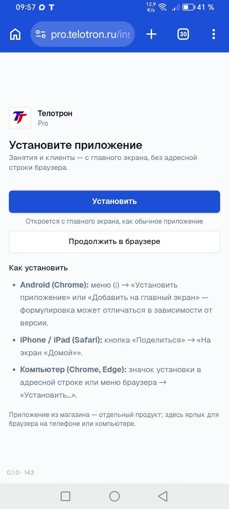
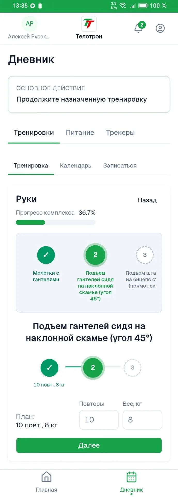
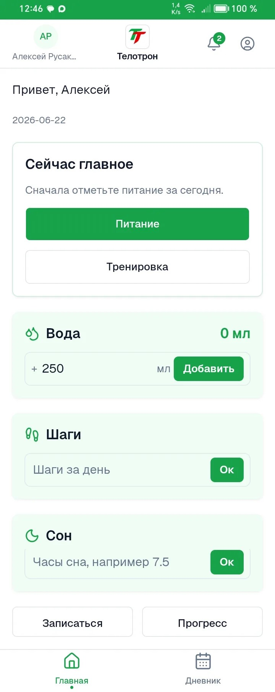

# Telotron · для тренера

## Одно место для вас и клиента

Расписание, планы тренировок, дневник — в двух приложениях: **Pro** (вы) и **Client** (клиент).

Открывается в браузере и **ставится на экран телефона** — как обычное приложение.

*Кабинет тренера: календарь занятий.*

**Не клиника и не медицина** — организация вашей работы.

---

## Знакомая картина?

Пятница, 21:00. Клиент пишет: «Скинь ещё раз план на следующую неделю». Вы ищете файл в переписке месячной давности.

Второй спрашивает, во сколько завтра тренировка. Третьему нужен отчёт по питанию — он в другом чате.

Пока клиентов мало — живёте в Telegram и таблицах. Когда их больше — вы становитесь **архивом переписки**, а не тренером.

> Перед запуском коллеги-тренеры чаще всего говорили: «всё размазано — чаты, таблицы, разные сервисы».

---

## Что меняется на практике

| Было | Стало |
|------|--------|
| «Скинь план ещё раз» | План у клиента в приложении — отправили один раз |
| «Во сколько завтра?» | Запись видна вам обоим в календаре |
| Отчёт по еде в чате | Дневник у клиента, вы видите сводку |
| «Как установить?» | Одна ссылка от вас — первый раз поможем вместе |

Общаетесь в привычных мессенджерах — но планы, записи и отчёты не теряются в потоке сообщений.

---

## Pro и Client — кто что видит

| Для вас (Pro) | Для клиента (Client) |
|---------------|----------------------|
| Календарь занятий | Ваши записи и планы |
| Клиенты и приглашения | Дневник (еда, вода, замеры — если нужно) |
| Программы тренировок | Отдельное приложение на телефоне |
| Планы питания (файлом) | Напоминания через MAX / Telegram |
| Группы и групповые занятия | |

---

## Ваш старт в Pro · около 15 минут

1. Переход по **личной ссылке** из сообщения.
2. Правила → MAX или Telegram → вход без пароля (Passkey).
3. Установка на главный экран телефона — по желанию, но удобно.

*Страница «Установите приложение» в зоне Pro.*

Пошагово — в PDF-инструкции, которую пришлём после регистрации.

---

## Календарь и напоминания

Создали занятие — клиент видит его у себя. Перенесли или отменили — клиент узнаёт сразу.

За **12 часов** до тренировки — напоминание в приложении и в MAX, Telegram или на почте (как клиент регистрировался).

> Всплывающие уведомления на экране телефона без открытия приложения — в ближайших обновлениях.

---

## Подключение клиента

**Для вас:** «Пригласить клиента» → скопировать ссылку → отправить в мессенджер.

**Для клиента:** первый раз 10–15 минут. Первого клиента обычно проводим **вместе** — в чате или на коротком созвоне.

*Ссылка — из раздела «Клиенты».*

*Старт у клиента: «Приглашён тренером…».*

---

## Планы и дневник

**Планы:** собрали программу — назначили клиенту. Он открывает её в приложении, а не ищет PDF в переписке. План питания — отдельным файлом.

**Дневник:** клиент отмечает еду, воду, замеры и выполняет назначенную тренировку у себя. Вы видите динамику в кабинете.

*Раздел «Тренировки» в Pro.*

*У клиента: назначенная тренировка, подходы и вес.*

*Главная клиента: питание, вода, шаги, сон.*

Замеры и подробности по здоровью — только в приложении клиента, не в MAX и Telegram.

---

## Группы (если ведёте групповые)

Постоянная группа, участники из клиентов, групповые занятия в календаре — на тест-драйве всё открыто.

*Создание группы и групповое занятие.*

---

## Бесплатный тест-драйв · 60 дней

- **60 дней** — полный функционал, **карта не нужна**, оплата **не раньше 01.08.2026**.
- Ищем тренеров со **своими** клиентами (очно и/или онлайн).

**От вас:**

1. Один **реальный** клиент в приложении.
2. Около **двух недель** обычной работы.
3. Один **созвон 15 минут** — что удобно, что мешает.

Не просим публичную рекламу и «продавать» сервис друзьям.

**После 60 дней:** не понравилось — просто перестаёте пользоваться. Понравилось — с 01.08.2026 появятся тарифы; участникам тест-драйва предложим условия лучше, чем «с улицы». Оплату предупредим заранее.

> Ранний доступ: что-то может вести себя странно — вы нам об этом и нужны.

---

## Чего пока нет

- Оплата занятий клиентом через Telotron — в разработке.
- Чат тренер–клиент внутри приложения — пока привычные мессенджеры.
- СМС — нет; вход и напоминания через MAX, Telegram или почту.

Если что-то непонятно или сломалось — напишите. Это нормальная часть тест-драйва.

---

## Как присоединиться

1. **Короткая анкета** (3–4 мин) — ссылку пришлём в личке *(или заполним на созвоне)*.
2. **Личная ссылка** на регистрацию — отдельным сообщением.
3. **PDF-инструкция** — регистрация → первый клиент → календарь.

> В этой презентации нет ссылки на регистрацию — она персональная.

**Без анкеты?** Напишите **Алексею** — проведём за 15 минут и сразу дадим ссылку.

---

## Контакты

| | |
|--|--|
| **Алексей Русаков** | основатель, поддержка тест-драйва |
| **Телефон** | +7 (900) 255-99-40 |
| **VK** | [vk.com/id224642120](https://vk.com/id224642120) |
| **Группа** | [Telotron · для тренеров](https://vk.com/club239586245) |
| **Сайт** | [telotron.ru](https://telotron.ru/) |

---

## Для команды (не отправлять тренеру)

| | |
|--|--|
| **Версия** | v1.3 · 2026-06-16 |
| **Предыдущая** | [v1.2](Презентация%20—%20Telotron%20для%20тренеров%20v1.2.md) |
| **Сборка PDF** | `python3 ../../разработка/презентация/build-presentation-pdf.py` |
| **Скрины** | [скрины/](../скрины/) · 05, 08, 06, 07, 09, 10, **11, 12** |
| **Воронка** | презентация → анкета → reg в личке → [онбординг PDF](../../Готовые%20документы/Онбординг%20—%20инструкция%20для%20тренеров.pdf) |
| **Reg** | [канон ссылок](../Пилот%20—%20канон%20ссылок%20регистрации.md) · только в личке |
| **Анкета** | [Анкета — входная перед пилотом](../../CRM/Анкета%20—%20входная%20перед%20пилотом.md) |
| **Изменения v1.3** | hero-скрин; 2-кол. «Было/Стало»; убран дубль «Что внутри»; слайд старта Pro; планы+дневник; укорочены пилот и «чего нет» (~12 слайдов) |

**Сборка PDF:** по умолчанию собирается **v1.3**. Аргумент: `python3 ../../разработка/презентация/build-presentation-pdf.py --version 1.2`.
