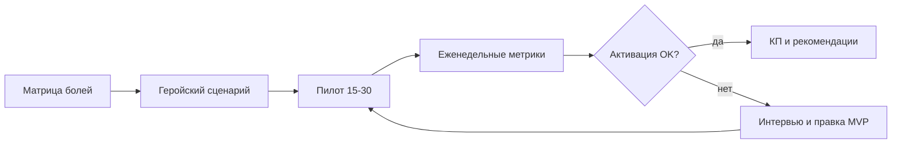

# Соответствие продукта запросам пользователей — контур валидации

**Статус:** рабочий документ, **P1** для маркетинга и продаж (май 2026).  
**Цель:** самым коротким путём приводить продукт в соответствие с реальными запросами тренеров — для **силы КП**, **удержания** и **рекомендаций**.

**Контекст оргмодели:** отдельного отдела продаж нет; продажи ведут **директор (основатель)** и **маркетолог** ([глоссарий](../../01-Директор/Инструкции/1-контекст-и-правила/Глоссарий.md)). Документ — общий контур для обеих ролей и стыка с **разработчиком** (интервью, пилот, канон в `_telotron.ru/docs/`).

**Связанные материалы:** [План работы — маркетинг и продажи](../План%20работы%20—%20маркетинг%20и%20продажи.md), [Черновик монетизации](Черновик%20монетизации.md), [MVP — модули и тарифы](../../03-Разработчик/Инструкции%20продукт/4-продукт/Функционал/MVP%20—%20модули%20и%20тарифы.md), исследования — `Команда/03-Разработчик/Исследования/Интервью/`.

---

## 1. Принцип

Не «больше фич», а **короткий цикл**:

**гипотеза → проверка на реальных тренерах → решение в каноне → релиз → измерение → правка КП**

Каждая итерация должна отвечать на три вопроса:

1. Какую **боль / job** закрываем?
2. Как это усиливает **коммерческое предложение**?
3. Какую **метрику удержания** двигаем?

---

## 2. Девять направлений усилий (по убыванию отдачи)

### 2.1. Единый источник правды о пользователе

**Проблема:** знания размазаны по интервью, анкетам, черновикам MVP и монетизации — без сводки каждая фича снова спорит с «а в интервью говорили…».

**Действия:**

- Одна **матрица болей / jobs / «готов платить за»** по сегментам (5–7 строк на сегмент достаточно для старта).
- У каждой значимой фичи в каноне — пометка **подтверждения**: *N интервью / пилот / гипотеза*.
- Правило приоритизации: в ближайший релиз — только то, что закрывает **топ-3 job** выбранного **пилотного сегмента**; остальное — backlog с меткой.

**Эффект:** меньше переделок, сильнее формулировки КП («сделано под ваш сценарий»).

---

### 2.2. Пилот как продуктовый контур, а не «выдали доступ»

**Проблема:** интервью дают намерения; удержание и сарафан — из **еженедельного использования** тренером и клиентом.

**Действия:**

- Когорта **15–30 тренеров** одного сегмента (ориентир: соло, 5–20 клиентов, онлайн/гибрид).
- Онбординг пилота: чеклист **«первые 48 часов»** (клиент → занятие → программа → клиент начал комплекс).
- **Еженедельно** — три метрики активации (см. §4).
- Короткий опрос **раз в 2 недели** (3 вопроса, не длинная анкета).

**Эффект:** видно, что из MVP реально открывают, а что «красиво в ТЗ, но не пользуются».

---

### 2.3. Один сегмент → один геройский сценарий → КП

**Проблема:** КП слабеет, когда продукт «для всех тренеров».

**Действия:**

- Выбрать **один пилотный сегмент** на 3–6 месяцев.
- Описать **один сквозной сценарий** (8–12 шагов): от регистрации до «клиент выполнил комплекс, тренер увидел в календаре».
- Лендинг, личные сообщения, демо и **краткий онбординг** — только под этот сценарий.
- Второй сегмент — после повторяемой активации в первом.

**Эффект:** понятное предложение, выше конверсия и рекомендации.

---

### 2.4. Discovery в ритме разработки

**Проблема:** после разморозки MVP легко «уплыть» от реальных запросов в объём разработки.

**Действия:**

| Ритм | Действие |
|------|----------|
| Перед спринтом / итерацией | 30 мин: какая боль / job + ссылка на матрицу |
| Во время | 2–3 прототипа на спорный UX — **5 тренеров**, не 50 |
| После релиза | 5 глубинных интервью: кто **не** активировался vs кто активировался |

**Эффект:** меньше дорогих промахов по программам, трекеру, онбордингу.

---

### 2.5. Количественный слой поверх качественного

**Проблема:** цитаты из интервью не хватают для приоритетов тарифа и масштаба КП.

**Действия:**

- Короткая **анкета v2** (закрытые вопросы, ранжирование болей) — черновик: `Команда/03-Разработчик/Исследования/Интервью/Анкета — количественная v2 (Google Forms, закрытые вопросы).md`.
- Рекрут из той же базы, что интервью (VK, чаты тренеров).
- Результат — **топ-5 болей с долями**, не только качественные цитаты.

**Эффект:** аргументы в продажах («у X% респондентов…»), приоритизация модулей тарифа.

---

### 2.6. Связка «фича → метрика → удержание»

**Проблема:** без метрик непонятно, усиливать конструктор, календарь или трекер.

**Минимальный набор для пилота** — см. §4.

**Эффект:** решения «режем / усиливаем» по цифрам, а не по громкости одного запроса.

---

### 2.7. Рекомендации как продуктовая задача

**Проблема:** сарафан редко растёт от «нравится приложение» — от **видимого результата у клиента**.

**Действия:**

- В пилоте спрашивать: показали ли клиенту прогресс так, что он похвалил?
- Закладывать смысл (даже post-MVP): **отчёт / сводка для клиента** «что сделал за неделю» — повод для рекомендации тренера.
- Партнёрка масштабируется, когда **первый сценарий** уже работает; иначе приводят аудиторию в сырой продукт.

**Эффект:** рост «тренер → тренер» без отдельного штата продажников.

---

### 2.8. Синхронизация маркетинг ↔ продукт ↔ разработка

**Ритм:** раз в **2 недели**, 30–45 мин (директор / маркетолог / разработчик).

1. Что изменилось в поведении пилота?
2. Топ-3 запроса и жалобы за период?
3. Одно решение: **в канон / в backlog / отменить**
4. Одна формулировка для **КП** на следующие 2 недели

**Эффект:** КП не обещает то, чего нет в ближайшем релизе; разработка не тянет «хотелки» без боли.

---

### 2.9. Что сознательно не делать на этом этапе

- Расширять сегменты и тарифную сетку до стабильной активации в **одном** сегменте.
- Строить чат, ИИ, воронку продаж тренера — пока не закрыт **геройский сценарий** MVP.
- Полировать UI всего приложения — сначала **install/auth → первый вход → онбординг К → первая сессия клиента**.
- Писать канон без связи с job пользователя.

---

## 3. Метрики пилота (минимум)

| Job | Прокси-метрика | Связь с удержанием |
|-----|----------------|-------------------|
| Веду клиентов | ≥3 клиента с активностью за 14 дней | Тренер «залип» в продукте |
| Даю программу | ≥1 назначенная программа + ≥1 сессия клиента | Ценность конструктора |
| Контроль без чата | Тренер открыл календарь/ленту клиента ≥2 раз/нед | Привычка Pro |
| Клиент вовлечён | Клиент: сессия или трекер еды за 7 дней | Иначе тренер уйдёт |

**Еженедельно на дашборде пилота:** активация тренера (D7), доля тренеров с ≥1 сессией клиента, возврат на 2-ю неделю.

---

## 4. План на 6–8 недель (ориентир)

| Недели | Фокус |
|--------|--------|
| 1–2 | Матрица болей + выбор сегмента + геройский сценарий + метрики |
| 3–4 | Запуск пилота 15–30 тренеров на текущем/ближайшем билде |
| Параллельно | Анкета v2 на расширенную выборку |
| 5+ | Только то, что двигает активацию и 2-ю неделю удержания |

---

## 5. Роли и ответственность

| Зона | Владелец | Вклад |
|------|----------|--------|
| Матрица болей, КП, рекрут пилота, анкета v2 | **Маркетолог** + директор | Коммерция и поле |
| Пилот: онбординг, сбор ОС, интервью | **Разработчик** (продукт) + маркетолог | Валидация и канон |
| Метрики в продукте / события | **Разработчик** | Данные для решений |
| Приоритет в каноне и релизе | **Директор** | Финальное решение |
| UX первого входа | **Дизайнер** | Конверсия в активацию |

---

## 6. Критерии успеха контура (через 8 недель)

1. Есть **актуальная матрица болей** по одному сегменту с пометками подтверждения.
2. Пилот **15+** тренеров с еженедельным учётом метрик §3.
3. **Геройский сценарий** описан и используется в КП и личных сообщениях.
4. Проведена **синхронизация** маркетинг–продукт минимум 4 раза (раз в 2 недели).
5. Запущена или завершена **анкета v2** с топ-5 болями в %.
6. Зафиксировано **одно** решение «не делаем сейчас» с обоснованием по данным пилота.

---

## 7. Открытые вопросы

- Какой **пилотный сегмент** выбрать первым (из MVP-1/2/3 и интервью)?
- Где вести **матрицу болей** (таблица, Notion, markdown в `Команда/02-Маркетолог/`)?
- Какие события уже можно считать в продукте без дeasning-аналитики?
