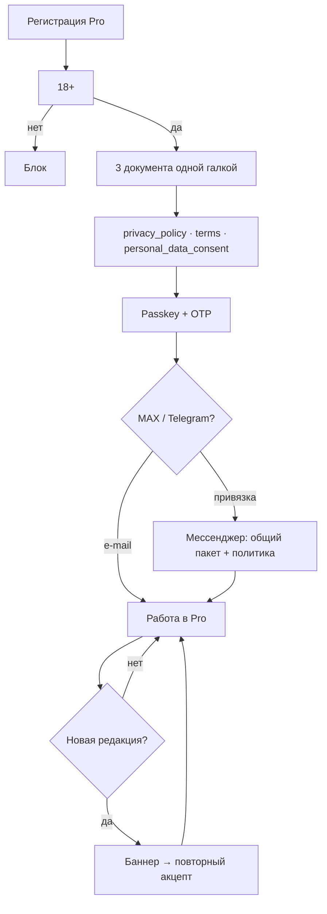
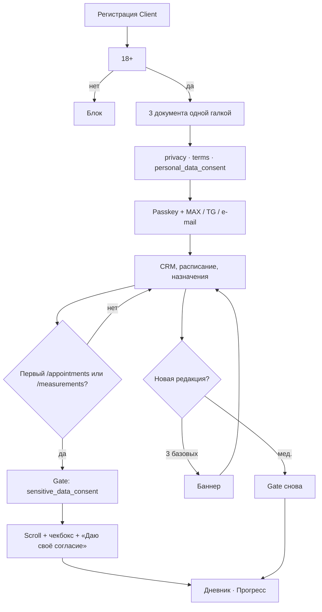
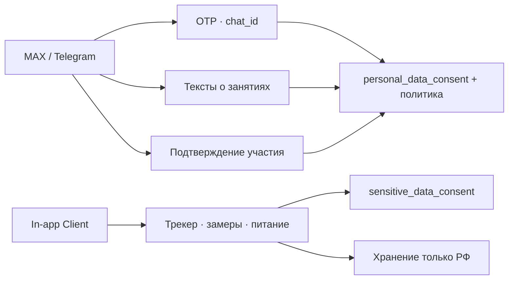

# Схема юрдокументов и этапы акцепта (Pro · Client)

Рабочий канон для A9, регистрации и gate Client.  
**Не юридическая консультация.** Тексты документов — черновики v1.0 в каталоге [07-Юрист](./); реализация — [T-007](../backlog/бэклог/T-007-legal-privacy-v1-compliance.md), [T-010](../backlog/сделано/T-010-акцепт-медицинские-pd-client.md), [T-011](../backlog/сделано/T-011-legal-acceptances-audit-поля.md).

**Обновлено:** 2026-05-24 · **v1.0** — совет проекта; **v2.0** — после юриста (**gate 01.08.2026**, приём платежей), см. [Вопросы юристу.md](./Вопросы%20юристу.md)

---

## Каталог документов

| `document_key` | Название | Где читают | Pro | Client |
|----------------|----------|------------|:---:|:------:|
| `privacy_policy` | Политика конфиденциальности | `/legal/privacy`, API | ✓ | ✓ |
| `terms_of_service` | Пользовательское соглашение | `/legal/terms`, API | ✓ | ✓ |
| `personal_data_consent` | Согласие на обработку ПДн | API (регистрация) | ✓ | ✓ |
| `sensitive_data_consent` | Согласие на обработку медицинских данных | API + экран gate | — | ✓ |
| `medical_disclaimer` | «Сервис не медицинский» | footer public; фраза в мед. согласии Client | — | — |
| `chat_rules` | Правила чата | — | — | — (чата нет в MVP) |

**Public (A13):** ссылки на политику/условия, дисклеймер в footer — **без акцепта**, только информация.

**Файлы черновиков v1.0:** см. таблицу в [Сборка-политики-v1-факты.md](./Сборка-политики-v1-факты.md) (раздел «Тексты v1.0»).

---

## Pro (тренер) — этапы акцепта

| # | Момент | Документы | UI | Контекст API |
|---|--------|-----------|-----|--------------|
| **1** | **Регистрация** | `privacy_policy`, `terms_of_service`, `personal_data_consent` | Ссылки на 3 документа + одна галка «принимаю / ознакомлен» | `registration` |
| **2** | **Привязка MAX или Telegram** (или e-mail при регистрации) | Отдельный документ **не** нужен | Deep link → бот MAX/TG | Основание: §4 общего согласия + политика §7–8 (TG — трансграничность ст. 12 для обычных ПДн) |
| **3** | **Новая редакция** | Те же 3 документа | Незакрываемый баннер в Pro | `POST /api/v1/me/legal-acceptances` |
| — | **Медицинское согласие** | **Нет** | — | Тренер не акцептует `sensitive_data_consent` |

**MAX / Telegram у тренера (канон продукта):** регистрация/авторизация (bind или OTP), сервисные тексты о **занятиях** — **обычные ПДн**, не спецкатегории из «Дневника» клиента. Приоритет канала: **MAX → Telegram → e-mail**. **SMS нет.**

---

## Client (клиент) — этапы акцепта

| # | Момент | Документы | UI | Контекст API |
|---|--------|-----------|-----|--------------|
| **1** | **Регистрация** | 3 документа (как у Pro) | Одна галка на комплект | `registration` |
| **2** | **MAX / Telegram / e-mail** | Общий пакет | Привязка бота или OTP на почту | Сервисные тексты о занятиях — **не** мед. данные |
| **3** | **Первый «Дневник»** (`/appointments`) или **«Прогресс»** (`/measurements`) | `sensitive_data_consent` | Full-screen gate: scroll, чекбокс «Ознакомлен(а)», кнопка «Даю своё согласие» | `first_sensitive_feature` |
| **4** | **Новая редакция базовых** | 3 документа | Баннер | как у Pro |
| **5** | **Новая редакция мед.** | `sensitive_data_consent` | Gate при входе в раздел | повторный акцепт |

**До шага 3:** профиль, расписание, запись на занятия, назначения — **без** ввода трекера, замеров, дневника питания.

**После шага 3:** трекер (вода/шаги/сон), замеры, заметки и фото питания — **только in-app**, хранение **в РФ**; через **MAX** и **Telegram не передаются**.

---

## Сводка: кто когда что принимает

| Документ | Pro рег. | Client рег. | Client Дневник/Прогресс | Повтор при новой редакции |
|----------|:--------:|:-----------:|:-----------------------:|:-------------------------:|
| `privacy_policy` | ✓ | ✓ | — | ✓ баннер |
| `terms_of_service` | ✓ | ✓ | — | ✓ баннер |
| `personal_data_consent` | ✓ | ✓ | — | ✓ баннер |
| `sensitive_data_consent` | — | — | ✓ | ✓ gate |
| `medical_disclaimer` | — (footer) | — (в мед. согласии) | — | v2.0: см. [Вопросы юристу](./Вопросы%20юристу.md) **п. 3** |

---

## MAX / Telegram vs медицинские данные

| Канал | Что уходит | Основание |
|-------|------------|-----------|
| **MAX** | OTP, `chat_id`, тексты о **занятиях** (не замеры/дневник) | Общее согласие + политика; v1.0: трансграничность **не** заявляем |
| **Telegram** | То же | Общее согласие + политика; возможна трансграничность (ст. 12) |
| **In-app** | Трекер, замеры, питание, фото еды | `sensitive_data_consent`; трансграничность **не** заявляется |

---

## Реализация в коде (на дату документа)

| Элемент | Статус |
|---------|--------|
| 3 документа при регистрации (Pro/Client) | **Есть** — `RegisterPage.vue` |
| Тексты v1.0 в prod / seeder | **T-007** |
| 18+ галка / блок &lt; 18 | **T-007** |
| Баннер новых редакций | **T-007** |
| Gate Client `sensitive_data_consent` | **T-010** |
| Фиксация акцепта (device_id и др.) | **T-011** |
| `medical_disclaimer` отдельный экран | **v1.0: нет** (footer + мед. согласие); юристу — [Вопросы юристу.md](./Вопросы%20юристу.md) **п. 3** |

---

## Связанные документы

- [Сборка-политики-v1-факты.md](./Сборка-политики-v1-факты.md) §4.3, 4.8, блок 6.2 (Telegram)
- [Согласие на обработку медицинских данных v1.0 — черновик.md](./Согласие%20на%20обработку%20медицинских%20данных%20v1.0%20—%20черновик.md)
- [Ревью — согласие медицинские ПДн v1.0 (2026-05-24).md](./Ревью%20—%20согласие%20медицинские%20ПДн%20v1.0%20(2026-05-24).md)
- [Глоссарий — «Согласие на обработку медицинских данных»](../01-Директор/Инструкции/1-контекст-и-правила/Глоссарий.md)
