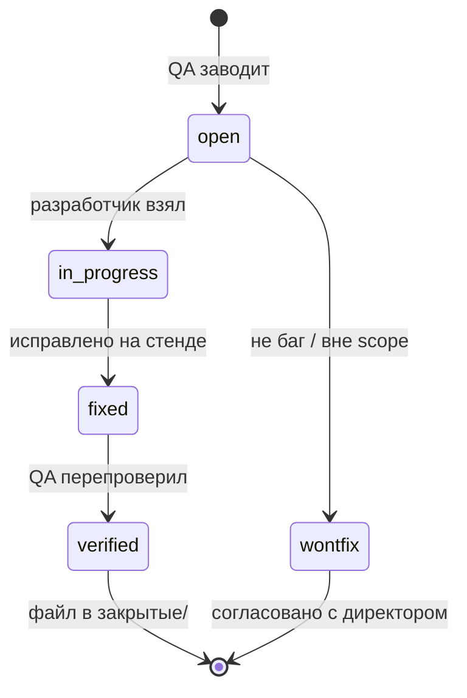

# Багтрекер (роль 09)

Канон оформления: [Оформление дефектов](../Инструкции/Оформление%20дефектов.md).

## Структура

| Каталог | Содержимое |
|---------|------------|
| `открытые/` | Активные дефекты (open, in_progress, fixed — ждёт verified) |
| `закрытые/` | verified, wontfix — после перепроверки QA |

При использовании **GitHub Issues** в `_telotron.ru`: в файле достаточно ссылки `Issue #N` и краткого резюме; полное описание — в issue. Не дублировать два полных текста.

## Имя файла

```text
YYYY-MM-DD-<модуль>-<номер>-<кратко-латиницей>.md
```

Примеры: `2026-05-21-M2-001-calendar-409-no-message.md`, `2026-05-22-M0-002-passkey-session-lost.md`

Номер `<001>` — порядковый в рамках дня и модуля.

## Поля в шапке (обязательно)

Копировать из [_шаблон.md](_шаблон.md):

- **Статус:** `open` | `in_progress` | `fixed` | `verified` | `wontfix`
- **Приоритет:** `blocker` | `high` | `medium` | `low`
- **Зона:** Pro | Client | Admin | API
- **Модуль:** M0 | M1 | M2 | M14 | …
- **Назначено:** разработчик / —
- **Issue:** #… (если есть)
- **Связи:** PR, commit, пункт [Критичные сценарии MVP](../Инструкции/Критичные%20сценарии%20MVP.md)

## Жизненный цикл



1. **open** — заведён тестировщиком (или поддержкой по шаблону).
2. **in_progress** — разработчик воспроизвёл и чинит.
3. **fixed** — фикс на стенде/ветке; по возможности добавлен feature-тест.
4. **verified** — QA перепроверил на том же типе стенда → файл переносится в `закрытые/`, статус в шапке `verified`.
5. **wontfix** — не дефект (новая фича, спор ТЗ) → директор; файл в `закрытые/` с пояснением.

**Блокеры** (`prio:blocker`): сразу уведомить директора и разработчика (см. [Взаимодействие с командой](../Инструкции/Взаимодействие%20с%20командой.md)).

## Labels для GitHub Issues (если включён внешний трекер)

| Label | Назначение |
|-------|------------|
| `zone:pro` / `zone:client` / `zone:admin` | Зона продукта |
| `module:M0` … `module:M14` | Модуль MVP |
| `prio:blocker` / `prio:high` / … | Приоритет |
| `type:regression` | Работало — сломалось |
| `type:tz-question` | Спор с ТЗ → директор, не чинить молча |

## Еженедельный срез (для директора)

Кратко в чате роли `[09 Тестировщик]`:

- открытые **blocker** / **high**;
- что перешло в **verified** за неделю;
- **go с оговорками** — список известных medium/low, согласованных на пилот.

## Не заводить как дефект

- Фича вне scope приёмки (согласовать с директором).
- Изменение ТЗ — `type:tz-question`, эскалация директору.
- Ожидание, не описанное в ТЗ/техдоке, без решения директора.
