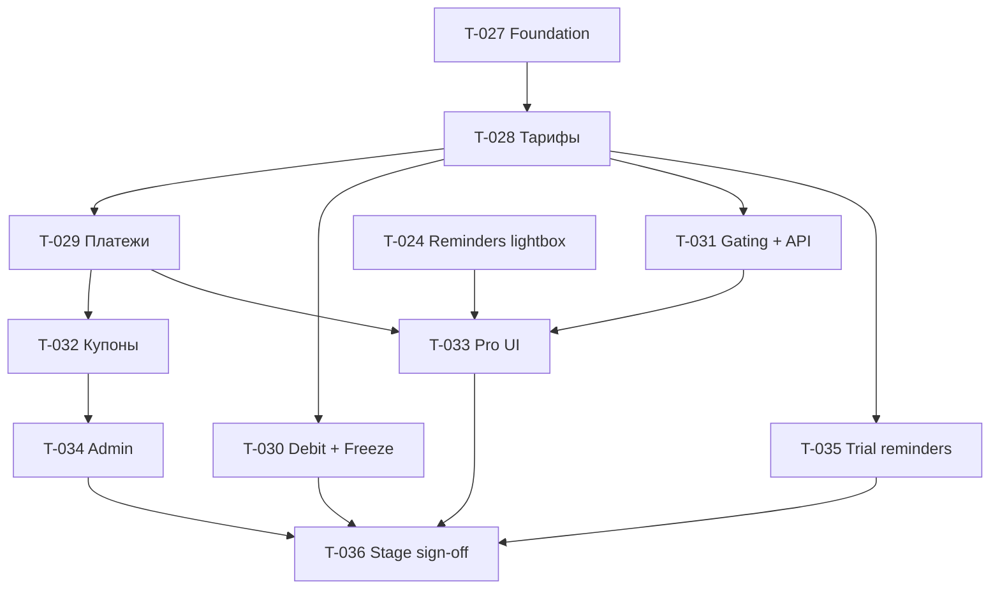

# T-026 · Commerce: модуль оплат, тарифов и купонов (эпик)

| Поле | Значение |
|------|----------|
| **Статус** | `backlog` · папка: **`бэклог/`** |
| **Приоритет** | P1 (stage ready **31.07**, prod платежей **01.08**) |
| **Спринт** | этап 1 · Пилот · спринты **2–5** |
| **Роль** | dev (+ архитектор на review слайсов) |
| **Создан** | 2026-06-12 |
| **Оценка** | **~80–95 ч** (1 FTE, ~10–15 ч/нед) |

## Контекст

Реализация модуля **`app/Modules/Commerce/`** по канону:

- [commerce-модуль-тз-mvp.md](../../_telotron.ru/docs/Техдок/03-модули/commerce-модуль-тз-mvp.md)
- [commerce-схема-данных-mvp.md](../../_telotron.ru/docs/Техдок/03-модули/commerce-схема-данных-mvp.md)
- [api-http §4.1m](../../_telotron.ru/docs/Техдок/01-канон-mvp/api-http-контракт-mvp.md)
- [ADR-001 B1–B7](../../_telotron.ru/docs/Техдок/00-мета/архитектурные-решения/ADR-001-scope-billing-partner-01-08.md)

**Вне эпика:** оплаты клиент→тренер, prod go/no-go **01.08**. **Partner:** [T-037](T-037-partner-модуль-эпик.md) (отдельный эпик, стык через topup).

**Зависимости не-dev:**

| Зависимость | Дедлайн | Блокирует |
|-------------|---------|-----------|
| [T-005](T-005-матрица-функция-тариф.md) черновик | 01.07 | gating (T-031) — временно канон-матрица |
| [T-024](T-024-reminders-одноразовый-лайтбокс.md) | до T-033 | лайтбокс при `light`/`frozen` |
| ЮKassa sandbox / stage webhook | 15.07 | T-029 на stage |
| Юр. тексты подписки | 01.07 | тексты в UI T-033 |

---

## Подтикеты (порядок)

| ID | Слайс | Спринт* | Оценка | Зависит от |
|----|-------|---------|--------|------------|
| [T-027](T-027-commerce-foundation-ledger.md) | Foundation: модуль, миграции, ledger | 2 | 12–16 ч | — |
| [T-028](T-028-commerce-тарифы-статусы-триал.md) | Тарифы, статусы, триал | 2–3 | 10–12 ч | T-027 |
| [T-029](T-029-commerce-платежи-yookassa.md) | Платежи + webhook | 3 | 10–14 ч | T-027, T-028 |
| [T-030](T-030-commerce-daily-debit-freeze.md) | Nightly debit + заморозка | 4 | 10–12 ч | T-028 |
| [T-031](T-031-commerce-gating-api.md) | TariffGate + HTTP API | 4 | 12–14 ч | T-028, T-005* |
| [T-032](T-032-commerce-купоны.md) | Купоны A/B | 4 | 8–10 ч | T-027, T-029 |
| [T-035](T-035-commerce-напоминания-триала.md) | Напоминания 14/7/1 | 4 | 6–8 ч | T-028 |
| [T-033](T-033-commerce-pro-ui.md) | Pro UI «Тариф и счёт» | 4–5 | 12–16 ч | T-029, T-031, T-024 |
| [T-034](T-034-commerce-admin-filament.md) | Admin Filament | 5 | 8–12 ч | T-027…T-032 |
| [T-047](T-047-commerce-public-тарифы.md) | Public `/tariffs` (SSR, матрица модулей) | 3–4 | 6–8 ч | T-031* |
| [T-036](T-036-commerce-stage-sign-off.md) | Stage sign-off, E2E, runbook | 5 | 6–8 ч | все выше |

\*Спринты — по [плану Пилота](../../_telotron.ru/docs/Техдок/00-мета/план-разработки-этап-1-пилот.md); неделя отпуска 06–12.07 без новых слайсов.

**Связанный (не подтикет эпика):** [T-024](T-024-reminders-одноразовый-лайтбокс.md) — Reminders, блокирует UX T-033.

---

## Критерии закрытия эпика T-026

Чеклист **ADR-001 Billing B1–B7** прогнан на **stage** (не prod):

- [ ] **B1** — ЮKassa sandbox: checkout, webhook, ошибки, логи `commerce_payment_webhook_logs`
- [ ] **B2** — триал 60 дн., один на аккаунт; на триале **Профи**
- [ ] **B3** — три тарифа; нехватка Ед. → `light`
- [ ] **B4** — gating: Лайт без групп (+ `tariff-capabilities.php`)
- [ ] **B5** — напоминания триала 14/7/1 (T-035)
- [ ] **B6** — счёт Ед., nightly debit МСК, freeze
- [ ] **B7** — feature-тесты модуля + runbook §14 ТЗ + E2E «триал → пополнение → списание → light» (T-036)
- [ ] **C+** — купоны A/B; admin; лайтбокс через Reminders (T-024 + T-030)

**Prod go/no-go** — отдельно **01.08**, не закрытие эпика.

---

## Дорожка (Mermaid)

---

## Журнал

### 2026-06-12

- Эпик и подтикеты T-027…T-036 созданы по канону Commerce и плану этапа 1 Пилот.
