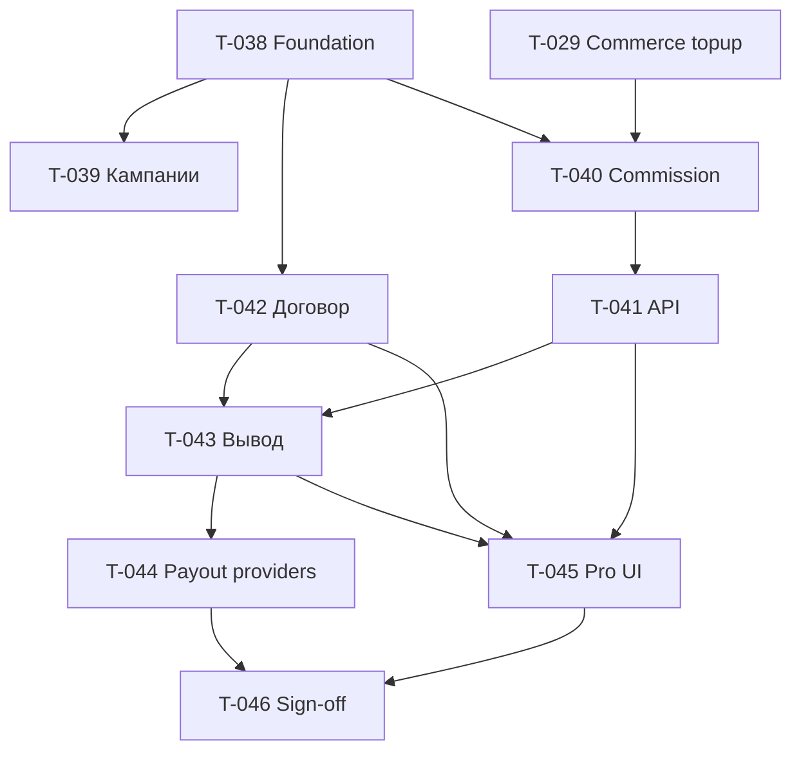

# T-037 · Partner: партнёрская программа (эпик)

| Поле | Значение |
|------|----------|
| **Статус** | `backlog` · папка: **`бэклог/`** |
| **Приоритет** | P1 (stage ready **31.07**, prod **01.08** вместе с Commerce) |
| **Спринт** | этап 1 · Пилот · спринты **4–5** |
| **Роль** | dev (+ архитектор на review) |
| **Создан** | 2026-06-12 |
| **Оценка** | **~55–70 ч** |

## Контекст

Модуль **`app/Modules/Partner/`** по канону:

- [partner-модуль-тз-mvp.md](../../_telotron.ru/docs/Техдок/03-модули/partner-модуль-тз-mvp.md)
- [partner-схема-данных-mvp.md](../../_telotron.ru/docs/Техдок/03-модули/partner-схема-данных-mvp.md)
- [api-http §4.1n](../../_telotron.ru/docs/Техдок/01-канон-mvp/api-http-контракт-mvp.md)
- [ADR-001 P1–P8](../../_telotron.ru/docs/Техдок/00-мета/архитектурные-решения/ADR-001-scope-billing-partner-01-08.md)

**Жёсткая зависимость:** [T-026](T-026-commerce-модуль-эпик.md) — событие **topup** (минимум T-027 + T-029).

**Зависимости не-dev:**

| Зависимость | Дедлайн | Блокирует |
|-------------|---------|-----------|
| Партнёрская оферта (legal) | 01.07 | T-042, UI договора |
| Commerce topup на stage | 31.07 | T-040, P8 |
| ЮKassa payout договор | по готовности | T-044 API payout (MVP = **manual**) |

---

## Подтикеты (порядок)

| ID | Слайс | Спринт | Оценка | Зависит от |
|----|-------|--------|--------|------------|
| [T-038](T-038-partner-foundation-config.md) | Foundation + config | 4 | 8–10 ч | — |
| [T-039](T-039-partner-кампании-ссылки.md) | Кампании, лимиты invite (P1) | 4 | 8–10 ч | T-038 |
| [T-040](T-040-partner-commission-topup.md) | L1/L2/L3 на topup (P4) | 4–5 | 12–14 ч | T-038, T-029 |
| [T-041](T-041-partner-http-api.md) | HTTP API §4.1n (P3, P5) | 4–5 | 8–10 ч | T-038, T-040 |
| [T-042](T-042-partner-договор-legal.md) | In-app договор (P6) | 4 | 6–8 ч | T-038, legal doc |
| [T-043](T-043-partner-вывод-admin.md) | Вывод, reserve, admin manual (P6–P7) | 5 | 10–12 ч | T-040, T-041, T-042 |
| [T-044](T-044-partner-payout-providers.md) | PayoutProvider + webhook задел | 5 | 6–8 ч | T-043 |
| [T-045](T-045-partner-pro-ui.md) | Pro UI партнёрки | 5 | 10–14 ч | T-041, T-042, T-043 |
| [T-046](T-046-partner-stage-sign-off.md) | Stage sign-off P1–P8 | 5 | 4–6 ч | все выше |

**Связанный:** [T-025](T-025-ux-подталkивание-партнёрской-ссылки.md) — UX share, после T-045.

---

## Критерии закрытия эпика T-037 (ADR P1–P8)

- [ ] **P1** — кампании, лимиты §3, счётчики, отзыв (T-039)
- [ ] **P2** — атрибуция без перепривязки (Invites + проверка в T-039)
- [ ] **P3** — список приведённых (T-041)
- [ ] **P4** — L1/L2/L3 на topup; L3 с договором; platform link без % (T-040)
- [ ] **P5** — мгновенные начисления + месячная статистика (T-040, T-041)
- [ ] **P6** — UI: статистика, вывод, договор (T-045)
- [ ] **P7** — admin: акцепт заявок, manual payout (T-043)
- [ ] **P8** — feature-тесты + стыковка webhook topup → commission (T-046)

---

## Дорожка

---

## Журнал

### 2026-06-12

- Эпик и подтикеты T-038…T-046; api §4.1n.
