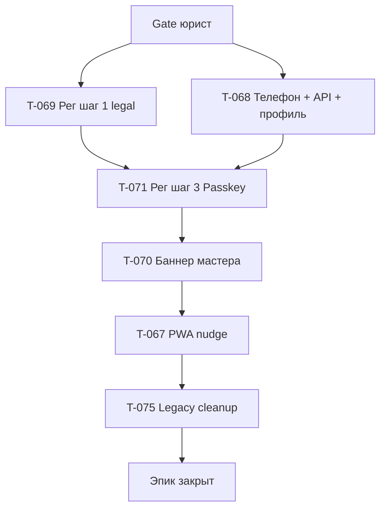

# T-066 · Упрощение входа (эпик)

| Поле | Значение |
|------|----------|
| **Статус** | `backlog` · папка: **`бэклог/`** |
| **Приоритет** | **P1** (конверсия reg → activation пилота) |
| **Спринт** | этап 1 · Пилот · спринты **2–4** |
| **Роль** | **директор** + **07 юрист** (резолюция) → дизайнер → dev |
| **Создан** | 2026-06-25 |
| **Оценка** | **~40–55 ч** (T-067…T-071) |

## Зачем в пилоте

**Не новый функционал**, а **оптимизация входа** по обратной связи пилота — в рамках [freeze scope](../../01-Директор/Инструкции/Цели%20этапов%202026.md) (баги/трение reg = задачи пилота).

Источники: [идея · конверсия reg](../идеи/конверсия-регистрации-снижение-трения.md) · [пожелания · Максим](../../02-Маркетолог/Исследования/Пилот%20—%20пожелания%20тренеров/2026-06-24%20—%20сессия%20с%20тренером.md).

**Scope v1:** только зона **Pro (тренер)**. **Client — wizard не трогаем** (текущий поток без изменений).

**Связано:** системные коды ссылок (`wo_link`, `public`) — [T-072](T-072-invite-ссылки-код-wo-link-public.md).

---

## ⛔ Gate перед разработкой

| # | Кто | Что нужно | Статус |
|---|-----|-----------|--------|
| 1 | **Директор** | Утверждение канона ниже | ☑ **утверждаю** · 2026-07-03 |
| 2 | **07 юрист** | Ответы в §«Вопросы юристу» + запись в журнале | ☐ |
| 3 | **07 юрист** | Обновить [схему акцептов](../../07-Юрист/Схема%20юрдокументов%20и%20этапы%20акцепта%20(Pro%20·%20Client).md) | ☐ |
| 4 | **PO** | [T-062](../отменено/T-062-client-регистрация-единый-шаг-согласий.md) отменён | ☑ |

После gate юриста — обновить [регистрация-и-вход-max-passkey](../../../_telotron.ru/docs/Бизнес-требования/02-модули/auth/регистрация-и-вход-max-passkey.md).

---

## Решения директора · утверждено 2026-07-03

### SMS и бюджет

- На пилоте подтверждение номера — **только SMS OTP** ([SMS Aero](https://smsaero.ru/)).
- Договор с SMS Aero **не обязателен** для старта отправки.
- Бюджет: **2–3 тыс. ₽** личные на пилот.
- MAX/TG/e-mail на странице телефона **не** используем.

### Кто в scope

- **Pro:** новый поток ниже (страница телефона + **3 шага** регистрации).
- **Client:** **без wizard** в v1; текущий поток не меняем.

### Страница телефона (вход и старт регистрации)

- **`terms_of_service`** (пользовательское соглашение) — на этой странице: текст **«Продолжая, вы соглашаетесь…»** + ссылка на оферту; отправка OTP = акцепт оферты.
- **18+** — **текст** на странице телефона (без галочки); отдельная запись в **`legal_acceptances`** — см. §Ю-3 / [§21](../../07-Юрист/Вопросы%20юристу.md).
- Остальные юрдокументы — на **рег. шаге 1** (см. §распределение документов).
- После успешного OTP:
  - номер **есть в БД** → **вход**; в localStorage — **отметка успешной авторизации**;
  - номера **нет** → **регистрация**; телефон только в **сессии**; **User в БД ещё нет**.

### localStorage (канон)

Ключи — в [T-068](T-068-упрощение-входа-sms-бот-напоминания.md); смысл:

| Данные | Назначение |
|--------|------------|
| Запомненный телефон | Подставить в поле при открытии страницы |
| Отметка «раньше входил с этого номера» | Вместе с совпадением номера — показать кнопку Passkey |
| Ключ Passkey (credential hint) | Условие показа кнопки Passkey на входе |

**Показать кнопку Passkey**, только если: есть запомненный номер **и** отметка авторизации **и** введённый номер **совпадает** с запомненным **и** есть ключ Passkey.

**Скрыть Passkey**, если: нет отметки, нет запомненного номера, номер в поле **не совпадает** с запомненным.

**При отправке OTP:** перезаписать телефон; **удалить** отметку авторизации; **удалить** ключ Passkey в **localStorage только** (credential на сервере не трогаем).

**При входе по Passkey:** localStorage **не менять**.

### Распределение юрдокументов

| Документ | `document_key` | Pro всего | Client всего |
|----------|----------------|:---------:|:------------:|
| Пользовательское соглашение | `terms_of_service` | **Страница телефона** | **Страница телефона** |
| Политика конфиденциальности | `privacy_policy` | Рег. шаг 1 | Рег. шаг 1 (когда будет wizard) |
| Согласие на обработку ПДн | `personal_data_consent` | Рег. шаг 1 | Рег. шаг 1 |
| Подтверждение **18+** | *(отдельная запись `legal_acceptances`)* | **Страница телефона** (текст, без галочки) | **Страница телефона** |
| Согласие на мед. данные | `sensitive_data_consent` | — | Рег. шаг 1 |

**На рег. шаге 1:** Pro — **2** кнопки «Принять»; Client (будущее) — **3** кнопки «Принять».

### Создание User и ПДн

- До завершения **рег. шага 1** («Немного формальностей») — телефон **только в сессии**, User **не создаётся**.
- На **последнем «Принять»** шага 1 — одна транзакция на сервере: **User + все `legal_acceptances` + partner/role**; затем **отметка авторизации** в localStorage.
- Тексты документов в API **не** передаются — только `document_key` + `version`; audit через `LegalAcceptanceWriter` ([T-011](../сделано/T-011-legal-acceptances-audit-поля.md)).

### Профиль (рег. шаг 2 · «Немного о себе»)

- **Имя, фамилия, пол** — обязательны.
- **Дата рождения** — для **тренера (Pro) не обязательна**; для Client (когда появится wizard) — обязательна.

### Passkey (рег. шаг 3 · «Для вашего удобства»)

- **Тренер (Pro):** Passkey **обязателен** — ссылки **«может быть позже» нет**; **в кабинет не попадает**, пока Passkey не привязан (жёсткий guard).
- **Клиент (будущее):** Passkey **опционален** + подталкивание; ссылка «может быть позже».

### Прерванная регистрация

| Остановились на | Поведение при следующем заходе |
|-----------------|--------------------------------|
| **До завершения рег. шага 1** | С **начала** (страница телефона → OTP); User в БД нет |
| **Рег. шаг 2 не завершён** | После входа → **рег. шаг 2** |
| **Рег. шаг 3 не завершён** (Pro) | После входа → **рег. шаг 3** (жёсткий guard, без monthly nudge) |
| **Шаг 3 · подталкивание** | Только **Client (будущее)**: раз в месяц, если ключ не привязан |

### После регистрации

- Кабинет сразу после шага 3 (или guard на незавершённый шаг).
- Post-reg nudge (не блокеры): **мастер → PWA → бот** ([T-070](T-070-упрощение-входа-мастер-баннер.md), [T-067](T-067-упрощение-входа-pwa-напоминания.md), [T-068](T-068-упрощение-входа-sms-бот-напоминания.md)).

### Прочее (не в этом эпике)

- **Смена телефона** в профиле через OTP — [T-068](T-068-упрощение-входа-sms-бот-напоминания.md) или отдельный тикет.

**Привязка к партнёру при регистрации Pro** — через существующие ссылки; специальные системные ссылки с **кодом** — [T-072](T-072-invite-ссылки-код-wo-link-public.md).

---

## Технические решения (сессия Q&A · 2026-07-03)

| # | Вопрос | Решение |
|---|--------|---------|
| 1 | Обязательна ли партнёрская ссылка в теле запроса при регистрации Pro? | **Нет.** Тренер может регистрироваться со страницы телефона без ссылки в браузере. Привязка — через ссылки в БД. Для системных сценариев — поле **«код»** у ссылки (`wo_link` — без ссылки в браузере; `public` — с публичной зоны). Реализация — [T-072](T-072-invite-ссылки-код-wo-link-public.md). Поиск системных ссылок — **по коду**, не по названию. |
| 2 | Когда писать в журнал согласий запись по `terms_of_service` (оферта на странице телефона)? | **Б.** Одним пакетом на последнем «Принять» рег. шага 1 — вместе с `privacy_policy` и `personal_data_consent` при `POST /register/complete` и создании пользователя. На странице телефона — только текст «Продолжая…» и факт отправки СМС; в БД до шага 1 записи нет. В сессии после СМС — зафиксировать факт акцепта оферты для включения в batch (версия документа + метка времени). |
| 3 | Старые серверные пути входа для Pro (сначала ключ, потом СМС)? | **А.** Полностью заменяем: для Pro только новая страница телефона + вход по СМС или по ключу по канону; старые пути входа и регистрации Pro **отключаем** (не дублируем). Client — без изменений, старые пути остаются. |
| 4 | Пользователь создан, рег. шаг 2 (профиль) не завершён — куда после входа по СМС? | **А.** Сразу на **рег. шаг 2**; кабинет недоступен, пока профиль не сохранён. Страница телефона — только этап аутентификации. |
| 5 | Профиль заполнен, ключ не привязан (рег. шаг 3) — куда после входа **тренера**? | **А.** Сразу на **рег. шаг 3**; кабинет недоступен до успешной привязки ключа. Без блокирующего окна поверх кабинета. |
| 6 | СМС подтверждён, рег. шаг 1 не завершён, сессия истекла | **А.** С **начала**: страница телефона → новый СМС-код. Пользователя в БД по-прежнему нет. |
| 7 | Тренеры со **старым** потоком регистрации (без `phone_verified_at`) | **А.** Считаем телефон **уже подтверждённым**; при входе — СМС или ключ по новым правилам, **без** принудительной повторной верификации. Объём legacy — единицы, не критично; при миграции проставить `phone_verified_at` (или эквивалент «complete»). |
| 8 | Потерян ключ на устройстве, учётка в базе есть | **А.** Вход **только по СМС** на тот же номер. Старые пути восстановления через мессенджер/почту для Pro **снимаем**. Привязать новый ключ — из профиля после входа (отдельно от сценария «рег. шаг 3»). |
| 9 | СМС в local / автотестах | **А.** Как с e-mail: поле **`debug_otp`** в ответе сервера — **только** вне production (`APP_ENV` ≠ production). На prod поля нет, реальная отправка через SMS Aero. |
| 10 | Миграция старого `telotron_pro_last_phone` в новые ключи localStorage | **Б.** **Не переносим**; при выкате поле телефона пустое, пользователь вводит заново. |
| 11 | Как хранить «на каком шаге остановилась регистрация»? | **Б.** **Без** отдельного поля: вычислять по данным — нет обязательных полей профиля (имя, фамилия, пол) → рег. шаг 2; нет ключа → рег. шаг 3; иначе → кабинет. Единый серверный «определитель прогресса» для редиректа после входа. Отдельное поле шага — только если позже понадобится для Client с опциональным ключом («позже»). |
| 12 | Что хранить в браузере как «подсказку для ключа»? | **А.** **Идентификатор ключа** (credential id) с этого устройства после успешной привязки WebAuthn. Только для показа кнопки; проверка — на сервере. При отправке СМС — стираем подсказку (ключ в БД не трогаем). |
| 13 | Новый ключ в профиле, старые в базе | **До 3 устройств.** Несколько ключей разрешены; **максимум 3** активных. При привязке 4-го — **удаляется самый старый** (по дате создания). Старые не отключаем пакетом при каждом входе по СМС. |
| 14 | Куда сохранять рег. шаг 2 (профиль)? | **А.** Существующий `PATCH /me/trainer-profile` (как в кабинете). При `register/complete` создать пустую запись профиля тренера. |
| 15 | Атрибуция ссылки на `register/complete` (`wo_link` / `public`) | **В.** С **публичного сайта** тренер уже приходит **с партнёрской ссылкой** в браузере — обработка **как сейчас** (токен из хранилища). **Без ссылки** в браузере: в конфиге код `wo_link` → по коду найти системную ссылку в БД → привязать тренера к ней. Отдельно передавать `public` в запросе **не** нужно; ссылка с кодом `public` — запись в БД для перехода с сайта через `/i/{код}`. |
| 16 | Подталкивание «раз в месяц», если ключ не привязан (Pro) | **А.** **Не нужно** для тренера — достаточно жёсткого рег. шага 3. Monthly nudge — только для **Client** (будущее). |

---

## Канон · страница телефона

```text
Открытие страницы
  · Если в localStorage есть телефон → подставить в поле
  · Условия показа кнопки Passkey — см. §localStorage

Перед отправкой OTP
  · terms_of_service: «Продолжая, вы соглашаетесь…» + ссылка; OTP = акцепт оферты
  · 18+: текст «Сервис только для лиц 18+…» (без галочки); OTP = подтверждение; запись в legal_acceptances — в пакете на рег. шаге 1

Отправка OTP
  · localStorage: перезаписать телефон; сбросить отметку авторизации и ключ Passkey
  · SMS Aero; rate limit / otp_challenges
  · User в БД НЕ создаётся

После успешного OTP
  · Номер в БД → LOGIN → Sanctum → localStorage: отметка авторизации
      · Guard: незавершённый рег. шаг 2/3 → соответствующий экран wizard
      · Иначе → кабинет
  · Номера нет → session[sms_verified] + phone_e164 → рег. шаг 1
```

---

## Канон · регистрация Pro · 3 шага

Линейка на всех шагах: **«Пройдите 3 простых шага для регистрации»**.

### Рег. шаг 1 · «Немного формальностей»

```text
  · Приветствие: «Мы рады, что Вы присоединились к нам!»
  · Pro: ДВА документа — privacy_policy, personal_data_consent
  · У каждого кнопка «Принять» → галочка
  · Последний «Принять» →
      POST /register/complete:
        session + acceptances (2 Pro + terms + 18+ с шага телефона, время из сессии)
      → User + все legal_acceptances (в т.ч. оферта и 18+ — отдельные строки) + login
      → localStorage: отметка авторизации
      → рег. шаг 2
```

**Client (будущее):** три кнопки — `privacy_policy`, `personal_data_consent`, `sensitive_data_consent` (`terms_of_service` уже на странице телефона).

### Рег. шаг 2 · «Немного о себе»

```text
  · Имя * · Фамилия * · Пол *
  · Дата рождения — необязательна (Pro)
  · Кнопка «Далее» → сохранить профиль → рег. шаг 3
```

### Рег. шаг 3 · «Для вашего удобства»

```text
  · «Чтобы следующий раз не отправлять код, подключите вход через Ваш телефон»
  · Кнопка регистрации Passkey (WebAuthn)
  · Pro: без «может быть позже»; guard — кабинет недоступен до WebAuthn
  · После привязки Passkey → кабинет + post-reg nudge
```

---

## Вопросы юристу (до старта dev)

**Порядок:** по одному вопросу → ответ в журнале → следующий. Не начинать dev, пока все **блокирующие** не закрыты.

| # | Статус | Тема |
|---|--------|------|
| Ю-1 | **v1.0 пилот** | Подтверждение номера только по СМС на пилоте → [T-073](T-073-legal-смс-пилот-обновление-документов.md) |
| Ю-2 | **задан** | SMS Aero в политике (кто обрабатывает номер при отправке кода) |
| Ю-3 | **v1.0 пилот** (частично) | Соглашение и **18+** на странице телефона → [T-073](T-073-legal-смс-пилот-обновление-документов.md) |
| Ю-4 | **v1.0 пилот** | Обязательная привязка ключа для тренера → [T-071](T-071-упрощение-входа-passkey-опционально.md) |
| Ю-5 | **v1.0 пилот** | Вход тренера: код по СМС **или** ключ — достаточно **одного** способа |
| Ю-6 | **v1.0 пилот** | Правки текстов: «СМС используем на пилоте» (Pro · Client, страница телефона) |

**Не блокирует T-066:** главный партнёр без ссылки (T-072); смена телефона (T-068).

**Уже согласовано директором** (ждём общей подписи юриста в gate): два «Принять» на рег. шаге 1 у Pro; пользователь создаётся только после формальностей; телефон до этого только в сессии. **18+ и оферта на странице телефона** — см. решения v1.0 пилота §Ю-3.

---

### Ю-1 · Подтверждение номера только по СМС на пилоте

**Статус:** решение v1.0 пилота · 2026-07-03 · **на юриста v2.0** перед приёмом платежей (01.08.2026)

**Вопрос юристу (простым языком):**

На пилоте (**Pro и Client — одинаково**) подтверждаем номер телефона **только кодом по СМС** — через сервис [SMS Aero](https://smsaero.ru/). Другие способы на этой странице (мессенджеры, почта) **не предлагаем**.

Раньше в наших документах по входу было написано, что **СМС не используем**. Нужно понять:

1. **Можно ли на пилоте** так подтверждать номер с точки зрения закона о связи (149-ФЗ) и политики персональных данных?
2. **Что обязательно поправить** в политике конфиденциальности и пользовательском соглашении, если переходим на СМС?
3. Достаточно ли для старта пилота **оплаты с личной карты** без отдельного договора с SMS Aero, или нужен договор до первой отправки?

**Тот же вопрос в общем списке:** [Вопросы юристу §18](../../07-Юрист/Вопросы%20юристу.md).

**Решение v1.0 пилота (директор, 2026-07-03):**

| # | Решение |
|---|---------|
| 1 | **Можно** — подтверждаем номер кодом по СМС на странице телефона (**Pro · Client**) |
| 2 | Правки политики и пользовательского соглашения — **[T-073](T-073-legal-смс-пилот-обновление-документов.md)** |
| 3 | **Можно** начинать без договора с SMS Aero; оплата с личной карты на пилот → договор до 01.08.2026: **[T-074](T-074-заключить-договор-sms-aero.md)** |

**Ответ профильного юриста (v2.0, gate платежей):** ☐ *(зададим перед 01.08.2026)*

---

### Ю-2 · SMS Aero в политике конфиденциальности

**Статус:** задан · 2026-07-03 · **на юриста v2.0** перед приёмом платежей (01.08.2026)

**Вопрос юристу (простым языком):**

Чтобы отправить код по СМС, мы **передаём номер телефона** во внешний сервис [SMS Aero](https://smsaero.ru/). Там же формируется и уходит текст сообщения с кодом.

Нужно понять, **как это правильно описать** в политике конфиденциальности и в уведомлении Роскомнадзора (если нужно обновлять):

1. Как **назвать** SMS Aero в тексте: обработчик по поручению, привлечённое лицо, оператор связи — что корректнее для 152-ФЗ?
2. **Какие данные** мы обязаны перечислить: только номер телефона или ещё текст СМС, технические данные?
3. **Достаточно ли** для пилота абзаца в политике (раздел о привлечённых лицах), или нужен **отдельный договор** с SMS Aero до первой отправки? *(Директор на пилот: без договора можно; договор — [T-074](T-074-заключить-договор-sms-aero.md) до 01.08.2026.)*
4. Нужно ли **обновлять уведомление** в Роскомнадзор после добавления SMS Aero в перечень?

**Куда пойдут формулировки:** [T-073](T-073-legal-смс-пилот-обновление-документов.md) (черновик политики).

**Тот же вопрос в общем списке:** [Вопросы юристу §19](../../07-Юрист/Вопросы%20юристу.md).

**Ответ профильного юриста (v2.0):** ☐

**Решение v1.0 пилота (директор):** ☐ *(ожидает ответа или решения совета)*

---

### Ю-3 · Соглашение и 18+ на странице телефона

**Статус:** решение v1.0 пилота (частично) · 2026-07-03 · **на юриста v2.0** перед 01.08.2026

**Вопрос юристу (простым языком):**

**Пользовательское соглашение:** на странице телефона — текст **«Продолжая, вы соглашаетесь…»** + ссылка. «Отправить код» → СМС. **Без отдельной галочки** на оферту.

**18+:** на той же странице — **только текст** (без галочки), что сервис для лиц **18+**. Отправка СМС = подтверждение.

Пользователя в базе **ещё нет** до рег. шага 1. Записи в **журнале согласий** (`legal_acceptances`) — **одним пакетом** на последнем «Принять» рег. шага 1. В сессии после СМС — версии документов и **время** акцепта оферты и 18+.

**Нужно понять:**

1. Достаточно ли **текста + отправки СМС** для оферты **без** галочки?
2. **18+ — отдельная строка** в `legal_acceptances`: к какому документу привязать (оферта, политика, отдельный текст)? Достаточно ли **текста без галочки**?
3. Можно ли записи создать **при создании пользователя**, с **временем из сессии** (момент СМС)?
4. Совместимо ли с отдельными «Принять» на политику и ПДн на рег. шаге 1?
5. Рекомендуемые **формулировки** текста на странице телефона.

**Тот же вопрос в общем списке:** [Вопросы юристу §20–21](../../07-Юрист/Вопросы%20юристу.md).

**Решение v1.0 пилота (директор, 2026-07-03):**

| Тема | Решение |
|------|---------|
| **18+** | **Отдельная запись** в `legal_acceptances`; UI — **текст на странице телефона, без галочки**; запись в пакете на рег. шаге 1 (время из сессии после СМС) |
| **Оферта** | Текст «Продолжая…» + СМС; запись в пакете на рег. шаге 1 — **без изменений** (тех. Q&A #2) |

**Ответ профильного юриста (v2.0):** ☐ *(подтвердить 18+ без галочки и привязку записи к документу)*

---

### Ю-4 · Обязательный ключ для тренера (Pro)

**Статус:** решение v1.0 пилота · 2026-07-03 · **на юриста v2.0** перед 01.08.2026

**Вопрос юристу (простым языком):**

После регистрации тренер проходит **третий шаг** — привязка **ключа входа** (отпечаток пальца или Face ID на телефоне/компьютере; технически WebAuthn / Passkey).

**Для тренера (Pro) ключ обязателен:**
- кнопки «может быть позже» **нет**;
- **в кабинет не пускаем**, пока ключ не привязан;
- если бросил регистрацию на этом шаге — при следующем входе снова ведём на привязку ключа.

**Для клиента** (когда появится новый wizard) ключ **не обязателен** — можно отложить.

**Нужно понять:**

1. Допустимо ли **требовать** такой ключ **только у тренеров**, а у клиентов — нет?
2. Можно ли **не пускать в кабинет** без привязки ключа, если вход по СМС уже был?
3. Нужно ли **отдельно прописать** в политике / соглашении использование ключа (биометрия **на устройстве**, мы не храним отпечаток)?
4. Достаточно ли **СМС на вход** как запасного способа, если ключ на устройстве потерян? *(Отдельно — [Ю-5](T-066-упрощение-входа-эпик.md).)*

**Решение директора (канон):** ключ Pro **обязателен**, жёсткий guard — см. §Passkey, [T-071](T-071-упрощение-входа-passkey-опционально.md).

**Тот же вопрос в общем списке:** [Вопросы юристу §22](../../07-Юрист/Вопросы%20юристу.md).

**Ответ профильного юриста (v2.0):** ☐

**Решение v1.0 пилота (директор, 2026-07-03):** **утверждаю**

| | |
|---|---|
| Pro | Ключ **обязателен**; без ключа кабинет **недоступен**; «позже» **нет** |
| Client (будущее) | Ключ **опционален** |
| Политика | Прописать: биометрия **на устройстве**, отпечаток **не храним** — [T-073](T-073-legal-смс-пилот-обновление-документов.md) |

---

### Ю-5 · Вход тренера: СМС или ключ

**Статус:** v1.0 пилот ☑ · 2026-07-03 · **на юриста v2.0** перед 01.08.2026

**Вопрос юристу (простым языком):**

После регистрации тренер может входить двумя способами:

1. **Код по СМС** на номер телефона (если на этом устройстве нет подсказки для ключа или номер не совпадает с запомненным).
2. **Ключ** (отпечаток / Face ID) — если устройство «знакомое» (запомненный номер + раньше входил + есть ключ на этом устройстве).

**Отдельной двухфакторной проверки нет** — достаточно **одного** способа: либо СМС, либо ключ.

При **потере доступа к ключу** на устройстве — вход **только по СМС** на тот же номер; новый ключ можно привязать в профиле после входа.

**Нужно понять:**

1. Достаточно ли для **защиты данных тренера** одного способа входа (СМС **или** ключ), без обязательной «второй проверки» каждый раз?
2. Допустимо ли **не требовать СМС**, если тренер входит по ключу с «знакомого» устройства?
3. Достаточно ли **СМС на тот же номер** как единственный способ восстановления, если ключ на устройстве недоступен?
4. Нужны ли **формулировки в политике** про способы входа и восстановление?

**Решение v1.0 пилота (директор, 2026-07-03):** **утверждаю** — на каждый вход **достаточно одного** способа (СМС **или** ключ); второй фактор **не** требуем.

| | |
|---|---|
| Вход | **Один** способ: код по СМС **или** ключ с «знакомого» устройства |
| Без СМС | Допустимо, если вход **только** по ключу |
| Recovery | **СМС на тот же номер**; новый ключ — в профиле после входа |
| Политика | Способы входа и восстановление — [T-073](T-073-legal-смс-пилот-обновление-документов.md) |

**Тот же вопрос в общем списке:** [Вопросы юристу §23](../../07-Юрист/Вопросы%20юристу.md).

**Ответ профильного юриста (v2.0):** ☐

---

### Ю-6 · Тексты: «СМС используем на пилоте»

**Статус:** v1.0 пилот ☑ · 2026-07-03 · **на юриста v2.0** перед 01.08.2026

**Вопрос юристу (простым языком):**

Во многих наших документах (политика, канон входа, техдок, README команды) зафиксировано: **«СМС не используем»** — из‑за стоимости провайдера. На пилоте **меняем** это для **страницы телефона** в обеих зонах (**Pro и Client** — **одинаково**): код подтверждения номера, вход и recovery — **по СМС** (SMS Aero). *(Отличие зон — не СМС, а шаги wizard после телефона: Passkey обязателен у Pro, опционален у Client; у Client на рег. шаге 1 — ещё `sensitive_data_consent`.)* Маркетинговые и массовые рассылки по СМС **не планируем**.

**Scope dev v1:** wizard с новой страницей телефона **сначала выкатываем в Pro**; Client — позже, но **канон СМС/страницы телефона тот же**.

Нужно понять:

1. **Как правильно переформулировать** «не используем» → **«на пилоте используем СМС только для кода подтверждения номера и входа на странице телефона (Pro и Client)»** — достаточно ли такой **узкой** формулировки в политике и соглашении?
2. **Где обязательно** обновить текст до старта пилота (политика, соглашение, уведомление РКН), а где достаточно внутреннего канона (техдок, README)?
3. Достаточно ли **одной** формулировки для **обеих зон** (Pro и Client) или нужны разные абзацы?
4. Нужна ли **отдельная строка** в политике, что СМС **не** используем для рекламы, уведомлений о тренировках и прочего — только OTP на странице телефона?
5. Есть ли **требования к тексту самого СМС** (подпись отправителя, упоминание Telotron, ссылка на политику)?

**Куда пойдут правки:** [T-073](T-073-legal-смс-пилот-обновление-документов.md) (юрдокументы); канон [регистрация-и-вход-max-passkey](../../../_telotron.ru/docs/Бизнес-требования/02-модули/auth/регистрация-и-вход-max-passkey.md); [Сборка-политики-v1-факты](../../07-Юрист/Сборка-политики-v1-факты.md) п. 3.7c.

**Тот же вопрос в общем списке:** [Вопросы юристу §24](../../07-Юрист/Вопросы%20юристу.md).

**Решение v1.0 пилота (директор, 2026-07-03):** **утверждаю**

| | |
|---|---|
| Формулировка | На пилоте — СМС **только** для кода на **странице телефона** (**Pro · Client**, одинаково) |
| Зоны | **Одна** формулировка для Pro и Client |
| Не СМС | Реклама, массовые и сервисные уведомления по СМС — **нет** |
| До пилота | Политика + соглашение → [T-073](T-073-legal-смс-пилот-обновление-документов.md); канон auth, п. 3.7c в [Сборка-политики-v1-факты](../../07-Юрист/Сборка-политики-v1-факты.md) |
| Текст СМС | Код + имя сервиса; подпись/ссылка на политику — **на юриста v2.0** (п.5) |

**Ответ профильного юриста (v2.0):** ☐

---

### Сводка (после закрытия всех Ю-N)

| Тема | Контекст | Ответ |
|------|----------|-------|
| СМС только на пилоте | 149-ФЗ, политика, оферта | v1.0 пилот ☑ · v2.0 ☐ |
| SMS Aero в политике | абзац о передаче номера | Ю-2 ☐ |
| Соглашение на странице телефона | запись в журнале согласий | v1.0 пилот ☑ (пакет) · v2.0 ☐ |
| 18+ на странице телефона | отдельная запись `legal_acceptances`, текст без галочки | v1.0 пилот ☑ · v2.0 ☐ |
| Рег. шаг 1: Pro 2 «Принять» | политика + согласие на ПДн | утверждено директором |
| Пользователь после шага 1, телефон в сессии | 152-ФЗ | утверждено директором |
| Ключ обязателен для тренера | без кабинета без привязки | v1.0 пилот ☑ · v2.0 ☐ |
| Вход: СМС или ключ | без второго фактора | v1.0 пилот ☑ · v2.0 ☐ |
| Тексты: «СМС используем» | Pro · Client, страница телефона | v1.0 пилот ☑ · v2.0 ☐ |

## Подтикеты

| ID | Зона | Файл |
|----|------|------|
| [T-068](T-068-упрощение-входа-sms-бот-напоминания.md) | Страница телефона, localStorage, API, рег. шаг 2 профиль, прерванный reg, каналы | dev |
| [T-069](T-069-упрощение-входа-legal-одна-страница.md) | **Рег. шаг 1** · формальности | юрист → dev |
| [T-071](T-071-упрощение-входа-passkey-опционально.md) | **Рег. шаг 3** · Passkey | dev |
| [T-070](T-070-упрощение-входа-мастер-баннер.md) | Post-reg баннер мастера | dev |
| [T-067](T-067-упрощение-входа-pwa-напоминания.md) | Post-reg PWA nudge | dev |
| [T-072](T-072-invite-ссылки-код-wo-link-public.md) | Код у ссылки · `wo_link` / `public` | dev |
| [T-073](T-073-legal-смс-пилот-обновление-документов.md) | Юрдокументы · СМС на пилоте | dev |
| [T-074](T-074-заключить-договор-sms-aero.md) | Договор с SMS Aero (до 01.08.2026) | директор / юрист |
| [T-075](T-075-упрощение-входа-legacy-cleanup.md) | **Уборка legacy** Pro auth + рефакторинг (после выката) | dev |

**Очередь:** юрист → **T-072** (до или вместе с T-068) → T-068 + T-069 → T-071 → T-070 + T-067 → **T-075** (после стабилизации Pro на prod).

**Связанные:** [T-064](T-064-auth-верификация-телефона-149-фз.md) · [T-050](T-050-спринт2-воронка-метрики.md).

---

## Критерии закрытия эпика

- [x] Gate директора (2026-07-03).
- [ ] Gate юриста.
- [ ] Pro: страница телефона + 3 шага reg + вход по канону.
- [ ] Client **без изменений**.
- [ ] T-067…T-071 закрыты.
- [ ] [T-075](T-075-упрощение-входа-legacy-cleanup.md) — legacy Pro auth удалён из кода (после выката).
- [ ] Канон auth и схема акцептов обновлены.
- [ ] Метрики отвала по шагам до/после ([T-050](T-050-спринт2-воронка-метрики.md)).

---

## Дорожка



---

## Журнал

### 2026-07-03 · T-075 legacy cleanup

- Подтикет [T-075](T-075-упрощение-входа-legacy-cleanup.md): уборка deprecated Pro auth/register/recovery и рефакторинг после выката нового потока; Client без изменений.

### 2026-07-03 · Ю-6 v1.0 пилота · утверждаю

- Узкая формулировка СМС (Pro · Client); §24 в [Вопросы юристу](../../07-Юрист/Вопросы%20юристу.md).

### 2026-07-03 · Ю-6: канон СМС Pro · Client

- Страница телефона и СМС **одинаковы** в обеих зонах; исправлена ошибочная формулировка «Client без СМС».

### 2026-07-03 · Ю-6 задан

- Ю-6 задан; §24 в [Вопросы юристу](../../07-Юрист/Вопросы%20юристу.md).

### 2026-07-03 · Ю-5 v1.0 пилота · утверждаю

- На вход **достаточно одного** способа (СМС **или** ключ); recovery — СМС на тот же номер; §23 в [Вопросы юристу](../../07-Юрист/Вопросы%20юристу.md).

### 2026-07-03 · Ю-4 v1.0 пилота · утверждаю

- Ключ Pro обязателен; §22 в [Вопросы юристу](../../07-Юрист/Вопросы%20юристу.md).

### 2026-07-03 · Ю-4 задан

- Обязательный ключ (Passkey) для тренера Pro; §22 в [Вопросы юристу](../../07-Юрист/Вопросы%20юристу.md).

### 2026-07-03 · Ю-3 · 18+ v1.0 пилота

- Директор: **18+** — отдельная запись в `legal_acceptances`; на странице телефона **текст без галочки**; запись в пакете на рег. шаге 1.
- [Вопросы юристу §20–21](../../07-Юрист/Вопросы%20юристу.md).

### 2026-07-03 · T-074 · Ю-3

- Тикет [T-074](T-074-заключить-договор-sms-aero.md) — договор SMS Aero до 01.08.2026.
- **Ю-3** задан: пользовательское соглашение на странице телефона; §20 в [Вопросы юристу](../../07-Юрист/Вопросы%20юристу.md).

### 2026-07-03 · Ю-2 задан

- Вопрос: как описать SMS Aero в политике и уведомлении РКН; §19 в [Вопросы юристу](../../07-Юрист/Вопросы%20юристу.md).

### 2026-07-03 · Ю-1 · решение v1.0 пилота

- Директор: (1) СМС можно; (2) правки документов → [T-073](T-073-legal-смс-пилот-обновление-документов.md); (3) без договора SMS Aero можно.
- Вопрос перенесён в [Вопросы юристу §18](../../07-Юрист/Вопросы%20юристу.md); профильный юрист — перед gate платежей 01.08.2026.

### 2026-07-03 · опрос юриста · Ю-1 задан

- В эпике заведена очередь **Ю-1…Ю-6** (по одному вопросу).
- **Ю-1** задан: подтверждение номера только по СМС на пилоте (149-ФЗ, правки политики, нужен ли договор с SMS Aero).

### 2026-07-03 · синхрон T-068

- Эскиз API в [T-068](T-068-упрощение-входа-sms-бот-напоминания.md) приведён к тех. Q&A #1…#16.

### 2026-07-03 · тех. Q&A #16

- Monthly nudge для Pro **не делаем**; только жёсткий рег. шаг 3.

### 2026-07-03 · тех. Q&A #15

- Партнёрская ссылка в браузере → как сейчас. Без ссылки → `wo_link` из конфига → ссылка из БД. `public` — ссылка для захода с сайта, не отдельный флаг в API.

### 2026-07-03 · тех. Q&A #14

- Рег. шаг 2 → `PATCH /me/trainer-profile`; пустой профиль при `register/complete`.

### 2026-07-03 · тех. Q&A #13

- Ключей на учётку: **не больше 3**; при добавлении четвёртого — снять **самый старый**.

### 2026-07-03 · тех. Q&A #12

- `passkey_credential_hint` = **credential id** устройства; сброс при OTP; не заменяет серверную проверку.

### 2026-07-03 · тех. Q&A #11

- Прогресс регистрации **вычисляем** по профилю и ключу; отдельное поле шага **не** вводим (Pro v1).

### 2026-07-03 · тех. Q&A #10

- Старый ключ номера в браузере **не мигрируем**.

### 2026-07-03 · тех. Q&A #9

- Local/E2E: `debug_otp` в ответе, как у e-mail; на prod — только реальная СМС.

### 2026-07-03 · тех. Q&A #8

- Потеря ключа: Pro входит по **СМС**; recovery через MAX/TG/e-mail для Pro **убираем**.

### 2026-07-03 · тех. Q&A #7

- Legacy-тренеры: телефон считаем подтверждённым; повторное СМС не требуем; миграция `phone_verified_at` + шаг регистрации `complete`.

### 2026-07-03 · тех. Q&A #6

- Прервано до рег. шага 1 + истекла сессия → **заново** телефон и СМС.

### 2026-07-03 · тех. Q&A #5

- Прерванный ключ (тренер, после рег. шага 2): после входа → **сразу рег. шаг 3**; кабинет закрыт до WebAuthn.

### 2026-07-03 · тех. Q&A #4

- Прерванный профиль (после рег. шага 1): после СМС-входа → **сразу рег. шаг 2**; кабинет закрыт до сохранения.

### 2026-07-03 · тех. Q&A #3

- Pro: старые пути входа/регистрации **снимаем**; только новый поток (телефон + СМС / ключ). Client — как сейчас.

### 2026-07-03 · тех. Q&A #2

- `terms_of_service`: запись в `legal_acceptances` — **только** в пакете на `register/complete` (рег. шаг 1); на странице телефона — UI + сессия, без строки в БД до создания пользователя.

### 2026-07-03 · тех. Q&A #1

- Регистрация Pro **без** ссылки в браузере — **разрешена**; привязка через ссылки в БД.
- Системные ссылки — поле **код** (`wo_link`, `public`); поиск по коду, не по названию → [T-072](T-072-invite-ссылки-код-wo-link-public.md).

### 2026-07-03 · утверждение канона (директор)

- **Утверждаю** полный канон эпика.
- Client wizard **не трогаем** в v1.
- Профиль Pro: имя, фамилия, пол обяз.; **ДР необязательна**.
- Юрдоки: **`terms_of_service` на странице телефона**; на рег. шаге 1 Pro — **2** (`privacy_policy`, `personal_data_consent`); Client (будущее) — **3** (+ `sensitive_data_consent`).
- **18+** — **текст** на странице телефона (без галочки); **отдельная запись** в `legal_acceptances` (пакет на рег. шаге 1).
- Регистрация Pro — **3 шага** (формальности → о себе → Passkey).
- Passkey Pro: **обязателен**, **кабинет недоступен** без привязки; Client — опционален (будущее).
- Сброс ключа Passkey при OTP — **только localStorage**.
- User после рег. шага 1; прерванный reg и localStorage — по канону.
- Эпик = **оптимизация пилота** по feedback.
- SMS без договора; бюджет 2–3 тыс. ₽.
- Системные коды ссылок — [T-072](T-072-invite-ссылки-код-wo-link-public.md).

### 2026-06-24 · сессия (черновик API)

- Телефон в session до legal; `register/complete` batch; SMS Aero.

### 2026-06-25

- Эпик и подтикеты T-067…T-071; T-062 отменён.
