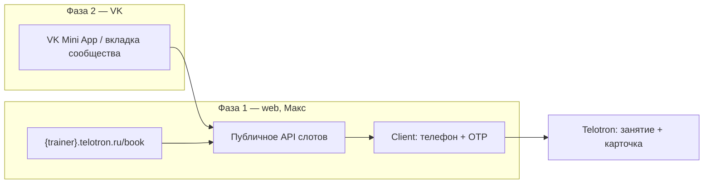

# VK · запись с страницы/сообщества тренера → Telotron

| Поле | Значение |
|------|----------|
| **Статус** | `idea` |
| **Автор** | директор (обсуждение с PO, 2026-07-05) |
| **Создан** | 2026-07-05 |
| **Область** | продукт · маркетинг · интеграции |
| **Связь с этапом** | **после** Commerce **01.08**, стабильного M2 (запись) и упрощённого входа Client ([E-003](../эпики/E-003-упрощение-входа.md)); слой «рост» тарифа **Максимальный** |
| **Тариф** | **Максимальный** (ориентир); web-запись может быть beta только на Макс |

> Папка **`идеи/`** — не тикет. См. также: [тариф-максимум · инструменты роста](тариф-максимум-инструменты-роста.md), [публичный каталог](публичный-каталог-тренеров-запись-лиды.md), [геореклама → лендинг](геореклама-лендинг-тренера.md).

## Суть

**Мини-приложение / вкладка VK** (сообщество или страница тренера), через которую **посетитель записывается на занятие** и попадает в **единый контур Telotron** (календарь тренера, карточка клиента, напоминания), а не в отдельный «виджет ради виджета».

**Ключевое продуктовое решение:** не дублировать логику записи в VK — **фаза 1** = публичная web-страница + API слотов; **фаза 2** = VK Mini App / кнопка в сообществе как **тонкая оболочка** над тем же API.

## Зачем / для кого

- **Тренер на Максимуме** — клиенты из VK (основной соцканал пилота) записываются без переписки «когда вам удобно?».
- **Telotron** — дифференциатор **Профи → Макс** (слой «рост», не операционка); оправдание цены ~10 000 ₽/мес.
- **Клиент** — короткий путь: увидел тренера в VK → выбрал слот / оставил заявку → подтверждение → напоминание.

## Связь с болями интервью

- Расписание, запись, отмены, ручная сверка — **Максим**, **Олеся**, анкета v2 (C4).
- Лиды из соцсетей / геосервисов — **Максим** (Яндекс Карты, 2ГИС); VK — тот же класс «клиент пришёл снаружи».

## Поэтапная реализация (рекомендация)

| Этап | Содержание | Зачем |
|------|------------|--------|
| **1** | Публичная **страница записи** тренера (web), API слотов/заявок, только **Макс** | Один backend; проверка конверсии **без** затрат на VK-платформу |
| **2** | VK: Mini App или кнопка «Записаться» → тот же URL/API | Не две кодовые базы записи |
| **3** | Онбординг «подключить запись к **сообществу** тренера» | Реальная установка на стороне тренера |

### MVP фазы 1 (черновик scope)

- [ ] Тренер на **Макс** включает «публичную запись» в Pro.
- [ ] Клиент: выбор слота **или** заявка «перезвоните» (TBD).
- [ ] Подтверждение по **SMS OTP** (зависимость: [E-003](../эпики/E-003-упрощение-входа.md) / пилот SMS).
- [ ] В Pro: занятие в календаре (M2) + черновик клиента / инвайт.
- [ ] Напоминание — существующий контур Reminders / M4.
- [ ] **Без оплаты на записи** в v1 (Commerce усложняет scope).

## Тарификация (черновик)

| Вариант | Плюс | Минус |
|---------|------|--------|
| **Только Макс** | Чёткий upsell | Узкая воронка на пилоте |
| **Макс = VK + бренд; Профи = только web-ссылка** | Разделение ценности | Сложнее объяснять |
| **Пилот: web на Макс, VK beta у 3–5 тренеров** | Быстрая проверка | Нужен честный scope коммуникации |

**Рекомендация:** закрепить за **Макс** «внешнюю воронку записи» (web + позже VK); **Профи** — ручная запись и client-invite как сейчас.

## Риски и ограничения

1. **«Приложение на странице» ≠ один сценарий** — личная страница vs **сообщество**; уточнить UX до ТЗ.
2. **Отдельная поверхность** — VK OAuth, модерация приложения, политики VK, поддержка «в группе не открывается» (оценка: **4–8 нед.** одного dev **с** готовым booking API).
3. **Цепочка после записи** — тяжёлый вход Client (Passkey/боты) убьёт конверсию; **сначала** упрощение входа Client.
4. **152-ФЗ / юрист** — третья площадка (VK), согласия, кто оператор записи.
5. **Конкуренты** — DIKIDI: «онлайн-запись всеми способами» уже на бесплатном тарифе; ценность Telotron — **запись → единый контур** (календарь, карточка, отчётность, удержание), не «просто виджет».

## Гипотеза

Если тренеру на **Макс** дать **запись с VK** (после web-MVP), растёт **число новых клиентов из соцсети** и **конверсия Профи → Макс**. Метрики: переходы VK → запись → состоявшееся занятие → клиент в базе (30 дней).

## Метрики успеха (черновик)

| Метрика | Ориентир |
|---------|----------|
| VK → начало записи | TBD после фазы 1 |
| Запись → подтверждённое занятие | ≥40% |
| Занятие → клиент с отчётом за 14 дней | ≥30% |
| Upsell Профи → Макс «ради VK-записи» | insight после 01.08 |

## Открытые вопросы

- [ ] **Куда ведём после записи?** Client PWA сразу, SMS со ссылкой, или «тренер свяжется»?
- [ ] **Группа или личная страница?** Приоритет — **сообщество** тренера?
- [ ] **Слот vs заявка?** Для соло без администратора — заявка + подтверждение тренером надёжнее?
- [ ] **Оплата на записи** — только post-MVP / Commerce+?
- [ ] **URL:** `{trainer}.telotron.ru/book` vs path на public-домене?
- [ ] **Юрист:** VK как обработчик, тексты согласий, оферта записи.
- [ ] **PO:** не обещать в маркетинге до go/no-go после фазы 1.

## Зависимости

| Блокер | Ссылка |
|--------|--------|
| Календарь / запись стабильны на пилоте | M2, T-060 |
| Упрощённый вход Client (SMS) | [E-003](../эпики/E-003-упрощение-входа.md) |
| Матрица «функция → тариф» | [T-005](../бэклог/T-005-матрица-функция-тариф.md) |
| Лендинг тренера (общий контур) | [тариф-максимум §2](тариф-максимум-инструменты-роста.md) |

## Если созреет →

- [ ] Строка в [матрица тарифов](../../../_telotron.ru/docs/Бизнес-требования/00-канон-mvp/матрица-тарифов-платформа.md) (`external_booking`, `vk_booking`)
- [ ] ADR: публичный booking API vs дублирование в VK
- [ ] Эпик в `бэклог/`: фаза 1 web → фаза 2 VK
- [ ] Insight brief: 3–5 тренеров с активным VK-сообществом

## Журнал

### 2026-07-05

- Идея зафиксирована по обсуждению директора: VK-приложение для записи на **Максимальном**; рекомендована **двухфазная** схема (web booking → VK-оболочка); тариф, риски, метрики и открытые вопросы — в документе.
