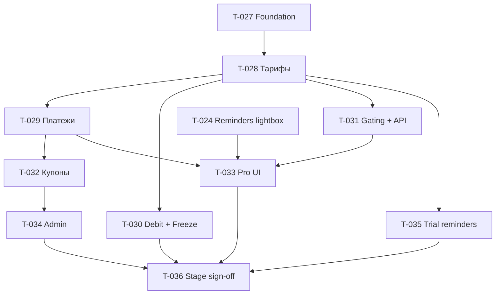

# E-001 · Commerce: счёт, клиенто-дни, аддоны, купоны

| Поле | Значение |
|------|----------|
| **Статус** | `backlog` · папка: **`эпики/`** · **DEC-007 + DEC-008** |
| **Бывш. ID** | T-026 |
| **Приоритет** | P1 · **prod платежей ориентир январь 2027** (DEC-008; ~~01.09 DEC-005~~) |
| **Спринт** | после стабилизации E-006 / параллельно подготовка кода |
| **Роль** | dev (+ архитектор на review слайсов) |
| **Создан** | 2026-06-12 |
| **Оценка** | **пересмотреть** после уточнения клиенто-дня |

## Контекст

Реализация модуля **`app/Modules/Commerce/`**.

**Канон монетизации · DEC-007:**

- **Тарифов** (Лайт / Профи / Максимальный) **нет**.
- **Ядро** — плата за **клиенто-день**.
- **Аддоны** — отдельная абонплата ([I-001](../инициативы/I-001-модуль-продаж.md) / [E-006](E-006-crm-тренера.md) и др.).
- Детали ставки и проводок — **при реализации** / пересмотре ТЗ.

**Срок включения денег · DEC-008:** **январь 2027** (вместе с контуром клиент→тренер — отдельное ТЗ). До этого — можно готовить код/ADR, без обязательного go/no-go 01.09.2026.

Канон: [модель-монетизации-платформа](../../../_telotron.ru/docs/Бизнес-требования/00-канон-mvp/модель-монетизации-платформа.md) · [модуль-оплаты-платформа](../../../_telotron.ru/docs/Бизнес-требования/02-модули/billing/модуль-оплаты-платформа.md) · [План-2026-09](../../01-Директор/Инструкции/План-2026-09-фокус-разработка.md).

Техдок [commerce-модуль-тз-mvp](../../../_telotron.ru/docs/Техдок/03-модули/commerce-модуль-тз-mvp.md) — **помечен к пересмотру** (исторически под тарифы).

**Смежно:** оплаты клиент→тренер — **январь 2027** (тот же платёжный горизонт, другой модуль/ТЗ). **Partner:** [E-002](E-002-partner-модуль.md).

> Подтикеты T-027…T-036 изначально нарезаны под **тарифную** модель. После DEC-007: **не** реализовывать gating Лайт/Профи/Макс как канон; переписать критерии под клиенто-день + аддоны (отдельные T или правка существующих — на planning).

**Зависимости не-dev:**

| Зависимость | Дедлайн | Блокирует |
|-------------|---------|-----------|
| [T-005](../бэклог/T-005-матрица-функция-тариф.md) черновик | 01.07 | gating (T-031) — временно канон-матрица |
| [T-024](../бэклог/T-024-reminders-одноразовый-лайтбокс.md) | до T-033 | лайтбокс при `light`/`frozen` |
| ЮKassa sandbox / stage webhook | 15.07 | T-029 на stage |
| Юр. тексты подписки | 01.07 | тексты в UI T-033 |

---

## Подтикеты (порядок)

| ID | Слайс | Спринт* | Оценка | Зависит от |
|----|-------|---------|--------|------------|
| [T-027](../бэклог/T-027-commerce-foundation-ledger.md) | Foundation: модуль, миграции, ledger | 2 | 12–16 ч | — |
| [T-028](../бэклог/T-028-commerce-тарифы-статусы-триал.md) | Тарифы, статусы, триал | 2–3 | 10–12 ч | T-027 |
| [T-029](../бэклог/T-029-commerce-платежи-yookassa.md) | Платежи + webhook | 3 | 10–14 ч | T-027, T-028 |
| [T-030](../бэклог/T-030-commerce-daily-debit-freeze.md) | Nightly debit + заморозка | 4 | 10–12 ч | T-028 |
| [T-031](../бэклог/T-031-commerce-gating-api.md) | TariffGate + HTTP API | 4 | 12–14 ч | T-028, T-005* |
| [T-032](../бэклог/T-032-commerce-купоны.md) | Купоны bonus/discount | 4 | 8–10 ч | T-027, T-029 |
| [T-035](../бэклог/T-035-commerce-напоминания-триала.md) | Напоминания 14/7/1 | 4 | 6–8 ч | T-028 |
| [T-033](../бэклог/T-033-commerce-pro-ui.md) | Pro UI «Тариф и счёт» | 4–5 | 12–16 ч | T-029, T-031, T-024 |
| [T-034](../бэклог/T-034-commerce-admin-filament.md) | Admin Filament | 5 | 8–12 ч | T-027…T-032 |
| ~~T-047~~ | Public `/tariffs` | — | — | **техдолг** · см. ниже |
| [T-036](../бэклог/T-036-commerce-stage-sign-off.md) | Stage sign-off, E2E, runbook | 5 | 6–8 ч | все выше |

\*Спринты — по [плану Пилота](../../_telotron.ru/docs/Техдок/00-мета/план-разработки-этап-1-пилот.md); неделя отпуска 06–12.07 без новых слайсов.

**Связанный (не подтикет эпика):** [T-024](../бэклог/T-024-reminders-одноразовый-лайтбокс.md) — Reminders, блокирует UX T-033.

---

## Критерии закрытия эпика E-001

Чеклист **ADR-001 Billing B1–B7** прогнан на **stage** (не prod):

Легенда: ☑ — покрыто автотестами / dev-доставкой; ☐ — нужен stage или prod.

- ☐ **B1** — ЮKassa sandbox: checkout, webhook, ошибки, логи `commerce_payment_webhook_logs` *(prod gate 01.09; PHPUnit — mock webhook)*
- ☑ **B2** — триал 30 дн., один на аккаунт; на триале **Профи**
- ☑ **B3** — Лайт + Профи; нехватка Ед. → freeze → light
- ☑ **B4** — gating: Лайт без групп; **только Лайт vs Профи**
- ☑ **B5** — напоминания триала 14/7/1 (T-035)
- ☑ **B6** — счёт Ед., nightly debit МСК, freeze
- ☑ **B7** — feature-тесты модуля + runbook §14 ТЗ + E2E «триал → пополнение → списание → light» (T-036 dev)
- ☑ **C+** — купоны bonus/discount; admin *(☑ PHPUnit/Filament)*; лайтбокс *(☐ T-024 stub, не prod UX)*

**Prod go/no-go** — отдельно **01.09**, не закрытие эпика.

---

## Дорожка (Mermaid)

---

## Журнал

### 2026-06-12

- Эпик и подтикеты T-027…T-036 созданы по канону Commerce и плану этапа 1 Пилот.

### 2026-07-08 (уточнения PO)

- [ADR-004](../../_telotron.ru/docs/Техдок/00-мета/архитектурные-решения/ADR-004-commerce-po-уточнения-mvp.md): Профи 3000 ₽; max — заглушка; freeze 10 дн./эпизод (без годового лимита); купоны individual/promotional; даунгрейд сам; Partner — только событие.
- T-047 → [техдолг](../../_telotron.ru/docs/Техдок/00-мета/техдолг-commerce-mvp.md).

### 2026-07-08

- Ссылка на [ADR-003](../../_telotron.ru/docs/Техдок/00-мета/архитектурные-решения/ADR-003-commerce-tovar-popolnenie-kupony.md); автопополнение — [идея](../идеи/commerce-автопополнение-с-карты.md).

### 2026-07-08 (T-036 dev)

- **T-036 dev-deliverable:** `CommerceLifecycleSignOffTest` (триал → webhook topup → `commerce:daily-debit` → freeze → light → gating); E2E `pro-commerce.flow.spec.ts`; [commerce-runbook-mvp.md](../../_telotron.ru/docs/Техдок/03-модули/commerce-runbook-mvp.md).
- Чеклист B1–B7 + C+ обновлён: ☑ автотесты/runbook/E2E smoke; ☐ B1 stage sandbox + director sign-off; ☐ лайтбокс T-024.
- Эпик **не** `done` — ждёт stage прогон с реальной ЮKassa и подпись директора.
