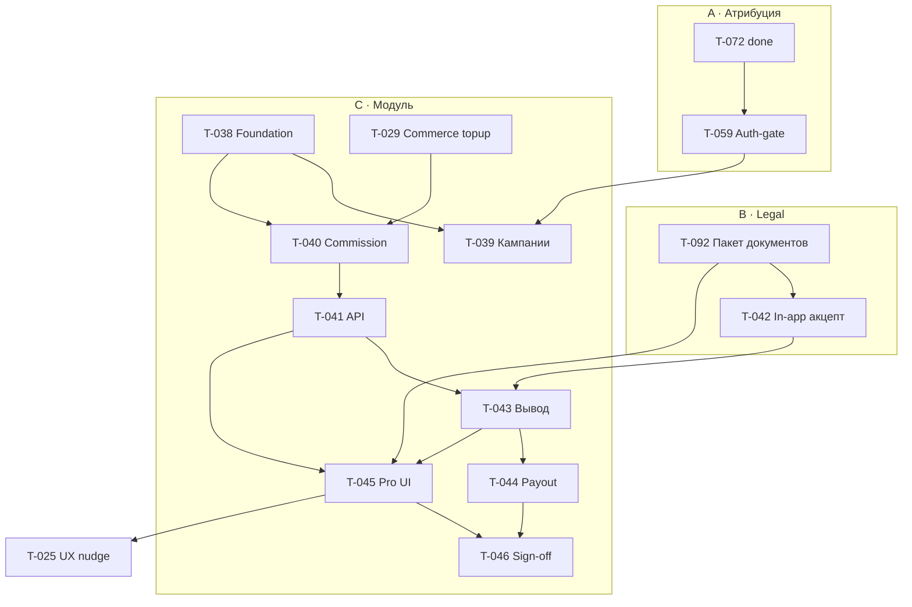

# E-002 · Партнёрская программа · внедрение и доработка

| Поле | Значение |
|------|----------|
| **Статус** | `in_progress` · папка: **`эпики/`** |
| **Бывш. ID** | T-037 |
| **Приоритет** | P1 (stage ready **31.07**, prod **01.08** вместе с Commerce) |
| **Спринт** | этап 1 · Пилот · спринты **4–5** |
| **Роль** | dev + юрист + PO (+ архитектор на review) |
| **Создан** | 2026-06-12 |
| **Оценка** | **~75–95 ч** (модуль T-038…T-046 + юр. пакет + UX/атрибуция) |

> **Не путать** с **человеческим co-promo** (Д. Рябко и др.) — [Сотрудничество — Дмитрий Рябко](../../01-Директор/Работа/Сотрудничество%20—%20Дмитрий%20Рябко.md); продуктовая модель L1/L2/L3 — здесь. Головной партнёр — [идея](../идеи/головной-партнёр-атрибуция-и-продажа-компании.md), **вне MVP**.

## Контекст

Эпик объединяет **всю** партнёрскую программу Telotron: от корректной **атрибуции** и входа тренера до **модуля Partner**, **юридического пакета**, **Pro UI** и **роста канала** (nudge ссылок).

**Технический канон:** модуль **`app/Modules/Partner/`**

- [partner-модуль-тз-mvp.md](../../_telotron.ru/docs/Техдок/03-модули/partner-модуль-тз-mvp.md)
- [partner-схема-данных-mvp.md](../../_telotron.ru/docs/Техдок/03-модули/partner-схема-данных-mvp.md)
- [api-http §4.1n](../../_telotron.ru/docs/Техдок/01-канон-mvp/api-http-контракт-mvp.md)
- [ADR-001 P1–P8](../../_telotron.ru/docs/Техдок/00-мета/архитектурные-решения/ADR-001-scope-billing-partner-01-08.md)

**Жёсткая зависимость:** [E-001](E-001-commerce-модуль.md) — событие **topup** (минимум T-027 + T-029).

---

## Треки эпика

### A · Атрибуция и вход (пререквизит пилота)

| ID | Слайс | Статус | Зависит от |
|----|-------|--------|------------|
| [T-072](../сделано/T-072-invite-ссылки-код-wo-link-public.md) | Коды ссылок `wo_link` / `public` | **done** 06.07 · эпик [E-003](E-003-упрощение-входа.md) | — |
| [T-059](../в-работе/T-059-auth-gate-pro-client-invite.md) | Auth-gate: Pro по invite, Client только по ссылке тренера | **in_progress** · P0 | T-072 |

### B · Юридический пакет

| ID | Слайс | Статус | Зависит от |
|----|-------|--------|------------|
| [T-092](../бэклог/T-092-legal-партнёрская-программа-пакет-документов.md) | Пакет юрдокументов (оферта, правила, правки ToS/политики) | `backlog` · **юрист** | PO / канон ставок |
| [T-042](../бэклог/T-042-partner-договор-legal.md) | In-app акцепт договора (P6) | `backlog` · dev | **T-092**, T-038 |

### C · Модуль Partner (ADR P1–P8)

| ID | Слайс | Спринт | Оценка | Зависит от |
|----|-------|--------|--------|------------|
| [T-038](../бэклог/T-038-partner-foundation-config.md) | Foundation + config | 4 | 8–10 ч | — |
| [T-039](../бэклог/T-039-partner-кампании-ссылки.md) | Кампании, лимиты invite (P1) | 4 | 8–10 ч | T-038 |
| [T-040](../бэклог/T-040-partner-commission-topup.md) | L1/L2/L3 на topup (P4) | 4–5 | 12–14 ч | T-038, T-029 |
| [T-041](../бэклог/T-041-partner-http-api.md) | HTTP API §4.1n (P3, P5) | 4–5 | 8–10 ч | T-038, T-040 |
| [T-043](../бэклог/T-043-partner-вывод-admin.md) | Вывод, reserve, admin manual (P6–P7) | 5 | 10–12 ч | T-040, T-041, T-042 |
| [T-044](../бэклог/T-044-partner-payout-providers.md) | PayoutProvider + webhook задел | 5 | 6–8 ч | T-043 |
| [T-045](../бэклог/T-045-partner-pro-ui.md) | Pro UI партнёрки | 5 | 10–14 ч | T-041, T-042, T-043 |
| [T-046](../бэклог/T-046-partner-stage-sign-off.md) | Stage sign-off P1–P8 | 5 | 4–6 ч | все C + B |

### D · UX и рост канала

| ID | Слайс | Статус | Зависит от |
|----|-------|--------|------------|
| [T-025](../бэклог/T-025-ux-подталкивание-партнёрской-ссылки.md) | Nudge шеринга partner link у client invite + checkout | `backlog` | T-045, **T-092** (формулировки) |

### E · Онбординг (стык)

| ID | Слайс | Статус | Примечание |
|----|-------|--------|------------|
| [T-060](../сделано/T-060-pro-onboarding-k-p.md) | Шаг `partner_invite` в контуре П | **done** | `/more/invites` |
| [T-065](../бэклог/T-065-pro-onboarding-порядок-подготовка-клиент.md) | Порядок шагов мастера | `backlog` | `partner_invite` остаётся в П |

### Связанные (не подтикеты эпика)

| ID | Зона |
|----|------|
| [T-051](../бэклог/T-051-спринт2-qm-юр-тексты.md) | Q-M02, Q-M12 — посты без обещания партнёрского дохода |
| [T-052](../бэклог/T-052-тз-crm-продвижение-pilot.md) | CRM: канал partner в касаниях |
| [T-063](../в-работе/T-063-crm-pilot-files.md) | `partners.yaml`, касания co-promo |

---

## Зависимости не-dev

| Зависимость | Дедлайн | Блокирует |
|-------------|---------|-----------|
| **Пакет юрдокументов** [T-092](../бэклог/T-092-legal-партнёрская-программа-пакет-документов.md) | stage Partner | T-042, T-045, prod **01.08** |
| Commerce topup на stage | 31.07 | T-040, P8 |
| ЮKassa payout договор | по готовности | T-044 API payout (MVP = **manual**) |

---

## Критерии закрытия эпика

### Продукт и право

- [ ] Пакет юрдокументов опубликован и согласован (**T-092**)
- [ ] In-app акцепт партнёрского договора работает (**T-042**)

### ADR P1–P8 (модуль)

- [x] **P1** — кампании, лимиты §3, счётчики, отзыв (T-039)
- [x] **P2** — атрибуция без перепривязки (Invites + T-039; T-059 deferred)
- [x] **P3** — список приведённых (T-041)
- [x] **P4** — L1/L2/L3 на topup; L3 с договором; platform link без % (T-040)
- [x] **P5** — мгновенные начисления + месячная статистика (T-040, T-041)
- [x] **P6** — UI: статистика, вывод, договор (T-045)
- [x] **P7** — admin: акцепт заявок, manual payout (T-043)
- [x] **P8** — feature-тесты + webhook topup → commission (T-046)

### Атрибуция и UX

- [ ] Auth-gate Pro/Client закрыт (**T-059**)
- [ ] Partner nudge в invite UI (**T-025**) или явный defer в журнале с причиной

---

## Дорожка

---

## Журнал

### 2026-07-09

- Dev track C (T-038…T-046) на ветке `partner`: модуль Partner, API §4.1n, Pro UI `/more/partner`, Filament вывод.
- **P1–P8 (dev):** P1–P7, P8 — feature-тесты + lifecycle sign-off; E2E smoke `pro-partner.flow.spec.ts`.
- **Отложено:** T-092 (юртексты), T-059 (auth-gate), T-025 (UX nudge), stage smoke с Commerce.
- **Не в Git приложения:** журнал обновлён в эпике.

### 2026-07-07

- Эпик переформулирован: **внедрение и доработка**; треки A–E; в эпик включены T-059, T-025, T-072, T-060, T-065.
- Добавлен **T-092** — пакет юридических документов партнёрской программы.

### 2026-06-12

- Эпик и подтикеты T-038…T-046; api §4.1n.
